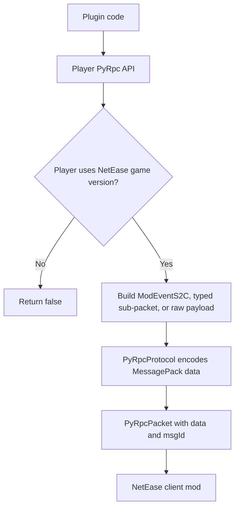
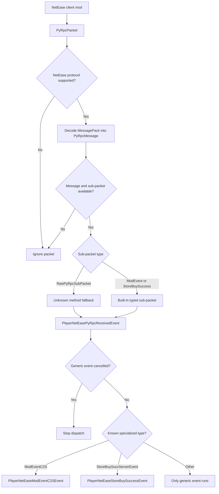
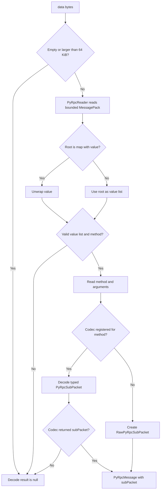
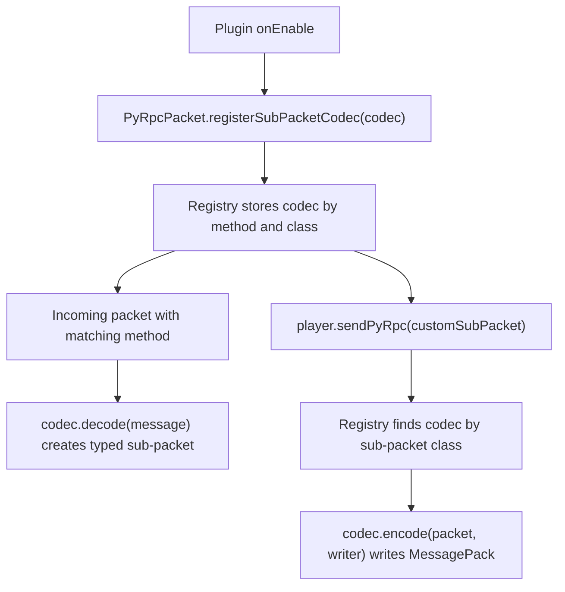

# PyRpc Guide

PyRpc is Nukkit-MOT's NetEase-only packet path for Python scripting RPC messages. It is mainly useful when a plugin needs to exchange custom events with a NetEase client mod or handle NetEase store callbacks.

:::tip Source-backed scope
This page is written against the current Nukkit-MOT source at `1f043b3e7`, especially `Player`, `PyRpcPacket`, `PyRpcProtocol`, `PyRpcProcessor`, `PyRpcSubPacketCodec`, `ModEventPyRpcSubPacket`, `RawPyRpcSubPacket`, and the player PyRpc events.
:::

## Core Rules

- PyRpc is available only for NetEase protocol sessions.
- The processor supports NetEase protocol `V1_20_50_NETEASE` and newer.
- `Player#sendPyRpcData(...)`, `Player#sendPyRpc(...)`, and `Player#modNotifyToClient(...)` return `false` when the player is not using a NetEase game version.
- Use `modNotifyToClient(...)` for normal server-to-client mod events.
- Use `PlayerNetEaseModEventC2SEvent` for normal client-to-server mod events.
- Use raw payload APIs only when you already know the exact PyRpc method and argument shape.

## Flow Overview

PyRpc has two different directions. Outbound packets start from your plugin and are rejected early when the player is not on a NetEase protocol session:



Inbound packets are decoded first, then dispatched through the generic event and optional specialized events:



## Packet Model

[PyRpcPacket](https://github.com/MemoriesOfTime/Nukkit-MOT/blob/master/src/main/java/cn/nukkit/network/protocol/netease/PyRpcPacket.java) contains two values:

| Field | Meaning |
| --- | --- |
| `data` | MessagePack-encoded PyRpc payload |
| `msgId` | Unsigned 32-bit message id, default `9753608` |

Nukkit-MOT decodes `data` into a [PyRpcMessage](https://github.com/MemoriesOfTime/Nukkit-MOT/blob/master/src/main/java/cn/nukkit/network/protocol/netease/pyrpc/PyRpcMessage.java):

| Value | Meaning |
| --- | --- |
| `method` | PyRpc method name, such as `ModEventC2S` |
| `arguments` | Decoded method arguments |
| `rawRoot` | Original decoded MessagePack root object |
| `rawPayload` | Original packet payload bytes |
| `subPacket` | Typed `PyRpcSubPacket`, or raw fallback |

Built-in helpers and codecs cover these methods:

| Method | Direction | Typed packet |
| --- | --- | --- |
| `ModEventC2S` | Client to server | `ModEventPyRpcSubPacket` |
| `ModEventS2C` | Server to client | `ModEventPyRpcSubPacket` |
| `StoreBuySuccServerEvent` | Client to server | `StoreBuySuccessPyRpcSubPacket` |

Unknown decoded methods become `RawPyRpcSubPacket`, so plugins can still inspect the method name and argument list.

The decode path is intentionally conservative:



## Sending A Mod Event To The Client

For most plugin code, use `Player#modNotifyToClient(...)`. It creates a `ModEventS2C` packet and sends it only when the target player is on a NetEase client.

```java title="pyrpc/DemoPyRpcSender.java"
package cn.nukkitmot.exampleplugin.pyrpc;

import cn.nukkit.Player;

import java.util.LinkedHashMap;
import java.util.Map;

public final class DemoPyRpcSender {

    public static boolean openPanel(Player player, String panelId) {
        Map<String, Object> eventData = new LinkedHashMap<>();
        eventData.put("panelId", panelId);
        eventData.put("readonly", false);

        return player.modNotifyToClient(
                "DemoMod",
                "main",
                "OpenPanelEvent",
                eventData);
    }
}
```

Check the boolean return value. A `false` result usually means the player is not using a NetEase game version, or the packet could not be queued.

### Encrypted Event Helper

`modNotifyToClientEncrypted(...)` is a small helper around `modNotifyToClient(...)`. It applies your encryption function to a string and sends the result as `eventData["data"]`.

```java
player.modNotifyToClientEncrypted(
        "DemoMod",
        "secure",
        "SecurePayloadEvent",
        "{\"action\":\"sync\"}",
        plainText -> encryptForClient(plainText));
```

Nukkit-MOT does not define the encryption algorithm. The server plugin and the client mod must agree on the format.

## Receiving Client Mod Events

Client-to-server mod events arrive as `ModEventC2S`. Nukkit-MOT first fires the generic `PlayerNetEasePyRpcReceivedEvent`, then fires `PlayerNetEaseModEventC2SEvent` for typed mod events.

```java title="pyrpc/DemoPyRpcListener.java"
package cn.nukkitmot.exampleplugin.pyrpc;

import cn.nukkit.event.EventHandler;
import cn.nukkit.event.Listener;
import cn.nukkit.event.player.PlayerNetEaseModEventC2SEvent;

import java.util.Map;

public final class DemoPyRpcListener implements Listener {

    @EventHandler(ignoreCancelled = true)
    public void onModEvent(PlayerNetEaseModEventC2SEvent event) {
        if (!"DemoMod".equals(event.getModName())) {
            return;
        }
        if (!"main".equals(event.getSystemName())) {
            return;
        }
        if (!"SubmitPanelEvent".equals(event.getCustomEventName())) {
            return;
        }

        Map<String, Object> data = event.getEventData();
        Object rawPanelId = data.get("panelId");
        if (!(rawPanelId instanceof String panelId)) {
            event.setCancelled();
            return;
        }

        event.getPlayer().sendMessage("Submitted panel: " + panelId);
    }
}
```

Register the listener in your plugin:

```java
this.getServer().getPluginManager().registerEvents(new DemoPyRpcListener(), this);
```

## Listening To All PyRpc Messages

Use `PlayerNetEasePyRpcReceivedEvent` when you need to inspect every decoded PyRpc message, including unknown methods.

```java
@EventHandler(ignoreCancelled = true)
public void onAnyPyRpc(PlayerNetEasePyRpcReceivedEvent event) {
    String method = event.getMethod();
    event.getPlayer().getServer().getLogger().debug(
            "PyRpc method=" + method + ", msgId=" + event.getMsgId());
}
```

Cancelling this generic event stops the later specialized event from being fired.

## Handling Raw Methods

If no typed codec is registered for a method, Nukkit-MOT exposes it as `RawPyRpcSubPacket`.

```java
@EventHandler(ignoreCancelled = true)
public void onRawPyRpc(PlayerNetEasePyRpcReceivedEvent event) {
    if (!(event.getSubPacket() instanceof RawPyRpcSubPacket raw)) {
        return;
    }
    if (!"CustomEngineCall".equals(raw.getMethod())) {
        return;
    }

    Object firstArgument = raw.getArguments().isEmpty() ? null : raw.getArguments().get(0);
    event.getPlayer().sendMessage("CustomEngineCall first arg = " + firstArgument);
}
```

You can also send a raw method with `sendPyRpc(...)`:

```java
player.sendPyRpc(
        new RawPyRpcSubPacket(
                "CustomEngineCall",
                List.of("alpha", 42),
                null,
                null),
        0x12345678L);
```

If you need a `PyRpcPacket` object instead of sending through `Player`, `PyRpcPacket.createCustomPacket(method, arguments, msgId)` creates the same raw-method payload shape.

## Sending Pre-encoded Payloads

`sendPyRpcData(byte[] data, long msgId)` sends raw MessagePack bytes directly. Prefer typed sub-packets or `modNotifyToClient(...)` unless you are bridging an existing payload format.

```java
byte[] payload = loadPayloadFromYourBridge();
boolean sent = player.sendPyRpcData(payload, 0x12345678L);
```

The server does not validate the semantic shape of pre-encoded outgoing bytes.

## Registering A Custom Typed Codec

For repeated custom methods, define a `PyRpcSubPacket` and a `PyRpcSubPacketCodec`. Register the codec once during plugin startup with `PyRpcPacket.registerSubPacketCodec(...)`.



```java title="pyrpc/CustomNoticeSubPacket.java"
package cn.nukkitmot.exampleplugin.pyrpc;

import cn.nukkit.network.protocol.netease.pyrpc.PyRpcSubPacket;

public final class CustomNoticeSubPacket implements PyRpcSubPacket {

    public static final String METHOD = "CustomNotice";

    private final String message;

    public CustomNoticeSubPacket(String message) {
        this.message = message;
    }

    @Override
    public String getMethod() {
        return METHOD;
    }

    public String getMessage() {
        return message;
    }
}
```

```java title="pyrpc/CustomNoticeCodec.java"
package cn.nukkitmot.exampleplugin.pyrpc;

import cn.nukkit.network.protocol.netease.pyrpc.PyRpcMessage;
import cn.nukkit.network.protocol.netease.pyrpc.PyRpcProtocol;
import cn.nukkit.network.protocol.netease.pyrpc.PyRpcSubPacketCodec;
import cn.nukkit.network.protocol.netease.pyrpc.io.PyRpcWriter;

public final class CustomNoticeCodec implements PyRpcSubPacketCodec<CustomNoticeSubPacket> {

    @Override
    public String getMethod() {
        return CustomNoticeSubPacket.METHOD;
    }

    @Override
    public Class<CustomNoticeSubPacket> getSubPacketClass() {
        return CustomNoticeSubPacket.class;
    }

    @Override
    public CustomNoticeSubPacket decode(PyRpcMessage message) {
        if (message.getArguments().isEmpty()) {
            return null;
        }

        String text = PyRpcProtocol.asString(message.getArguments().get(0));
        return text != null ? new CustomNoticeSubPacket(text) : null;
    }

    @Override
    public void encode(CustomNoticeSubPacket packet, PyRpcWriter writer) {
        writer.writeMessage(packet.getMethod(), java.util.List.of(packet.getMessage()));
    }
}
```

```java title="DemoPlugin.java"
@Override
public void onEnable() {
    PyRpcPacket.registerSubPacketCodec(new CustomNoticeCodec());
    this.getServer().getPluginManager().registerEvents(new DemoPyRpcListener(), this);
}
```

The codec registry is global. Avoid reusing method names owned by other plugins or by Nukkit-MOT's built-in codecs.

## MessagePack Value Support

`PyRpcWriter` can encode these common Java values:

- `null`
- `String` and other `CharSequence`
- `byte[]`
- `Boolean`
- `Float` and `Double`
- integer `Number` values
- `BigInteger`
- `Map`
- `Iterable`
- Java arrays

Map keys are written as strings. Values with unsupported object types are written with `toString()`, so keep event payloads explicit and simple.

## Limits And Failure Behavior

Nukkit-MOT intentionally keeps PyRpc decoding bounded:

- Empty payloads are ignored.
- Payloads larger than `64 KiB` are ignored.
- MessagePack containers larger than `1024` entries are rejected.
- MessagePack nesting deeper than `32` levels is rejected.
- Invalid or unsupported MessagePack payloads decode to `null` and do not fire PyRpc events.

For plugin-side safety:

- Do not trust incoming `eventData`; validate method names, types, sizes, and permissions.
- Keep event payloads small.
- Cancel unwanted generic PyRpc events early if you do not want specialized handlers to run.
- Treat PyRpc as a NetEase integration layer, not a replacement for normal Nukkit plugin APIs.
