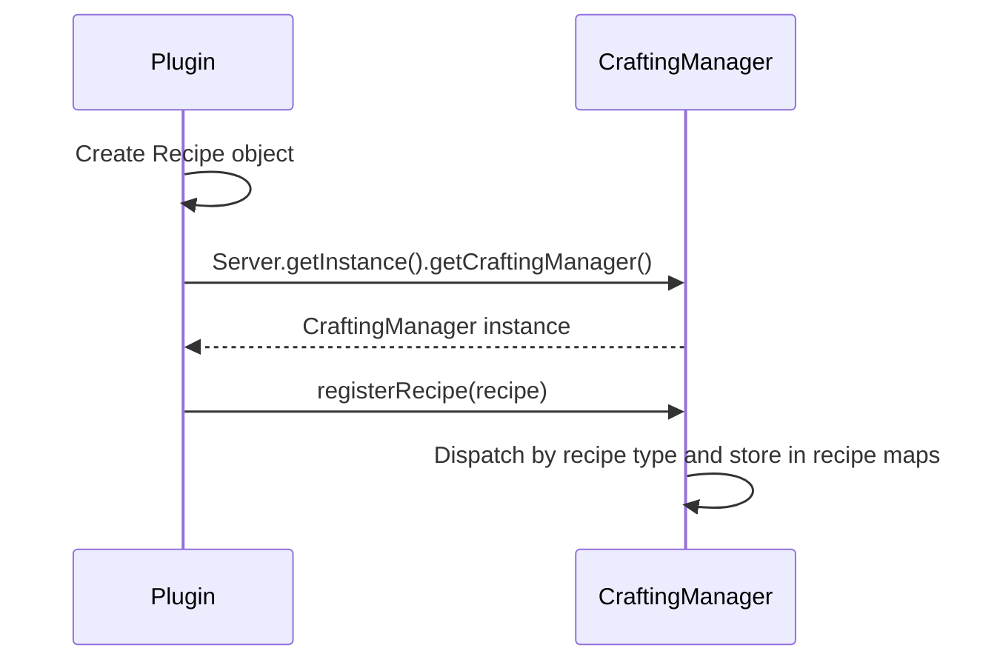

# Custom Recipe

Custom recipes allow you to add new crafting, smelting, and smithing recipes to the server. You can use them to let players craft vanilla items in new ways, create recipes that produce your custom items, or define entirely new smelting and upgrade paths.

This page covers the following common recipe types supported by Nukkit-MOT:

| Recipe Type | Class | Description |
|---|---|---|
| Shaped Recipe | `ShapedRecipe` | Crafting table recipe with a specific pattern |
| Shapeless Recipe | `ShapelessRecipe` | Crafting table recipe where arrangement doesn't matter |
| Furnace Recipe | `FurnaceRecipe` | Furnace smelting recipe |
| Blast Furnace Recipe | `BlastFurnaceRecipe` | Blast furnace smelting recipe |
| Campfire Recipe | `CampfireRecipe` | Campfire cooking recipe |
| Smithing Recipe | `SmithingRecipe` | Smithing table upgrade recipe |
| Stonecutter Recipe | `StonecutterRecipe` | Stonecutter cutting recipe |

## Registration Flow \{#registration-flow}

Follow this sequence diagram for the registration process:



Register all recipes in your plugin's `onEnable` method:

```java title="ExamplePlugin.java"
import cn.nukkit.Server;
import cn.nukkit.inventory.CraftingManager;
import cn.nukkit.plugin.PluginBase;

public class ExamplePlugin extends PluginBase {
    @Override
    public void onEnable() {
        // highlight-start
        CraftingManager craftingManager = Server.getInstance().getCraftingManager();
        // Register recipes here...
        // highlight-end
    }
}
```

:::tip Convenience Method

You can also use `getServer().getCraftingManager()` directly, since `PluginBase` provides `getServer()`.

:::

## Shaped Recipe \{#shaped-recipe}

Shaped recipes define a specific pattern in the crafting recipe data sent to clients. This is the most common recipe type, used for things like tools, armor, and blocks.

### Basic Usage \{#shaped-basic}

The shape is defined as an array of strings (1–3 rows, each 1–3 characters). Each character maps to an ingredient item. Spaces represent empty slots.

```java title="ShapedRecipe example"
import cn.nukkit.inventory.ShapedRecipe;
import cn.nukkit.item.Item;

// Craft a Diamond from 9 Diamond Ore
// highlight-start
craftingManager.registerRecipe(new ShapedRecipe(
    Item.get(Item.DIAMOND),                    // primaryResult
    new String[]{                               // shape (3x3 grid)
        "DDD",
        "DDD",
        "DDD"
    },
    Map.of(                                     // ingredient map
        'D', Item.get(Item.DIAMOND_ORE)
    ),
    List.of()                                   // extraResults (empty buckets, etc.)
));
// highlight-end
```

This creates a recipe where 9 Diamond Ore arranged in a 3×3 square produce a Diamond.

### Understanding the Shape \{#shaped-shape}

The shape array defines the crafting grid layout:

```
Shape: {"AB ",
        " C "}
```

Represents a crafting grid like:

```
[A] [B] [ ]
[ ] [C] [ ]
[ ] [ ] [ ]
```

:::warning Shape Rules

- Each row must be the same length (1–3 characters)
- There must be 1–3 rows
- Every non-space character must have a matching ingredient
- The ingredient map must not contain symbols that do not appear in the shape
- The recipe grid is **not** required to be square — no need to pad empty rows or columns

:::

:::info Server-Side Matching

`CraftingDataPacket` sends the shaped grid to clients, but `CraftingManager.matchRecipe()` validates shaped recipes by output hash and aggregate ingredients, not by exact grid positions. If your plugin needs extra positional rules beyond normal client recipe data, validate them in `CraftItemEvent`.

:::

### Full Constructor \{#shaped-constructor}

From [cn.nukkit.inventory.ShapedRecipe](https://github.com/MemoriesOfTime/Nukkit-MOT/blob/master/src/main/java/cn/nukkit/inventory/ShapedRecipe.java):

```java title="Constructor"
new ShapedRecipe(
    String recipeId,         // Unique recipe identifier (can be null)
    int priority,            // Priority metadata
    Item primaryResult,      // Primary output item
    String[] shape,          // Shape array
    Map<Character, Item> ingredients,  // Character → Item mapping
    List<Item> extraResults  // Additional results (e.g., empty buckets)
);
```

### Example: Crafting a Custom Item \{#shaped-custom-item}

Using a custom item as the recipe result:

```java title="Crafting a custom sword with custom items"
import cn.nukkit.inventory.ShapedRecipe;
import cn.nukkit.item.Item;

// Craft the Candy Cane Sword: Candy Cane (C) + Stick (S)
craftingManager.registerRecipe(new ShapedRecipe(
    "candy_cane_sword",                         // recipeId
    1,                                          // priority metadata
    Item.fromString("nukkit:candy_cane_sword"), // custom item result
    new String[]{
        " C ",
        " C ",
        " S "
    },
    Map.of(
        'C', Item.get(Item.DYE, 9),             // Pink dye as "Candy Cane"
        'S', Item.get(Item.STICK)
    ),
    List.of()
));
```

### Example: Recipe with Extra Results \{#shaped-extra-results}

Some recipes leave items behind in the crafting grid (like empty buckets from cake):

```java title="Recipe with extra results"
import cn.nukkit.inventory.ShapedRecipe;
import cn.nukkit.item.Item;

craftingManager.registerRecipe(new ShapedRecipe(
    Item.get(Item.CAKE),
    new String[]{
        "MMM",
        "SES",
        "WWW"
    },
    Map.of(
        'M', Item.get(Item.BUCKET, 1),             // Milk bucket
        'S', Item.get(Item.SUGAR),
        'E', Item.get(Item.EGG),
        'W', Item.get(Item.WHEAT)
    ),
    // highlight-next-line
    List.of(Item.get(Item.BUCKET, 0, 3))        // 3 empty buckets returned
));
```

## Shapeless Recipe \{#shapeless-recipe}

Shapeless recipes don't require a specific pattern — the ingredients can be placed anywhere in the crafting grid. This is used for recipes like dyes, fire charges, and other combined items.

### Basic Usage \{#shapeless-basic}

```java title="ShapelessRecipe example"
import cn.nukkit.inventory.ShapelessRecipe;
import cn.nukkit.item.Item;

// Combine Iron Ingot + Flint = Flint and Steel
// highlight-start
craftingManager.registerRecipe(new ShapelessRecipe(
    Item.get(Item.FLINT_AND_STEEL),           // result
    List.of(                                    // ingredients (order doesn't matter)
        Item.get(Item.IRON_INGOT),
        Item.get(Item.FLINT)
    )
));
// highlight-end
```

### Full Constructor \{#shapeless-constructor}

From [cn.nukkit.inventory.ShapelessRecipe](https://github.com/MemoriesOfTime/Nukkit-MOT/blob/master/src/main/java/cn/nukkit/inventory/ShapelessRecipe.java):

```java title="Constructor"
new ShapelessRecipe(
    String recipeId,             // Unique recipe identifier (can be null)
    int priority,                // Priority metadata
    Item result,                 // Output item
    Collection<Item> ingredients // Ingredient list (max 9 items)
);
```

:::warning Ingredient Limit

`ShapelessRecipe` rejects ingredient collections with more than 9 entries. Individual `Item` counts can be greater than 1, such as `Item.get(Item.COAL, 1, 2)`.

:::

### Example: Dye Mixing \{#shapeless-dye-mix}

```java title="ShapelessRecipe - custom dye mixing"
import cn.nukkit.inventory.ShapelessRecipe;
import cn.nukkit.item.Item;

// Mix Red + Yellow Dye = Orange Dye
craftingManager.registerRecipe(new ShapelessRecipe(
    "orange_dye_mix",
    0,
    Item.get(Item.DYE, 14),                   // Orange dye
    List.of(
        Item.get(Item.DYE, 1),                 // Red dye
        Item.get(Item.DYE, 11)                 // Yellow dye
    )
));
```

## Furnace Recipe \{#furnace-recipe}

Furnace recipes define what happens when you smelt an item in a furnace.

### Basic Usage \{#furnace-basic}

```java title="FurnaceRecipe example"
import cn.nukkit.inventory.FurnaceRecipe;
import cn.nukkit.item.Item;

// Smelt Diamond Ore → Diamond
// highlight-start
craftingManager.registerRecipe(new FurnaceRecipe(
    "diamond_ore_to_diamond",
    Item.get(Item.DIAMOND),                   // result
    Item.get(Item.DIAMOND_ORE)                // ingredient
));
// highlight-end
```

### Full Constructor \{#furnace-constructor}

From [cn.nukkit.inventory.FurnaceRecipe](https://github.com/MemoriesOfTime/Nukkit-MOT/blob/master/src/main/java/cn/nukkit/inventory/FurnaceRecipe.java):

```java title="Constructor"
new FurnaceRecipe(
    String recipeId,   // Unique recipe identifier (can be null)
    Item result,       // Smelting output
    Item ingredient    // Input item to smelt
);
```

:::tip Metadata Matching

`CraftingManager` stores smelting recipes by input item hash. Furnace, Blast Furnace, and Campfire matching first checks the exact input damage/meta hash; if that misses, it falls back to the same item id with meta `0`. This means a meta `0` recipe can act as the fallback for other variants unless a more specific recipe is registered.

The network recipe type, such as `FURNACE` versus `FURNACE_DATA`, is based on `ingredient.hasMeta()`, so do not use the type name alone to reason about server matching.

:::

## Blast Furnace Recipe \{#blast-furnace-recipe}

Blast Furnace recipes use the Blast Furnace block's separate recipe map. The block entity matches that map and processes matching recipes with a speed multiplier of `2`.

Current `CraftingManager.packetFor()` does not iterate `getBlastFurnaceRecipes()` when building `CraftingDataPacket`, so custom Blast Furnace recipes are server-side processing rules and should not be relied on for client recipe book advertising.

```java title="BlastFurnaceRecipe example"
import cn.nukkit.inventory.BlastFurnaceRecipe;
import cn.nukkit.item.Item;

// highlight-start
craftingManager.registerRecipe(new BlastFurnaceRecipe(
    Item.get(Item.IRON_INGOT),                // result
    Item.get(Item.IRON_ORE)                   // ingredient
));
// highlight-end
```

## Campfire Recipe \{#campfire-recipe}

Campfire recipes define cooking rules for the Campfire block. `BlockEntityCampfire` matches registered campfire recipes while processing items on the block.

Current `CraftingManager.packetFor()` does not add campfire recipes to `CraftingDataPacket`, so these recipes affect server-side campfire processing rather than client recipe book advertising.

```java title="CampfireRecipe example"
import cn.nukkit.inventory.CampfireRecipe;
import cn.nukkit.item.Item;

// highlight-start
craftingManager.registerRecipe(new CampfireRecipe(
    Item.get(Item.COOKED_PORKCHOP),           // result
    Item.get(Item.RAW_PORKCHOP)               // ingredient
));
// highlight-end
```

## Smithing Recipe \{#smithing-recipe}

Smithing recipes are used in the Smithing Table transform path. Current Nukkit-MOT normal output generation is implemented for the netherite-upgrade flow: equipment + material + `minecraft:netherite_upgrade_smithing_template`.

### Basic Usage \{#smithing-basic}

```java title="SmithingRecipe example"
import cn.nukkit.inventory.SmithingRecipe;
import cn.nukkit.item.Item;

// Upgrade: Diamond Sword + Netherite Ingot = Netherite Sword
// highlight-start
craftingManager.registerRecipe(new SmithingRecipe(
    "diamond_to_netherite_sword",              // recipeId
    0,                                         // priority metadata
    List.of(                                   // ingredients (order matters!)
        Item.get(Item.DIAMOND_SWORD),          //   [0] equipment
        Item.get(Item.NETHERITE_INGOT),        //   [1] material
        Item.fromString(Item.NETHERITE_UPGRADE_SMITHING_TEMPLATE) // [2] template
    ),
    Item.get(Item.NETHERITE_SWORD)             // result
));
// highlight-end
```

### Constructor and Parameter Order \{#smithing-constructor}

From [cn.nukkit.inventory.SmithingRecipe](https://github.com/MemoriesOfTime/Nukkit-MOT/blob/master/src/main/java/cn/nukkit/inventory/SmithingRecipe.java):

```java title="Constructor"
new SmithingRecipe(
    String recipeId,
    int priority,
    Collection<Item> ingredients,  // Must follow this order:
                                   //   [0] equipment (base item to upgrade)
                                   //   [1] ingredient (upgrade material)
                                   //   [2] template (use the netherite upgrade template for normal output)
    Item result                     // Upgraded output item
);
```

:::warning Ingredient Order Matters

The ingredients collection must contain at least **equipment → ingredient** in that order. A third item is optional at constructor level and defaults to Air, but the default Smithing Table result path only returns a real result when the actual template item is `minecraft:netherite_upgrade_smithing_template`.

When using that template, `getFinalResult()` copies the input equipment compound tag to the result and carries damage up to the result item's max durability.

:::

## Stonecutter Recipe \{#stonecutter-recipe}

Stonecutter recipes allow cutting blocks into variants using the Stonecutter block.

```java title="StonecutterRecipe example"
import cn.nukkit.inventory.StonecutterRecipe;
import cn.nukkit.item.Item;

// highlight-start
craftingManager.registerRecipe(new StonecutterRecipe(
    "stone_to_stone_bricks",                  // recipeId
    0,                                         // priority metadata
    Item.get(Item.STONE_BRICKS, 0, 4),          // result (4 Stone Bricks)
    Item.get(Item.STONE)                       // ingredient
));
// highlight-end
```

### Full Constructor \{#stonecutter-constructor}

From [cn.nukkit.inventory.StonecutterRecipe](https://github.com/MemoriesOfTime/Nukkit-MOT/blob/master/src/main/java/cn/nukkit/inventory/StonecutterRecipe.java):

```java title="Constructor"
new StonecutterRecipe(
    String recipeId,     // Unique recipe identifier
    int priority,        // Priority metadata
    Item result,         // Output item
    Item ingredient      // Input item
);
```

## Putting It All Together \{#full-example}

Here is a complete example of registering multiple recipe types in a plugin:

```java title="RecipePlugin.java"
package cn.nukkitmot.exampleplugin;

import cn.nukkit.inventory.*;
import cn.nukkit.item.Item;
import cn.nukkit.plugin.PluginBase;

import java.util.List;
import java.util.Map;

public class RecipePlugin extends PluginBase {
    @Override
    public void onEnable() {
        CraftingManager craftingManager = getServer().getCraftingManager();

        // Shaped: Craft a compass from 4 iron ingots + 1 redstone
        craftingManager.registerRecipe(new ShapedRecipe(
            "custom_compass",
            1,
            Item.get(Item.COMPASS),
            new String[]{
                " I ",
                "IRI",
                " I "
            },
            Map.of(
                'I', Item.get(Item.IRON_INGOT),
                'R', Item.get(Item.REDSTONE)
            ),
            List.of()
        ));

        // Shapeless: Combine 2 charcoal + 1 stick = 4 torches
        craftingManager.registerRecipe(new ShapelessRecipe(
            "custom_torch",
            0,
            Item.get(Item.TORCH, 0, 4),
            List.of(
                Item.get(Item.COAL, 1, 2),  // Charcoal
                Item.get(Item.STICK)
            )
        ));

        // Furnace: Smelt cobblestone back into stone
        craftingManager.registerRecipe(new FurnaceRecipe(
            "cobblestone_to_stone",
            Item.get(Item.STONE),
            Item.get(Item.COBBLESTONE)
        ));

        // Campfire: Cook raw beef
        craftingManager.registerRecipe(new CampfireRecipe(
            Item.get(Item.COOKED_BEEF),
            Item.get(Item.RAW_BEEF)
        ));

        // Stonecutter: Stone → 4 Stone Bricks
        craftingManager.registerRecipe(new StonecutterRecipe(
            "stone_to_bricks",
            0,
            Item.get(Item.STONE_BRICKS, 0, 4),
            Item.get(Item.STONE)
        ));

        this.getLogger().info("Custom recipes registered!");
    }
}
```

## Further Exploration \{#further-exploration}

### Recipe Priority \{#recipe-priority}

The `priority` parameter is stored on shaped, shapeless, smithing, and stonecutter recipe objects. For shaped, shapeless, and stonecutter recipes, it is also written to crafting data. Current server-side matching does not sort recipes by this value. For shaped and shapeless recipes, `CraftingManager` groups recipes by output item hash, indexes them by the aggregate ingredient hash, and may iterate the matching output bucket.

- **ShapedRecipe** and **ShapelessRecipe** short constructors use default priorities `1` and `10` respectively
- The default value from vanilla recipe JSON files is `0`
- A later shaped or shapeless recipe with the same output hash and the same aggregate ingredient hash replaces the previous server match-map entry; recipes with different ingredients coexist
- Do not rely on `priority` to override vanilla recipes

### Using Items with Metadata \{#metadata-items}

Many vanilla items use damage/meta values to distinguish variants. Use the two-argument form of `Item.get()`:

```java
// Bone meal / legacy white dye (meta 15)
Item.get(Item.DYE, 15);

// Coal (meta 0) vs Charcoal (meta 1)
Item.get(Item.COAL, 0);    // Coal
Item.get(Item.COAL, 1);    // Charcoal

// Items with count
Item.get(Item.TORCH, 0, 4);  // 4 torches
```

### Recipe Unlocking Requirement \{#recipe-unlocking}

ShapedRecipe and ShapelessRecipe have extended constructors that accept `RecipeUnlockingRequirement`. For protocol `v1_21_0` and newer, Nukkit-MOT writes recipe requirements to `CraftingDataPacket`, which controls when recipes are visible to players. Short constructors use `RecipeUnlockingRequirement.ALWAYS_UNLOCKED`.

```java
import cn.nukkit.inventory.data.RecipeUnlockingRequirement;

// Always unlocked (default)
RecipeUnlockingRequirement.ALWAYS_UNLOCKED

// Based on context
new RecipeUnlockingRequirement(
    RecipeUnlockingRequirement.UnlockingContext.PLAYER_IN_WATER
)
```

### Recipe with Custom Items \{#recipe-with-custom-items}

You can use `Item.fromString()` to reference custom items registered by your plugin or other plugins:

```java
// Use a custom item as ingredient
Item.fromString("nukkit:candy_cane_sword")

// Use a custom item as result
Item.fromString("myplugin:magic_dust")
```

:::tip Registration Order

Custom items must be registered **before** recipes that reference them. Since `Item.registerCustomItem()` is typically called in `onEnable()`, make sure it runs before your recipe registration code in the same `onEnable()` method.

:::

### Replacing or Removing Vanilla Recipes \{#removing-vanilla-recipes}

Nukkit-MOT does not provide a high-level "remove vanilla recipe" call. Registering a recipe with a higher `priority` does not make it win over the vanilla recipe.

For shaped and shapeless recipes, replacement only happens when registration writes the same `CraftingManager` map key: the same output item hash and the same aggregate ingredient hash. If your custom recipe uses different inputs, both recipes remain available.

Removing an entry from the exposed server match storage affects matching: use `getShapedRecipes()`, `getShapelessRecipes()`, `getFurnaceRecipes()`, `getBlastFurnaceRecipes()`, `getSmithingRecipes()`, `getStonecutterRecipes()`, or `campfireRecipes` depending on the recipe type.

For client-advertised recipes, also remove the entry from the collection used by `CraftingManager.packetFor()` and call `rebuildPacket()` so cached `CraftingDataPacket` data is refreshed. Shaped and shapeless recipes are advertised from `getRecipes()`, furnace recipes from `getFurnaceRecipes()`, stonecutter recipes from `getStonecutterRecipes()`, and smithing recipes from `getSmithingRecipes()`. Current `packetFor()` does not advertise the Blast Furnace or Campfire recipe maps. For policy-based blocking, validate/cancel the crafting transaction in your plugin.
