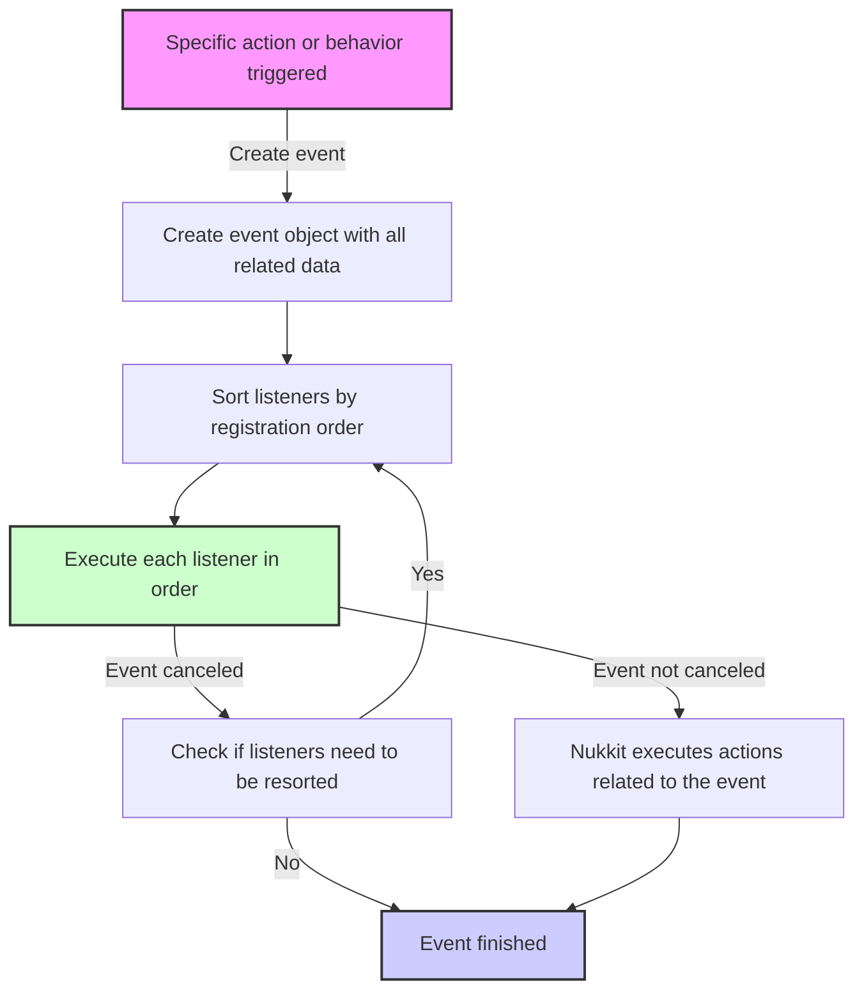

# Event Guide

```mermaid
graph TD;
    A[Specific action or behavior triggered] -->|Create event| B[Create event object with all related data]
    B --> D[Sort listeners by registration order]
    D --> C[Execute each listener in order]
    C -->|Event canceled| F[Check if listeners need to be resorted]
    F -->|Yes| D
    F -->|No| Z[Event finished]
    C -->|Event not canceled| E[Nukkit executes actions related to the event]
    E --> Z
    style A fill:#f9f,stroke:#333,stroke-width:2px
    style C fill:#cfc,stroke:#333,stroke-width:2px
    style Z fill:#ccf,stroke:#333,stroke-width:2px
```