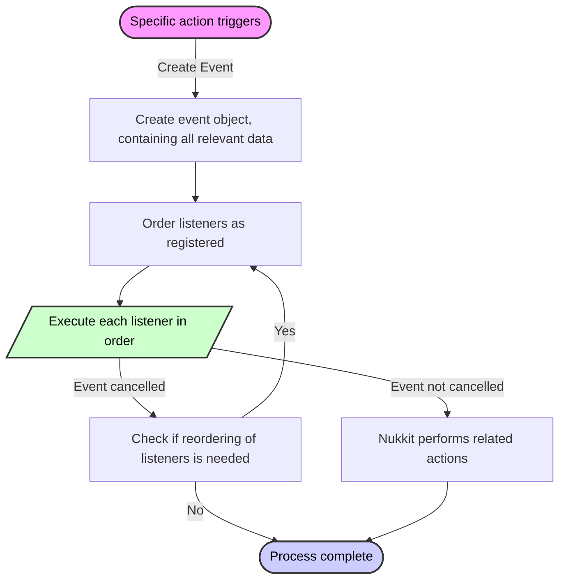

# Event Guide

## Event Concept

In the server environment, whenever specific actions occur, an event object is generated.

Events describe actions such as player logins, player departures, and message transmissions. Various actions correspond to event objects abstracting these actions, containing key information like player objects and message strings in the **Player Message Event**. The player object includes details like the player’s location, health, and inventory.

Plugins can register listeners with Nukkit-MOT to react when events occur.

Event objects contain a description of the event, and listeners are usually called before the event takes place, allowing them to cancel the event to prevent it from actually occurring. If no listeners cancel the event, it will occur within the game.

Listener execution is single-threaded; all listeners must provide their priority when registering with Nukkit-MOT, which then orders the listeners by priority and executes them in sequence.

:::note

Single-threading means you should not perform time-consuming operations during events, as this can affect server performance.

:::

It's possible that an event may be cancelled before your plugin's listener executes, but generally, this does not affect the execution of your listener. You can check if an event is cancelled with `event.isCancelled()`.

:::warning

Note that the higher the priority, the later the listener executes.
That is, the lower the priority, the sooner it executes!

:::

### Flowchart
<div style={{textAlign: 'center'}}>

</div>

## Event Listeners

Event listeners are a crucial component in game server plugin development, used to handle various events within the game. This section will detail how to abstract and implement an event listener, set its priority, and register it to effectively respond to server and player activities within a Nukkit plugin.

### Implementing Listener

Creating an event listener involves implementing the `Listener` interface and using the `@EventHandler` annotation to mark methods that should be called when specific events occur. Here is a specific implementation example for a server command event:

```java title="EventListener.java"
package cn.nukkitmot.exampleplugin;

import cn.nukkit.event.EventHandler;
import cn.nukkit.event.EventPriority;
import cn.nukkit.event.Listener;
import cn.nukkit.event.server.ServerCommandEvent;
import cn.nukkit.event.player.PlayerChatEvent;

public class EventListener implements Listener {
    private final ExamplePlugin plugin;

    public EventListener(ExamplePlugin plugin) {
        this.plugin = plugin;
    }

    @EventHandler(priority = EventPriority.NORMAL, ignoreCancelled = false)
    public void onServerCommand(ServerCommandEvent event) {
        if (event.isCancelled()) {
            return;
        }
        // Log the command to server console
        this.plugin.getLogger().info("ServerCommandEvent is called with command: " + event.getCommand());

        // Here you can add additional logic to modify the behavior based on the command
        if (event.getCommand().equalsIgnoreCase("stop")) {
            this.plugin.getLogger().info("Server stop command issued!");
            // Perform additional actions before server stops
        }
    }

    @EventHandler(priority = EventPriority.LOW, ignoreCancelled = true)
    public void onPlayerChat(PlayerChatEvent event) {
        if (event.getMessage().includes("cnm")) { // Check if the message includes "cnm"
            event.setCancelled(true);
        }
    }
}
```

In the demo code, the `onServerCommand` method executes when a server command event is triggered. Through this method, further processing of the event can be managed, such as checking the content of the command and responding accordingly.

The `onPlayerChat` method executes when a player chat event is triggered. Through this method, player-sent messages can be intercepted and processed accordingly.

### Priority

The handling priority of events is an important means of adjusting interactions between plugins. In Nukkit, events can be assigned different priorities based on their importance, as shown below:

Quoted from [cn.nukkit.event.EventPriority](https://github.com/CloudburstMC/Nukkit/blob/master/src/main/java/cn/nukkit/event/EventPriority.java)

```java title="event/EventPriority.java"
public enum EventPriority {

    /**
     * Event calls are of very low importance and should be executed first, so that other

 plugins can further customize the outcome
     */
    LOWEST(0),
    /**
     * The importance of the event call is low
     */
    LOW(1),
    /**
     * The importance of the event call is moderate, this is also the default priority.
     */
    NORMAL(2),
    /**
     * The importance of the event call is high
     */
    HIGH(3),
    /**
     * The event call is crucial and must have the final decision on the event outcome
     */
    HIGHEST(4),
    /**
     * The event is only for monitoring the outcome of the event.
     * 
     * No modifications should be made to the event at this priority level
     * 
     * Modifications refer to cancelling the event through `Event#setCancelled()` and altering the data carried by the event.
     */
    MONITOR(5);

    private final int slot;

    EventPriority(int slot) {
        this.slot = slot;
    }

    public int getSlot() {
        return slot;
    }
}
```

### Registering Listeners

Event listeners must be registered during plugin startup to ensure they can respond to events. This can be done through the plugin’s `onEnable` method:

```java title="ExamplePlugin.java"
public class ExamplePlugin extends PluginBase {
    @Override
    public void onEnable() {
        // Register the EventListener
        // highlight-start
        this.getServer().getPluginManager().registerEvents(new EventListener(this), this);
        // highlight-end
    }
}
```

In this method, we create an instance of `EventListener` and register it through the plugin manager. This ensures that whenever relevant events occur, our `EventListener` can receive and process these events.

## Conclusion

When you issue the `/stop` command, it triggers the `ServerCommandEvent`. The `onServerCommand` method will then be called, where you can implement logic to handle this event.

Similarly, when a player sends a message, the `onPlayerChat` method is invoked. If the message contains "cnm", the event is cancelled, and the player's message will not be sent in the game.