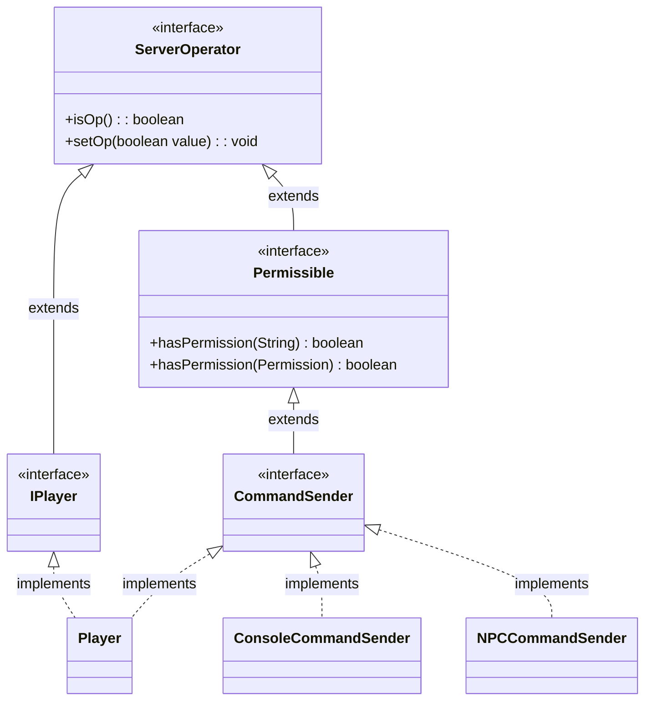

# Permissions Guide

In Nukkit-MOT plugins, permissions are key mechanisms used to control access to specific features and operations.

Permissions ensure that only authorized players can execute certain actions, thereby enhancing both the security and functionality of the plugin.

## Package Structure
Permission management in Nukkit is handled within the [cn.nukkit.permission](https://github.com/MemoriesOfTime/Nukkit-MOT/tree/master/src/main/java/cn/nukkit/permission) package.

This package is crucial as it contains the necessary classes and interfaces for implementing permission checks.

Commonly used classes include:
- [BanList](#class-banlist)
- Permissible
- [Permission](#class-permission)

Commonly used interfaces include:
- [ServerOperator](#class-serveroperator)

## Permission Class {#class-permission}
The `Permission` class plays a central role within the `cn.nukkit.permission` package. It includes default permission values used throughout the system, helping standardize the handling of permissions within plugins.

### Core Constants {#permission-static}
This class defines several core constants that represent default values in the permission system, including:
- `DEFAULT_OP`: The default permission value for operators, represented by `op`.
- `DEFAULT_NOT_OP`: The default permission value for non-operators, represented by `notop`.
- `DEFAULT_TRUE`: The default permission value for allowed access, represented by `true`.
- `DEFAULT_FALSE`: The default permission value for denied access, represented by `false`.
- `DEFAULT_PERMISSION`: If no default is specified, this permission (which is the `op` of DEFAULT_OP) is used.

### Main Constructors and Methods
- **Constructors**: The `Permission` class offers several constructors, allowing for the setting of name, description, default value, and child permissions upon creation.
- `getByName(String value)`: This static method returns the corresponding default permission value via a string parameter. It supports recognition of various aliases such as `admin`, `isadmin`, `notadmin`, etc.
- `setDefault(String value)`: Sets the default value of the permission.
- `getDescription()` and `setDescription(String description)`: Get and set the description of the permission.
- `getPermissibles()`: Returns a collection of `Permissible` instances that subscribe to this permission.
- `recalculatePermissibles()`: When the default value or structure of a permission changes, this recalculates the permissions of all `Permissible` instances associated with this permission.
- `addParent(Permission permission, boolean value)`: Adds a permission as a parent to this permission, specifying the inheritance method.

### Example Usage

Here is how to register permissions and check if a player has them when the plugin starts:

```java
import cn.nukkit.permission.Permission;

public class YourPlugin extends PluginBase {
    @Override
    public void onEnable() {
        // Register custom permissions
        registerPermissions();
    }

    private void registerPermissions() {
        PluginManager pm = this.getServer().getPluginManager();
        pm.addPermission(new Permission("yourplugin.custom.permission", "Allows access to custom features", Permission.DEFAULT_TRUE));
    }

    public void checkPermission(Player player) {
        if (player.hasPermission("yourplugin.custom.permission")) {
            player.sendMessage("You have permission to access this feature.");
        } else {
            player.sendMessage("You do not have permission to access this feature.");
        }
    }
}
```

## BanList Class {#class-banlist}

The `BanList` class within the `cn.nukkit.permission` package is used to manage the server's ban list. It can be used to perform operations such as adding, removing, and checking ban status.

Unless you are writing a security-related plugin, this class is typically not used.

### Example Usage

```java
public class YourPlugin extends PluginBase {
    @Override
    public void onEnable() {
        this.getServer().getNameBans();// Get the server's player ban list
        this.getServer().getIPBans();// Get the server's IP ban list
    }
}
```

## ServerOperator Interface {#class-serveroperator}

In Nukkit, an OP (Operator) refers to a server administrator with access to privileged commands and features. This section introduces the `ServerOperator` interface, which defines methods related to managing operator status.

### Main Methods

The `ServerOperator` interface provides methods to check and set an object's operator status.

- **isOp() method:**
  - **Description:** Checks if the object is a server operator.
  - **Return Type:** `boolean`
  - **Return Value:** Returns `true` if the object is an operator, otherwise `false`.

- **setOp(boolean value) method:**
  - **Description:** Sets or removes the operator status of an object.
  - **Parameters:**


    - `value` (`boolean`): `true` to grant operator status, `false` to revoke it.

### Relationship Diagram



### Example Usage

Here's how to use the `ServerOperator` interface in plugin code:

```java
import cn.nukkit.permission.ServerOperator;

public class MyPluginCommandExecutor implements CommandExecutor {

    @Override
    public boolean onCommand(CommandSender sender, Command command, String label, String[] args) {
        if (sender.isOp()) {
            // Perform operations allowed for operators
            sender.sendMessage("You are an operator.");
        } else {
            // Handle non-operator actions
            sender.sendMessage("You are not an operator.");
        }
        return true;
    }
}
```

## Tips

### Registering Permission Nodes with plugin.yml

Nukkit-MOT's `plugin.yml` inherits the excellent design of Bukkit, allowing you to quickly register plugin permission nodes by simply editing the yml file.

Here is an example showing how to register permissions to control the functionality of a pet management plugin:

```yml title="plugin.yml"
permissions:
  pets.command:
    description: "Allows user to manage own pets"
    default: op
  pets.manage:
    description: "Allows user to manage all pets"
    default: op
  pets.call:
    description: "Allows user to call a pet"
    default: true
```

In this example:

- The `pets.command` permission allows players to manage their own pets, but by default, only operators (OP) have this permission.
- The `pets.manage` permission allows players to manage all pets, again by default, only operators (OP) have this permission.
- The `pets.call` permission allows players to call a pet, and by default, anyone has this permission.
- The `default` value used can refer to the [Core Constants of the Permission Class](#permission-static)

# Conclusion

As ordinary developers, we generally use `plugin.yml` to register permission nodes.

Later, before performing operations, use the `hasPermission(String permission)` method to ensure players have the required permissions.