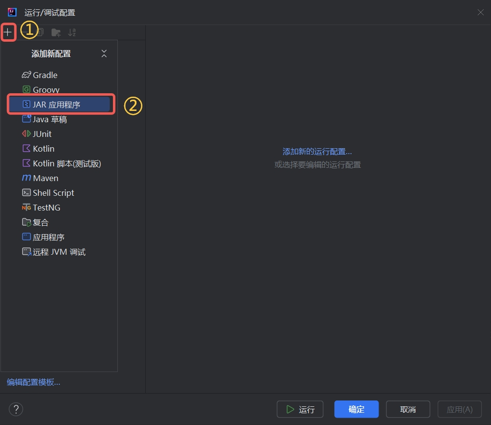

# Debug Your Plugin

During the plugin development process, you will often encounter challenges such as logic errors in the code, compatibility issues with other components, performance bottlenecks, and so on.

Using breakpoints effectively can help us quickly analyze and locate issues.

Plugin debugging requires editing the `Run/Debug Configurations` in IntelliJ IDEA beforehand.

## Editing Debug Configurations

1. Open your project in IntelliJ IDEA.

2. In the top bar, open the `Run/Debug Configurations` window.
3. Choose the `JAR Application` template.

4. Edit the configuration settings as follows:

| Field | Description |
| --- | --- |
| Name | Nukkit-MOT |
| JAR Path | Specify the full path to `Nukkit-MOT-SNAPSHOT.jar` |
| Working Directory | Specify the folder path where `Nukkit-MOT` server is located |
| JRE | Choose Java 17 Runtime |

Finally, click `OK`.

## Automatically Updating the Plugin After Successful Build

With the above steps completed, you can now use the `Shift + F9` shortcut to debug your code.

However, for convenience, we want to automatically update the plugin after each successful build.