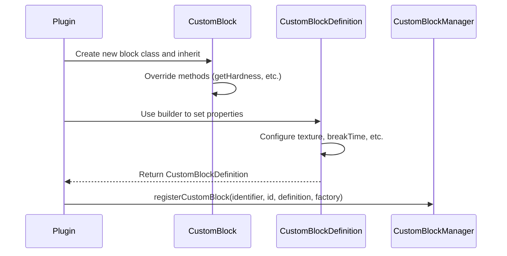

import FolderView from '@site/src/components/FolderView';

# Custom Block

:::danger Prerequisites: Bin Data Files

Before using custom blocks, you must download and place the Bin data files in your server directory:

1. Download from [Bin_Data Repository](https://github.com/MemoriesOfTime/Bin_Data)
2. Place the `bin` folder in your server root directory

Your server directory should look like:
```
NukkitServer/
├── bin/                          ← Required for custom blocks
│   ├── vanilla_palette_xxx.nbt
│   └── ...
├── plugins/
├── worlds/
└── Nukkit-MOT-SNAPSHOT.jar
```

Without these files, custom block registration will fail.

:::

To create a custom block, you need to include two main components:

1. Successfully register the block within the plugin to Nukkit-MOT.
2. Define the block textures in the resource pack to send to the client.

Next, using a **Custom Stone Block** as an example, I'll demonstrate the steps to create a custom block.

## Registering the Block in the Plugin \{#register-block-in-plugin}

Follow this sequence diagram for the registration process:



### Creating the New Block Class \{#create-new-block-class}

Within the plugin, create a new class `MyCustomStone`, inheriting from `CustomBlock`:

```java title="custom/block/MyCustomStone.java"
package cn.nukkitmot.exampleplugin.custom.block;

import cn.nukkit.block.custom.container.CustomBlock;

public class MyCustomStone extends CustomBlock {
    // highlight-start
    public static final String IDENTIFIER = "myplugin:custom_stone";
    public static final int BLOCK_ID = 10001; // Must be >= 10000

    public MyCustomStone() {
        super(IDENTIFIER, BLOCK_ID);
    }

    @Override
    public String getName() {
        return "Custom Stone";
    }

    @Override
    public double getHardness() {
        return 1.5;
    }

    @Override
    public double getResistance() {
        return 6.0;
    }

    @Override
    public int getToolType() {
        return ItemTool.TYPE_PICKAXE;
    }
    // highlight-end
}
```

### Key Classes Overview \{#key-classes-overview}

#### CustomBlock vs CustomBlockMeta

Nukkit-MOT provides two base classes for custom blocks:

- **CustomBlock** - For simple blocks without custom properties (like stone, dirt)
- **CustomBlockMeta** - For blocks with custom properties/states (like redstone lamp with on/off state)

### Registering the Block \{#register-block}

Register the block in your plugin's `onEnable` method:

```java title="ExamplePlugin.java"
import cn.nukkit.block.custom.CustomBlockManager;
import cn.nukkit.block.custom.CustomBlockDefinition;
import cn.nukkit.math.Vector3f;
import cn.nukkitmot.exampleplugin.custom.block.MyCustomStone;

public class ExamplePlugin extends PluginBase {
    @Override
    public void onEnable() {
        // highlight-start
        CustomBlockManager.get().registerCustomBlock(
            MyCustomStone.IDENTIFIER,
            MyCustomStone.BLOCK_ID,
            CustomBlockDefinition.builder(new MyCustomStone())
                .name("Custom Stone")
                .texture("custom_stone")
                .breakTime(1.5)
                .collisionBox(new Vector3f(-8, 0, -8), new Vector3f(16, 16, 16))
                .selectionBox(new Vector3f(-8, 0, -8), new Vector3f(16, 16, 16))
                .creativeGroup("itemGroup.name.stoneBrick")
                .creativeCategory(CreativeItemCategory.CONSTRUCTION)
                .build(),
            MyCustomStone::new
        );
        // highlight-end
    }
}
```

:::danger Critical: Plugin Load Order

Your plugin **must** be configured with `load: STARTUP` in `plugin.yml`:

```yaml title="plugin.yml"
name: MyPlugin
main: cn.example.MyPlugin
version: 1.0.0
# highlight-next-line
load: STARTUP
```

This is because custom blocks must be registered **before** `CustomBlockManager.closeRegistry()` is called. The server startup sequence is:

1. `enablePlugins(STARTUP)` → Calls `onEnable()` for STARTUP plugins
2. `CustomBlockManager.closeRegistry()` → **Closes registration, generates palette**
3. `enablePlugins(POSTWORLD)` → Calls `onEnable()` for POSTWORLD plugins

If your plugin uses the default `load: POSTWORLD`, the block registry will already be closed when `onEnable()` is called, and registration will fail.

:::

:::warning Other Notes

1. Custom block IDs must be >= 10000 (`CustomBlockManager.LOWEST_CUSTOM_BLOCK_ID`)
2. The identifier should follow the format `namespace:block_name`

:::

### CustomBlockDefinition Builder Methods \{#customblockdefinition-builder}

From [cn.nukkit.block.custom.CustomBlockDefinition](https://github.com/MemoriesOfTime/Nukkit-MOT/blob/master/src/main/java/cn/nukkit/block/custom/CustomBlockDefinition.java):

#### Basic Properties \{#basic-properties}

| Method | Description |
|--------|-------------|
| `name(String name)` | Set the display name |
| `texture(String texture)` | Set the texture identifier |
| `breakTime(double second)` | Set mining time in seconds |

#### Collision and Selection Box \{#collision-selection-box}

```java
// Full block collision
.collisionBox(new Vector3f(-8, 0, -8), new Vector3f(16, 16, 16))
.selectionBox(new Vector3f(-8, 0, -8), new Vector3f(16, 16, 16))

// Half slab collision
.collisionBox(new Vector3f(-8, 0, -8), new Vector3f(16, 8, 16))
```

The origin is at the center-bottom of the block. Size is in 1/16 units (pixels).

#### Creative Inventory \{#creative-inventory}

```java
.creativeCategory(CreativeItemCategory.CONSTRUCTION)
.creativeGroup("itemGroup.name.stoneBrick")
// Or use combined method:
.creativeGroupAndCategory(CreativeItemGroup.STONE_BRICK, CreativeItemCategory.CONSTRUCTION)
```

#### Geometry Model \{#geometry-model}

```java
// Use geometry identifier
.geometry("geometry.custom_model")

// Or use Geometry object with bone visibility
.geometry(new Geometry("geometry.custom_model")
    .boneVisibility("bone1", true)
    .boneVisibility("bone2", "query.block_property('myplugin:active') == 1"))
```

#### Transformation \{#transformation}

```java
import cn.nukkit.block.custom.container.data.Transformation;
import cn.nukkit.math.Vector3;

// Rotation must be multiples of 90 degrees
.transformation(new Transformation(
    new Vector3(0, 0, 0),     // translation
    new Vector3(1, 1, 1),     // scale
    new Vector3(0, 90, 0)     // rotation (90 degree increments)
))

// Simple rotation
.rotation(new Vector3f(0, 90, 0))
```

#### Materials (Multi-face Textures) \{#materials}

```java
import cn.nukkit.block.custom.container.data.Materials;

.materials(Materials.builder()
    .up(Materials.RenderMethod.OPAQUE, "grass_top")
    .down(Materials.RenderMethod.OPAQUE, "dirt")
    .any(Materials.RenderMethod.OPAQUE, "grass_side")
    .build())
```

**RenderMethod options:**
- `OPAQUE` - Fully opaque (default)
- `BLEND` - Transparent with blending (like glass)
- `ALPHA_TEST` - Binary transparency (like leaves)

## Blocks with Properties \{#blocks-with-properties}

For blocks that need to store state (like a lamp that can be on/off), use `CustomBlockMeta` with `BlockProperties`.

### Creating a Block with Properties \{#create-block-with-properties}

```java title="custom/block/MyLamp.java"
package cn.nukkitmot.exampleplugin.custom.block;

import cn.nukkit.block.custom.container.CustomBlockMeta;
import cn.nukkit.block.custom.properties.BlockProperties;
import cn.nukkit.block.custom.properties.BooleanBlockProperty;

public class MyLamp extends CustomBlockMeta {
    // highlight-start
    public static final String IDENTIFIER = "myplugin:my_lamp";
    public static final int BLOCK_ID = 10002;

    // Define the property
    public static final BooleanBlockProperty LIT =
        new BooleanBlockProperty("myplugin:lit", true);

    public static final BlockProperties PROPERTIES =
        new BlockProperties(LIT);

    public MyLamp() {
        this(0);
    }

    public MyLamp(int meta) {
        super(IDENTIFIER, BLOCK_ID, PROPERTIES, meta);
    }

    // Getter and setter for the property
    public boolean isLit() {
        return getBooleanValue(LIT.getName());
    }

    public void setLit(boolean lit) {
        setBooleanValue(LIT.getName(), lit);
    }

    @Override
    public int getLightLevel() {
        return isLit() ? 15 : 0;
    }
    // highlight-end
}
```

### Registering Block with Properties \{#register-block-with-properties}

```java title="ExamplePlugin.java"
CustomBlockManager.get().registerCustomBlock(
    MyLamp.IDENTIFIER,
    MyLamp.BLOCK_ID,
    MyLamp.PROPERTIES,
    CustomBlockDefinition.builder(new MyLamp())
        .name("My Lamp")
        .texture("my_lamp_off")
        .breakTime(0.3)
        // Use permutations for different states
        .permutation(new Permutation(
            Materials.builder().any(Materials.RenderMethod.OPAQUE, "my_lamp_on").build(),
            "query.block_property('myplugin:lit') == 1"
        ))
        .build(),
    MyLamp::new  // Factory that accepts meta parameter
);
```

### Property Types \{#property-types}

#### BooleanBlockProperty \{#boolean-property}

```java
// Simple on/off state
BooleanBlockProperty powered = new BooleanBlockProperty("myplugin:powered", true);
```

#### IntBlockProperty \{#int-property}

```java
// Range of values (e.g., water level 0-7)
IntBlockProperty level = new IntBlockProperty("myplugin:level", true, 7, 0);

// With custom bit size
IntBlockProperty rotation = new IntBlockProperty("myplugin:rotation", true, 15, 0, 4);
```

#### EnumBlockProperty \{#enum-property}

```java
// Using string array
EnumBlockProperty<String> woodType = new EnumBlockProperty<>(
    "myplugin:wood_type",
    true,
    new String[]{"oak", "spruce", "birch", "jungle"}
);

// Using Java enum
public enum FacingDirection { NORTH, SOUTH, EAST, WEST }
EnumBlockProperty<FacingDirection> facing = new EnumBlockProperty<>(
    "myplugin:facing",
    true,
    FacingDirection.class
);
```

### Permutations (Conditional Rendering) \{#permutations}

Permutations allow different rendering based on block properties:

```java
import cn.nukkit.block.custom.container.data.Permutation;

CustomBlockDefinition.builder(new MyBlock())
    // Default state
    .texture("my_block_default")
    // When property is true, use different texture
    .permutation(new Permutation(
        Materials.builder().any(Materials.RenderMethod.OPAQUE, "my_block_active").build(),
        "query.block_property('myplugin:active') == 1"
    ))
    // Multiple permutations
    .permutations(
        new Permutation(geometry1, "query.block_property('myplugin:state') == 0"),
        new Permutation(geometry2, "query.block_property('myplugin:state') == 1"),
        new Permutation(geometry3, "query.block_property('myplugin:state') == 2")
    )
    .build()
```

## Creating the Resource Pack \{#creating-resource-pack}

### Resource Pack Directory Structure \{#resource-pack-directory}

<FolderView
    paths={[
    'Resource Pack/manifest.json',
    'Resource Pack/pack_icon.png',
    'Resource Pack/textures/terrain_texture.json',
    'Resource Pack/textures/blocks/custom_stone.png',
    'Resource Pack/textures/blocks/my_lamp_off.png',
    'Resource Pack/textures/blocks/my_lamp_on.png',
]}
>
</FolderView>

### terrain_texture.json \{#terrain_texture-json}

```json title="RP/textures/terrain_texture.json"
{
    "resource_pack_name": "myplugin",
    "texture_name": "atlas.terrain",
    "padding": 8,
    "num_mip_levels": 4,
    "texture_data": {
        "custom_stone": {
            "textures": "textures/blocks/custom_stone"
        },
        "my_lamp_off": {
            "textures": "textures/blocks/my_lamp_off"
        },
        "my_lamp_on": {
            "textures": "textures/blocks/my_lamp_on"
        }
    }
}
```

:::tip Block vs Item Textures

- Block textures use `terrain_texture.json` and `textures/blocks/` folder
- Item textures use `item_texture.json` and `textures/items/` folder

:::

### Custom Geometry Models \{#custom-geometry-models}

If using custom geometry, add the model file:

<FolderView
    paths={[
    'Resource Pack/models/blocks/custom_model.geo.json',
]}
>
</FolderView>

```json title="RP/models/blocks/custom_model.geo.json"
{
    "format_version": "1.16.0",
    "minecraft:geometry": [
        {
            "description": {
                "identifier": "geometry.custom_model",
                "texture_width": 16,
                "texture_height": 16
            },
            "bones": [
                {
                    "name": "root",
                    "pivot": [0, 0, 0],
                    "cubes": [
                        {
                            "origin": [-8, 0, -8],
                            "size": [16, 16, 16],
                            "uv": [0, 0]
                        }
                    ]
                }
            ]
        }
    ]
}
```

## Further Exploration \{#further-exploration}

### Built-in Resource Packs in Plugin \{#resource-packs-in-plugin}

Just like custom items, you can embed resource packs in your plugin. Create the `assets/resource_pack` folder within the `resources` directory.

<details>
    <summary>
      Show the resources directory structure
    </summary>
<FolderView
    paths={[
    'resources/plugin.yml',
    'resources/assets/resource_pack/manifest.json',
    'resources/assets/resource_pack/pack_icon.png',
    'resources/assets/resource_pack/textures/terrain_texture.json',
    'resources/assets/resource_pack/textures/blocks/custom_stone.png',
  ]}
>
</FolderView>
</details>

### Crafting Table Block \{#crafting-table-block}

Create a custom crafting table with its own recipe grid:

```java
import cn.nukkit.block.custom.container.data.CraftingTable;

CustomBlockDefinition.builder(new MyCraftingTable())
    .craftingTable(new CraftingTable(
        "My Crafting Table",        // Table name
        Arrays.asList("crafting_table", "my_table")  // Tags for recipes
    ))
    .build()
```

### Block Tags \{#block-tags}

Add tags to your block for compatibility with vanilla mechanics:

```java
CustomBlockDefinition.builder(new MyBlock())
    .blockTags("stone", "minecraft:mineable/pickaxe")
    .build()
```

### Custom NBT Configuration \{#custom-nbt}

For advanced configurations not covered by builder methods:

```java
CustomBlockDefinition.builder(new MyBlock())
    .texture("my_texture")
    .customBuild(nbt -> {
        // Add custom NBT data
        nbt.getCompound("components")
            .putCompound("minecraft:light_emission", new CompoundTag()
                .putInt("emission", 15));
    })
```