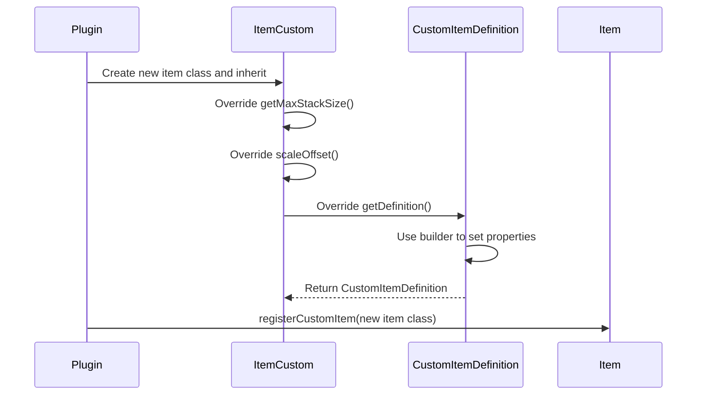

import FolderView from '@site/src/components/FolderView';

# Custom Item

To create a custom item, you need to include two main components:

1. Successfully register the item within the plugin to Nukkit-MOT.
2. Define the item textures in the resource pack to send to the client.

Next, using the **Candy Cane Sword** as an example, I'll demonstrate the steps to create a custom item.

## Registering the Item in the Plugin \{#register-item-in-plugin}

Follow this sequence diagram for the registration process:



### Creating the New Item Class \{#creat-new-item-class}

Within the plugin, create a new class `CandyCaneSword`, inheriting from ItemCustom and overriding the necessary methods:

```java title="custom/item/CandyCaneSword.java"
package cn.nukkitmot.exampleplugin.custom.item;

import cn.nukkit.item.customitem.CustomItemDefinition;
import cn.nukkit.item.customitem.ItemCustom;
import cn.nukkit.item.customitem.data.ItemCreativeCategory;
import cn.nukkit.item.customitem.data.ItemCreativeGroup;
import cn.nukkit.item.customitem.data.RenderOffsets;

public class CandyCaneSword extends ItemCustom {
    // highlight-start
    private static String spacenameId = "nukkit:candy_cane_sword";
    private static String textureName = "candy_cane_sword";
    private static String name = null;

    public CandyCaneSword() {
        super(spacenameId, name, textureName);
    }

    public int scaleOffset() {
        return 32; // Must be a multiple of 16, such as 32, 64, 128
    }

    /**
     * This method sets up the custom item definition.
     */
    @Override
    public CustomItemDefinition getDefinition() {
        return CustomItemDefinition
                .simpleBuilder(this, ItemCreativeCategory.EQUIPMENT)
                .creativeGroup(ItemCreativeGroup.SWORD)
                .allowOffHand(true)
                .handEquipped(true)
                .renderOffsets(RenderOffsets.scaleOffset(scaleOffset()))
                .build();
    }

    @Override
    public int getMaxDurability() {
        return 500;
    }

    @Override
    public int getMaxStackSize() {
        return 1;
    }

    @Override
    public int getAttackDamage() {
        return 4;
    }

    @Override
    public boolean isSword() {
        return true;
    }
    // highlight-end
}
```

### Key Methods in ItemCustom \{#key-methods-itemcustom}

From [cn.nukkit.item.customitem.ItemCustom](https://github.com/MemoriesOfTime/Nukkit-MOT/blob/master/src/main/java/cn/nukkit/item/customitem/ItemCustom.java):

We need to use `@Override` to override the following methods:

- `getMaxStackSize()`
Used to set the maximum stack size for the custom item.

- `scaleOffset()`
Used to set the texture size of the custom item, return values must be multiples of 16, such as 32, 64, 128.

- `getDefinition()`
Returns a CustomItemDefinition class that summarizes the basic attributes of the item, such as whether it is allowed in the off-hand, its category in creative mode, and enchantment effects.

### Key Methods in CustomItemDefinition \{#key-methods-customitemdefinition}

From [cn.nukkit.item.customitem.CustomItemDefinition](https://github.com/MemoriesOfTime/Nukkit-MOT/blob/master/src/main/java/cn/nukkit/item/customitem/CustomItemDefinition.java):

#### Common Builders  \{#common-builders}

- `customBuilder` - A builder for defining custom items.
- `simpleBuilder` - A builder for simple items (typically used by default).
- `toolBuilder` - A builder for tool items.
- `armorBuilder` - A builder for armor items.
- `edibleBuilder` - A builder for edible items.

Start with a builder to return a `CustomItemDefinition` class.

```java title="java"
CustomItemDefinition.simpleBuilder(ItemCustom item, ItemCreativeCategory creativeCategory);
```

#### Common Methods \{#common-methods}

Since methods directly return `this`, we can use a flattened writing style:

- `allowOffHand(boolean allowOffHand)` - Whether to allow the item to be held in the off-hand.
- `handEquipped(boolean handEquipped)` - Controls how the item is displayed in third-person view when held.
- `foil(boolean foil)` - Whether the item has an enchantment glow effect, like enchanted books.
- `creativeGroup(ItemCreativeGroup creativeGroup)` - Controls the custom item's group in the creative inventory, such as all enchanted books being in the `ItemCreativeGroup.ENCHANTED_BOOK` group.
- `canDestroyInCreative(boolean value)` - Controls whether a player holding the item can break blocks in creative mode.

### ItemCreativeGroup Key Methods \{#itemcreativegroup-key-methods}

From [cn.nukkit.item.customitem.data.ItemCreativeGroup](https://github.com/MemoriesOfTime/Nukkit-MOT/blob/master/src/main/java/cn/nukkit/item/customitem/data/ItemCreativeGroup.java):

### Registering the Item \{#register-item}

Finally, register the item in the plugin's entry class `onEnable` method:

```java title="ExamplePlugin.java"
import cn.nukkit.item.Item;
import cn.nukkitmot.exampleplugin.custom.item.CandyCaneSword;

public class ExamplePlugin extends PluginBase {
    @Override
    public void onEnable() {
        // highlight-start
        Item.registerCustomItem(CandyCaneSword.class);
        // highlight-end
    }
}
```

## Creating the Resource Pack \{#creating-resource-pack}

This tutorial will guide you on how to create a resource pack, ensuring the correct item textures are pointed to, so the custom item displays correctly in-game.

If you still see blank spaces in the creative item bar in-game, check to ensure the resource pack configuration and item texture paths are correct.

Detailed steps include:

1. Define the UUID and information for the resource pack.
2. Define the item texture paths in the resource pack.
3. Package the resource pack and place it in the server's `resource_packs` folder.

### Resource Pack Directory Structure \{#resource-pack-directory}

The resource pack directory should contain the following files:

<FolderView
    paths={[
    'Resource Pack/manifest.json',
    'Resource Pack/pack_icon.png',
    'Resource Pack/textures/item_texture.json',
    'Resource Pack/textures/texture_list.json',
    'Resource Pack/textures/items/candy_cane_sword.png',
]}
>
</FolderView>

### manifest.json \{#manifest-json}

Refer to Bedrock Wiki's explanation on [RP Manifest](https://wiki.bedrock.dev/guide/project-setup.html#rp-manifest).

```json title="RP/manifest.json"
{
    "format_version": 2,
    "header": {
        "description": "BY.nukkit-mot",
        "name": "§7Test Resource Pack",
        "uuid": "00000000-0000-0000-0000-000020160300",
        "version": [1, 1, 6],
        "min_engine_version": [1, 14, 0]
    },
    "modules": [
        {
            "type": "resources",
            "uuid": "dde211f9-e1a6-435e-9a84-06fa9242f63e",
            "version": [1, 0, 0]
        }
    ]
}
```

### item_texture.json \{#item_texture-json}

```json title="RP/textures/item_texture.json"
{
    "resource_pack_name": "nukkit-mot",
    "texture_name": "atlas.items",
    "texture_data": {
        "candy_cane_sword": {
            "textures": "textures/items/candy_cane_sword"
        }
    }
}
```

Package the resource pack and place it in the server's `resource_packs` folder. Upon entering the server, the resource pack should display normally.

:::danger Item Textures Not Displaying Correctly?

Sorry to hear that, but keep your cool. Check the following to troubleshoot:

1. If it’s not a plugin's built-in resource pack, was the pack zipped from the root directory?
> In other words, when you open the zip file, can you see the `manifest.json` file right away?

2. Did you change the file extension of the resource pack from `.zip` to `.mcpack`?
> The client doesn't support compression algorithms other than zip.

3. After updating the resource pack, did you clear the client's cache?
> Go to `Settings → Storage → Resource Packs`. If there's a cached of the resource pack, the client won't ask the server for the updated pack.

:::

## Further Exploration \{#further-exploration}

### Built-in Resource Packs in Plugin \{#resource_packs-in-plugin}

Thanks to the design of Nukkit-MOT, we can easily manage resource packs during plugin development.

Simply create a `assets/resource_pack` folder within the `resources` directory of the plugin and place the resource pack files there.

This is exactly how the [ExamplePlugin](https://github.com/MemoriesOfTime/ExamplePlugin-Maven/tree/master/src/main/resources) does it.

<details>
    <summary>
      Show the resources directory structure of ExamplePlugin
    </summary>
<FolderView
	paths={[
    'resources/plugin.yml',
    'resources/language',
    'resources/assets/resource_pack/manifest.json',
    'resources/assets/resource_pack/pack_icon.png',
    'resources/assets/resource_pack/textures/item_texture.json',
    'resources/assets/resource_pack/textures/texture_list.json',
    'resources/assets/resource_pack/textures/items/candy_cane_sword.png',
  ]}
>
</FolderView>
</details>

### Comparing with Bedrock Wiki \{#comparing-with-bedrock-wiki}

What if there is no encapsulation method in CustomItemDefinition that you need? What should you do?

We can refer directly to the Bedrock Wiki's [ItemComponents](https://wiki.bedrock.dev/items/item-components.html) documentation!

For example, allowing the off-hand.

In Nukkit-MOT's [CustomItemDefinition](https://github.com/MemoriesOfTime/Nukkit-MOT/blob/master/src/main/java/cn/nukkit/item/customitem/CustomItemDefinition.java#L203) class, the content is as follows:

```java
public class CustomItemDefinition {
    public static class SimpleBuilder {
        /**
         * Whether to allow the off-hand to have
         */
        public SimpleBuilder allowOffHand(boolean allowOffHand) {
            this.nbt.getCompound("components")
                    .getCompound("item_properties")
                    .putBoolean("allow_off_hand", allowOffHand);
            return this;
        }
    }
}
```

While Bedrock Wiki introduces [Allow Off Hand](https://wiki.bedrock.dev/items/item-components.html#allow-off-hand) like this:

```md
## Allow Off Hand

Determines whether an item can be placed in the off-hand slot of the inventory.
```
```java title="minecraft:item > components"
"minecraft:allow_off_hand": {
    "value": true
}
```

The SimpleBuilder#allowOffHand method's `this.nbt` is created within the builder, which can be referred to in Nukkit-MOT's [CustomItemDefinition.java#L171](https://github.com/MemoriesOfTime/Nukkit-MOT/blob/master/src/main/java/cn/nukkit/item/customitem/CustomItemDefinition.java#L171):

```java
    public static class SimpleBuilder {
        protected final CompoundTag nbt = new CompoundTag()


                .putCompound("components", new CompoundTag()
                        .putCompound("item_properties", new CompoundTag()
                                .putCompound("minecraft:icon", a CompoundTag())
                        )
                );
    }
```

:::note

Not all methods can achieve their effects simply by adding nbt, such as `minecraft:cooldown`, which requires the server to handle the `PlayerStartItemCoolDownPacket` to implement the item use cooldown behavior.

You can see all the supported protocol packets in [cn.nukkit.network.protocol.ProtocolInfo](https://github.com/MemoriesOfTime/Nukkit-MOT/blob/master/src/main/java/cn/nukkit/network/protocol/ProtocolInfo.java).

:::

### RenderOffsets \{#render-offsets}

The knowledge surrounding rendering offsets is extensive and complex. Currently, there are no visualization tools available, so a good spatial imagination is necessary.

References:

- [cn.nukkit.item.customitem.data.RenderOffsets](https://github.com/MemoriesOfTime/Nukkit-MOT/blob/master/src/main/java/cn/nukkit/item/customitem/data/RenderOffsets.java)
- [cn.nukkit.item.customitem.data.Offset](https://github.com/MemoriesOfTime/Nukkit-MOT/blob/master/src/main/java/cn/nukkit/item/customitem/data/Offset.java)

From the highlighted portion of the code below, it is clear that four `Offset` objects must be passed to the `RenderOffsets` class.

```java title="Excerpt from: cn.coolloong.amethyst_equipment.Item.AmethystSpear"
    @Override
    public CustomItemDefinition getDefinition() {
        return CustomItemDefinition
                .toolBuilder(this, ItemCreativeCategory.EQUIPMENT)
                .addRepairItems(List.of(Item.fromString("minecraft:amethyst_shard")), 100)
                .addRepairItems(List.of(Item.fromString("yes:amethyst_spear")), 400)
                .renderOffsets(new RenderOffsets(
                    // highlight-start
                                Offset.builder()
                                        .position(0.48f, -0.128f, -0.946f)
                                        .rotation(11.696f, -64.536f, 79.413f)
                                        .scale(0.038f, 0.037f, 0.038f),
                                Offset.builder()
                                        .position(0.258f, 0.979f, -0.541f)
                                        .rotation(-63.268f, -43.969f, 144.041f)
                                        .scale(0.094f, 0.094f, 0.094f),
                                Offset.builder()
                                        .position(-1.053f, 0.136f, -0.803f)
                                        .rotation(27.273f, 67.731f, -64.494f)
                                        .scale(0.063f, 0.063f, 0.063f),
                                Offset.builder()
                                        .position(0.258f, 0.979f, -0.541f)
                                        .rotation(-63.268f, -43.969f, 144.041f)
                                        .scale(0.094f, 0.094f, 0.094f)
                        )
                    // highlight-end
                )
                .creativeGroup("itemGroup.name.sword")
                .allowOffHand(false)
                .handEquipped(true)
                .customBuild(nbt -> {
                    nbt.getCompound("components")
                            .putCompound("minecraft:cooldown", new CompoundTag()
                                    .putString("category", "amethyst_spear")
                                    .putFloat("duration", 3f))
                            .getCompound("item_properties").putBoolean("animates_in_toolbar", true)
                            .getCompound("item_properties").putInt("use_duration", 640);
                });
    }
```

In the definition of the RenderOffsets class:

```java
public RenderOffsets(@Nullable Offset mainHandFirstPerson, @Nullable Offset mainHandThirdPerson, @Nullable Offset offHandFirstPerson, @Nullable Offset offHandThirdPerson) {}
```

It can be understood that the four parameters are:

- mainHandFirstPerson: Main hand, first-person view
- mainHandThirdPerson: Main hand, third-person view
- offHandFirstPerson: Off hand, first-person view
- offHandThirdPerson: Off hand, third-person view

More discoveries are needed...