# Custom Item

To create a custom item, you need to include two main components:

1. Successfully register the item within the plugin to Nukkit-MOT.
2. Define the item textures in the resource pack to send to the client.

Next, using the **Candy Cane Sword** as an example, I'll demonstrate the steps to create a custom item.

## Registering the Item in the Plugin

Follow this sequence diagram for the registration process:


### Creating the New Item Class

Within the plugin, create a new class `CandyCaneSword`, inheriting from ItemCustom and overriding the necessary methods:

```java title="custom/item/CandyCaneSword.java"
public static class CandyCaneSword extends ItemCustom {
    private static String stringId = "candy_cane_sword";
    public static String name = "Candy Cane Sword";

    @Override
    public int getMaxStackSize() {
        return 1;
    }

    public int scaleOffset() {
        return 32; // Must be a multiple of 16, such as 32, 64, 128
    }

    /**
     * This method sets up the custom item definition.
     */
    @Override
    public CustomItemDefinition getDefinition() {
        return CustomItemDefinition
            .simpleBuilder(this, ItemCreativeCategory.EQUIPMENT)
            .creativeGroup("itemGroup.name.item")
            .allowOffHand(false)
            .renderOffsets(RenderOffsets.scaleOffset(scaleOffset()))
            .build();
    }

    public CandyCaneSword() {
        super(stringId, name);
    }

    @Override
    public int getMaxDurability() {
        return 500;
    }
}
```

### Key Methods in ItemCustom

From [cn.nukkit.item.customitem.ItemCustom](https://github.com/MemoriesOfTime/Nukkit-MOT/blob/master/src/main/java/cn/nukkit/item/customitem/ItemCustom.java):

We need to use `@Override` to override the following methods:

- `getMaxStackSize()`
Used to set the maximum stack size for the custom item.

- `scaleOffset()`
Used to set the texture size of the custom item, return values must be multiples of 16, such as 32, 64, 128.

- `getDefinition()`
Returns a CustomItemDefinition class that summarizes the basic attributes of the item, such as whether it is allowed in the off-hand, its category in creative mode, and enchantment effects.

### Key Methods in CustomItemDefinition

From [cn.nukkit.item.customitem.CustomItemDefinition](https://github.com/MemoriesOfTime/Nukkit-MOT/blob/master/src/main/java/cn/nukkit/item/customitem/CustomItemDefinition.java):

#### Common Builders

- `customBuilder` - A builder for defining custom items.
- `simpleBuilder` - A builder for simple items (typically used by default).
- `toolBuilder` - A builder for tool items.
- `armorBuilder` - A builder for armor items.
- `edibleBuilder` - A builder for edible items.

Start with a builder to return a `CustomItemDefinition` class.

```java title="java"
CustomItemDefinition.simpleBuilder(ItemCustom item, ItemCreativeCategory creativeCategory);
```

#### Common Methods

Since methods directly return `this`, we can use a flattened writing style:

- `allowOffHand(boolean allowOffHand)` - Whether to allow the item to be held in the off-hand.
- `handEquipped(boolean handEquipped)` - Controls how the item is displayed in third-person view when held.
- `foil(boolean foil)` - Whether the item has an enchantment glow effect, like enchanted books.
- `creativeGroup(ItemCreativeGroup creativeGroup)` - Controls the custom item's group in the creative inventory, such as all enchanted books being in the `ItemCreativeGroup.ENCHANTED_BOOK` group.
- `canDestroyInCreative(boolean value)` - Controls whether a player holding the item can break blocks in creative mode.

### ItemCreativeGroup Key Methods

From [cn.nukkit.item.customitem.data.ItemCreativeGroup](https://github.com/MemoriesOfTime/Nukkit-MOT/blob/master/src/main/java/cn/nukkit/item/customitem/data/ItemCreativeGroup.java):

### Registering the Item

Finally,

 register the item in the plugin's entry class `onEnable` method:

```java title="ExamplePlugin.java"
import cn.nukkit.item.Item;

@Override
public void onEnable() {
    Item.registerCustomItem(CandyCaneSword.class);
}
```

## Creating the Resource Pack

This tutorial will guide you on how to create a resource pack, ensuring the correct item textures are pointed to, so the custom item displays correctly in-game.

If you still see blank spaces in the creative item bar in-game, check to ensure the resource pack configuration and item texture paths are correct.

Detailed steps include:

1. Define the UUID and information for the resource pack.
2. Define the item texture paths in the resource pack.
3. Package the resource pack and place it in the server's `resource_packs` folder.

### Resource Pack Directory Structure

The resource pack directory should contain the following files:

```mermaid
graph TD;
    RP("📁 Resource Pack") --> manifest["📄 manifest.json"];
    RP --> pack_icon["📄 pack_icon.png"];
    RP --> textures("📁 textures");
    textures --> item_texture["📄 item_texture.json"];
    RP --> items("📁 items");
    items --> candy_cane_sword["📄 candy_cane_sword.png"];
```



### manifest.json

Refer to Bedrock Wiki's explanation on [RP Manifest](https://wiki.bedrock.dev/guide/project-setup.html#rp-manifest).

```json title="RP/manifest.json"
{
    "format_version": 2,
    "header": {
        "description": "BY.nukkit-mot",
        "name": "§7Test Resource Pack",
        "uuid": "00000000-0000-0000-0000-000020160300",
        "version": [1, 1, 6],
        "min_engine_version": [1, 14, 0]
    },
    "modules": [
        {
            "type": "resources",
            "uuid": "dde211f9-e1a6-435e-9a84-06fa9242f63e",
            "version": [1, 0, 0]
        }
    ]
}
```

### item_texture.json

```json title="RP/textures/item_texture.json"
{
    "resource_pack_name": "nukkit-mot",
    "texture_name": "atlas.items",
    "texture_data": {
        "candy_cane_sword": {
            "textures": "textures/items/candy_cane_sword"
        }
    }
}
```

Package the resource pack and place it in the server's `resource_packs` folder. Upon entering the server, the resource pack should display normally.

:::note

When packaging the resource pack, it should be done from the root directory, otherwise, the client will not be able to read the resource pack.

The root directory refers to the level at which the `manifest.json` file is located.

:::

## Further Exploration

### Comparing with Bedrock Wiki

What if there is no encapsulation method in CustomItemDefinition that you need? What should you do?

We can refer directly to the Bedrock Wiki's [ItemComponents](https://wiki.bedrock.dev/items/item-components.html) documentation!

For example, allowing the off-hand.

In Nukkit-MOT's [CustomItemDefinition](https://github.com/MemoriesOfTime/Nukkit-MOT/blob/master/src/main/java/cn/nukkit/item/customitem/CustomItemDefinition.java#L203) class, the content is as follows:

```java
public class CustomItemDefinition {
    public static class SimpleBuilder {
        /**
         * Whether to allow the off-hand to have
         */
        public SimpleBuilder allowOffHand(boolean allowOffHand) {
            this.nbt.getCompound("components")
                    .getCompound("item_properties")
                    .putBoolean("allow_off_hand", allowOffHand);
            return this;
        }
    }
}

While Bedrock Wiki introduces [Allow Off Hand](https://wiki.bedrock.dev/items/item-components.html#allow-off-hand) like this:

```md
## Allow Off Hand

Determines whether an item can be placed in the off-hand slot of the inventory.
```
```java title="minecraft:item > components"
"minecraft:allow_off_hand": {
    "value": true
}
```

The SimpleBuilder#allowOffHand method's `this.nbt` is created within the builder, which can be referred to in Nukkit-MOT's [CustomItemDefinition.java#L171](https://github.com/MemoriesOfTime/Nukkit-MOT/blob/master/src/main/java/cn/nukkit/item/customitem/CustomItemDefinition.java#L171):

```java
    public static class SimpleBuilder {
        protected final CompoundTag nbt = new CompoundTag()


                .putCompound("components", new CompoundTag()
                        .putCompound("item_properties", new CompoundTag()
                                .putCompound("minecraft:icon", a CompoundTag())
                        )
                );
    }
```

:::note

Not all methods can achieve their effects simply by adding nbt, such as `minecraft:cooldown`, which requires the server to handle the `PlayerStartItemCoolDownPacket` to implement the item use cooldown behavior.

You can see all the supported protocol packets in [cn.nukkit.network.protocol.ProtocolInfo](https://github.com/MemoriesOfTime/Nukkit-MOT/blob/master/src/main/java/cn/nukkit/network/protocol/ProtocolInfo.java).

:::