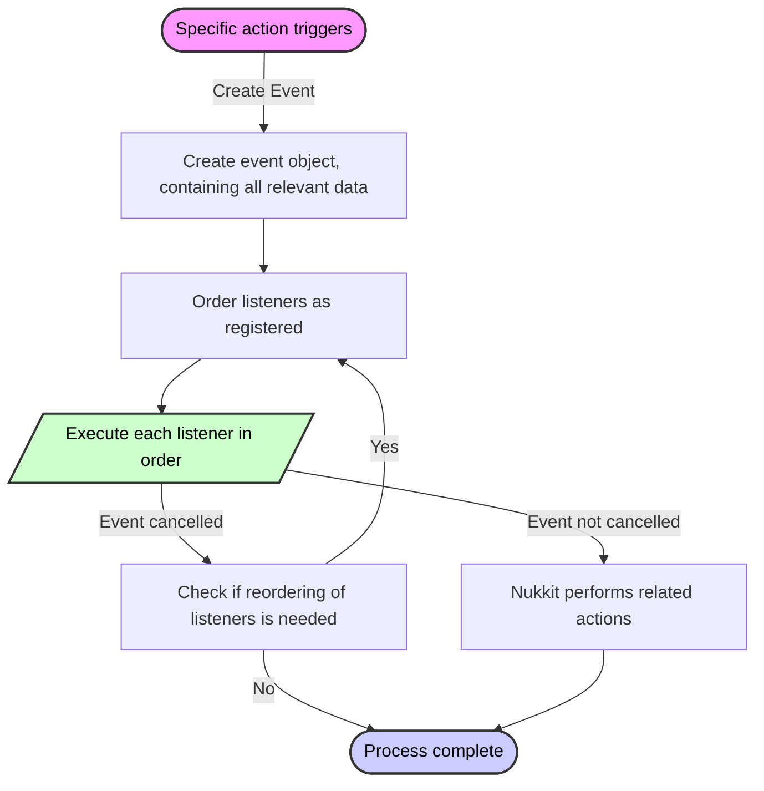

# Руководство по событиям

## Понятие события \{#event-concept}

В среде сервера при каждом возникновении определённых действий создаётся объект события.

События описывают такие действия, как вход игроков в игру, их выход и передача сообщений. Различным действиям соответствуют объекты событий, абстрагирующие эти действия и содержащие ключевую информацию — например, в **событии сообщения игрока** это объект игрока и строка сообщения. Объект игрока включает такие сведения, как местоположение игрока, здоровье и инвентарь.

Плагины могут регистрировать слушателей в Nukkit-MOT, чтобы реагировать на возникновение событий.

Объекты событий содержат описание события, а слушатели обычно вызываются до того, как событие произойдёт, что позволяет им отменить событие и предотвратить его фактическое наступление. Если ни один слушатель не отменит событие, оно произойдёт в игре.

Выполнение слушателей однопоточное; все слушатели при регистрации в Nukkit-MOT должны указать свой приоритет, после чего Nukkit-MOT упорядочивает слушателей по приоритету и выполняет их по очереди.

:::note

Однопоточность означает, что не следует выполнять длительные операции во время обработки событий, так как это может повлиять на производительность сервера.

:::

Возможно, что событие будет отменено до выполнения слушателя вашего плагина, но обычно это не влияет на выполнение вашего слушателя. Проверить, отменено ли событие, можно с помощью `event.isCancelled()`.

:::warning

Обратите внимание: чем выше приоритет, тем позже выполняется слушатель.
То есть чем ниже приоритет, тем раньше он выполняется!

:::

### Блок-схема \{#flowchart}
<div style={{textAlign: 'center'}}>

</div>

## Слушатели событий \{#event-listeners}

Слушатели событий — ключевой компонент при разработке плагинов для игровых серверов, используемый для обработки различных событий в игре. В этом разделе подробно описано, как абстрагировать и реализовать слушателя событий, задать его приоритет и зарегистрировать его, чтобы эффективно реагировать на активность сервера и игроков в плагине для Nukkit.

### Реализация интерфейса Listener \{#implementing-listener}

Создание слушателя событий заключается в реализации интерфейса `Listener` и использовании аннотации `@EventHandler` для пометки методов, которые должны вызываться при наступлении определённых событий. Вот конкретный пример реализации для события серверной команды:

```java title="EventListener.java"
package cn.nukkitmot.exampleplugin;

import cn.nukkit.event.EventHandler;
import cn.nukkit.event.EventPriority;
import cn.nukkit.event.Listener;
import cn.nukkit.event.server.ServerCommandEvent;
import cn.nukkit.event.player.PlayerChatEvent;

public class EventListener implements Listener {
    private final ExamplePlugin plugin;

    public EventListener(ExamplePlugin plugin) {
        this.plugin = plugin;
    }

    @EventHandler(priority = EventPriority.NORMAL, ignoreCancelled = false)
    public void onServerCommand(ServerCommandEvent event) {
        if (event.isCancelled()) {
            return;
        }
        // Log the command to server console
        this.plugin.getLogger().info("ServerCommandEvent is called with command: " + event.getCommand());

        // Here you can add additional logic to modify the behavior based on the command
        if (event.getCommand().equalsIgnoreCase("stop")) {
            this.plugin.getLogger().info("Server stop command issued!");
            // Perform additional actions before server stops
        }
    }

    @EventHandler(priority = EventPriority.LOW, ignoreCancelled = true)
    public void onPlayerChat(PlayerChatEvent event) {
        if (event.getMessage().contains("cnm")) { // Check if the message includes "cnm"
            event.setCancelled(true);
        }
    }
}
```

В демонстрационном коде метод `onServerCommand` выполняется при срабатывании события серверной команды. С помощью этого метода можно организовать дополнительную обработку события — например, проверить содержимое команды и соответствующим образом отреагировать.

Метод `onPlayerChat` выполняется при срабатывании события чата игрока. С его помощью можно перехватывать отправленные игроками сообщения и обрабатывать их соответствующим образом.

### Приоритет \{#priority}

Приоритет обработки событий — важное средство настройки взаимодействия между плагинами. В Nukkit событиям можно назначать разные приоритеты в зависимости от их важности, как показано ниже:

Цитата из [cn.nukkit.event.EventPriority](https://github.com/CloudburstMC/Nukkit/blob/master/src/main/java/cn/nukkit/event/EventPriority.java)

```java title="event/EventPriority.java"
public enum EventPriority {

    /**
     * Event calls are of very low importance and should be executed first, so that other

 plugins can further customize the outcome
     */
    LOWEST(0),
    /**
     * The importance of the event call is low
     */
    LOW(1),
    /**
     * The importance of the event call is moderate, this is also the default priority.
     */
    NORMAL(2),
    /**
     * The importance of the event call is high
     */
    HIGH(3),
    /**
     * The event call is crucial and must have the final decision on the event outcome
     */
    HIGHEST(4),
    /**
     * The event is only for monitoring the outcome of the event.
     * 
     * No modifications should be made to the event at this priority level
     * 
     * Modifications refer to cancelling the event through `Event#setCancelled()` and altering the data carried by the event.
     */
    MONITOR(5);

    private final int slot;

    EventPriority(int slot) {
        this.slot = slot;
    }

    public int getSlot() {
        return slot;
    }
}
```

### Регистрация слушателей \{#registering-listeners}

Слушатели событий должны быть зарегистрированы при запуске плагина, чтобы иметь возможность реагировать на события. Это можно сделать в методе `onEnable` плагина:

```java title="ExamplePlugin.java"
public class ExamplePlugin extends PluginBase {
    @Override
    public void onEnable() {
        // Register the EventListener
        // highlight-start
        this.getServer().getPluginManager().registerEvents(new EventListener(this), this);
        // highlight-end
    }
}
```

В этом методе мы создаём экземпляр `EventListener` и регистрируем его через менеджер плагинов. Это гарантирует, что при возникновении соответствующих событий наш `EventListener` сможет получать и обрабатывать их.

## Заключение \{#conclusion}

Когда вы выполняете команду `/stop`, срабатывает `ServerCommandEvent`. Затем будет вызван метод `onServerCommand`, в котором можно реализовать логику обработки этого события.

Аналогично, когда игрок отправляет сообщение, вызывается метод `onPlayerChat`. Если сообщение содержит «cnm», событие отменяется, и сообщение игрока не будет отправлено в игре.
