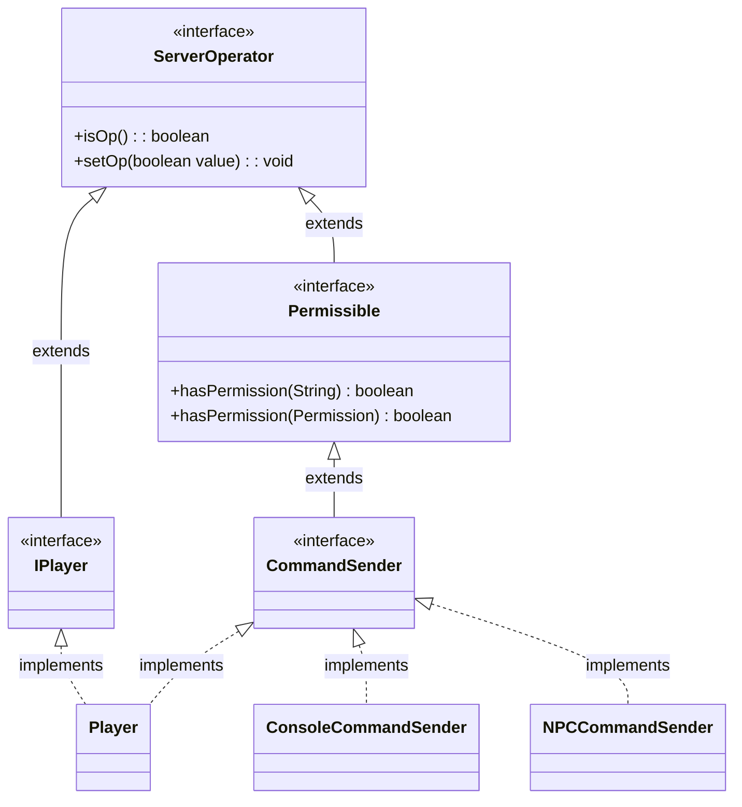

# Руководство по правам

В плагинах Nukkit-MOT права — это ключевые механизмы, используемые для контроля доступа к определённым функциям и операциям.

Права гарантируют, что только уполномоченные игроки могут выполнять определённые действия, что повышает как безопасность, так и функциональность плагина.

## Структура пакета \{#package-structure}
Управление правами в Nukkit осуществляется в пакете [cn.nukkit.permission](https://github.com/MemoriesOfTime/Nukkit-MOT/tree/master/src/main/java/cn/nukkit/permission).

Этот пакет имеет важное значение, поскольку содержит необходимые классы и интерфейсы для реализации проверки прав.

Часто используемые классы:
- [BanList](#class-banlist)
- Permissible
- [Permission](#class-permission)

Часто используемые интерфейсы:
- [ServerOperator](#class-serveroperator)

## Класс Permission \{#class-permission}
Класс `Permission` играет центральную роль в пакете `cn.nukkit.permission`. Он содержит значения прав по умолчанию, используемые во всей системе, что помогает унифицировать работу с правами в плагинах.

### Основные константы \{#permission-static}
Этот класс определяет несколько ключевых констант, представляющих значения по умолчанию в системе прав:
- `DEFAULT_OP`: значение права по умолчанию для операторов, обозначается как `op`.
- `DEFAULT_NOT_OP`: значение права по умолчанию для не-операторов, обозначается как `notop`.
- `DEFAULT_TRUE`: значение права по умолчанию для разрешённого доступа, обозначается как `true`.
- `DEFAULT_FALSE`: значение права по умолчанию для запрещённого доступа, обозначается как `false`.
- `DEFAULT_PERMISSION`: если значение по умолчанию не указано, используется это право (оно равно `op` из DEFAULT_OP).

### Основные конструкторы и методы \{#main-constructors-and-methods}
- **Конструкторы**: класс `Permission` предоставляет несколько конструкторов, позволяющих задать при создании имя, описание, значение по умолчанию и дочерние права.
- `getByName(String value)`: этот статический метод возвращает соответствующее значение права по умолчанию по строковому параметру. Поддерживается распознавание различных псевдонимов, таких как `admin`, `isadmin`, `notadmin` и т. д.
- `setDefault(String value)`: устанавливает значение права по умолчанию.
- `getDescription()` и `setDescription(String description)`: получают и устанавливают описание права.
- `getPermissibles()`: возвращает коллекцию экземпляров `Permissible`, подписанных на это право.
- `recalculatePermissibles()`: при изменении значения по умолчанию или структуры права пересчитывает права всех экземпляров `Permissible`, связанных с этим правом.
- `addParent(Permission permission, boolean value)`: добавляет право как родительское для данного права, определяя способ наследования.

### Пример использования \{#example-usage-permission}

Вот как зарегистрировать права при запуске плагина и проверить, есть ли они у игрока:

```java
import cn.nukkit.permission.Permission;

public class YourPlugin extends PluginBase {
    @Override
    public void onEnable() {
        // Register custom permissions
        registerPermissions();
    }

    private void registerPermissions() {
        PluginManager pm = this.getServer().getPluginManager();
        pm.addPermission(new Permission("yourplugin.custom.permission", "Allows access to custom features", Permission.DEFAULT_TRUE));
    }

    public void checkPermission(Player player) {
        if (player.hasPermission("yourplugin.custom.permission")) {
            player.sendMessage("You have permission to access this feature.");
        } else {
            player.sendMessage("You do not have permission to access this feature.");
        }
    }
}
```

## Класс BanList \{#class-banlist}

Класс `BanList` из пакета `cn.nukkit.permission` используется для управления списком банов сервера. С его помощью можно выполнять такие операции, как добавление, удаление и проверка статуса бана.

Если вы не пишете плагин, связанный с безопасностью, этот класс обычно не используется.

### Пример использования \{#example-usage-banlist}

```java
public class YourPlugin extends PluginBase {
    @Override
    public void onEnable() {
        this.getServer().getNameBans();// Get the server's player ban list
        this.getServer().getIPBans();// Get the server's IP ban list
    }
}
```

## Интерфейс ServerOperator \{#class-serveroperator}

В Nukkit OP (оператор) — это администратор сервера, имеющий доступ к привилегированным командам и функциям. В этом разделе представлен интерфейс `ServerOperator`, определяющий методы, связанные с управлением статусом оператора.

### Основные методы \{#main-methods-serveroperator}

Интерфейс `ServerOperator` предоставляет методы для проверки и установки статуса оператора у объекта.

- **Метод isOp():**
  - **Описание:** проверяет, является ли объект оператором сервера.
  - **Тип возвращаемого значения:** `boolean`
  - **Возвращаемое значение:** возвращает `true`, если объект является оператором, иначе `false`.

- **Метод setOp(boolean value):**
  - **Описание:** устанавливает или снимает статус оператора у объекта.
  - **Параметры:**


    - `value` (`boolean`): `true` — выдать статус оператора, `false` — отозвать его.

### Диаграмма отношений \{#relationship-diagram}



### Пример использования \{#example-usage-serveroperator}

Вот как использовать интерфейс `ServerOperator` в коде плагина:

```java
import cn.nukkit.permission.ServerOperator;

public class MyPluginCommandExecutor implements CommandExecutor {

    @Override
    public boolean onCommand(CommandSender sender, Command command, String label, String[] args) {
        if (sender.isOp()) {
            // Perform operations allowed for operators
            sender.sendMessage("You are an operator.");
        } else {
            // Handle non-operator actions
            sender.sendMessage("You are not an operator.");
        }
        return true;
    }
}
```

## Советы \{#tips}

### Регистрация узлов прав с помощью plugin.yml \{#registering-permission-nodes}

Файл `plugin.yml` в Nukkit-MOT наследует отличный дизайн Bukkit, позволяя быстро зарегистрировать узлы прав плагина, просто отредактировав yml-файл.

Вот пример регистрации прав для управления функциональностью плагина управления питомцами:

```yml title="plugin.yml"
permissions:
  pets.command:
    description: "Allows user to manage own pets"
    default: op
  pets.manage:
    description: "Allows user to manage all pets"
    default: op
  pets.call:
    description: "Allows user to call a pet"
    default: true
```

В этом примере:

- Право `pets.command` позволяет игрокам управлять своими питомцами, однако по умолчанию оно есть только у операторов (OP).
- Право `pets.manage` позволяет игрокам управлять всеми питомцами — оно также по умолчанию есть только у операторов (OP).
- Право `pets.call` позволяет игрокам призывать питомца, и по умолчанию оно есть у всех.
- Возможные значения `default` описаны в разделе [Основные константы класса Permission](#permission-static)

## Заключение \{#conclusion}

Как обычные разработчики, мы обычно используем `plugin.yml` для регистрации узлов прав.

А затем, перед выполнением операций, используйте метод `hasPermission(String permission)`, чтобы убедиться, что у игроков есть необходимые права.
