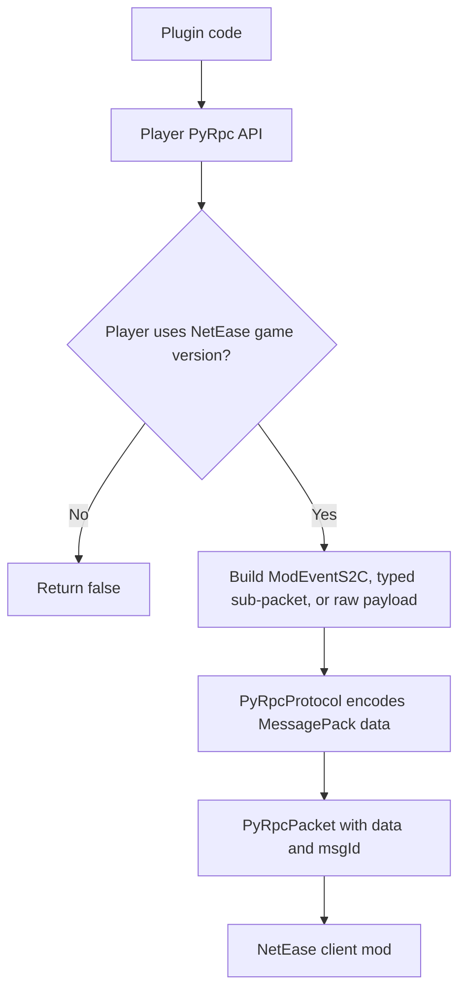
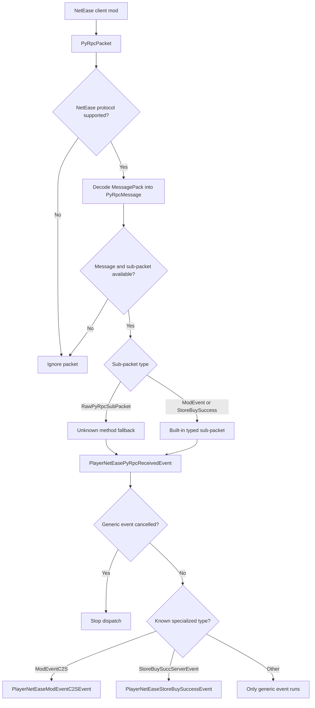
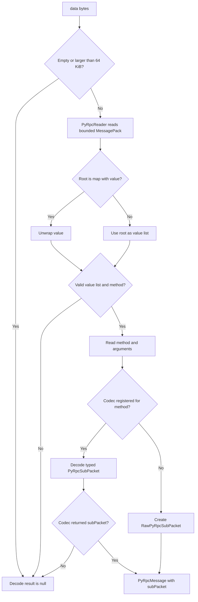
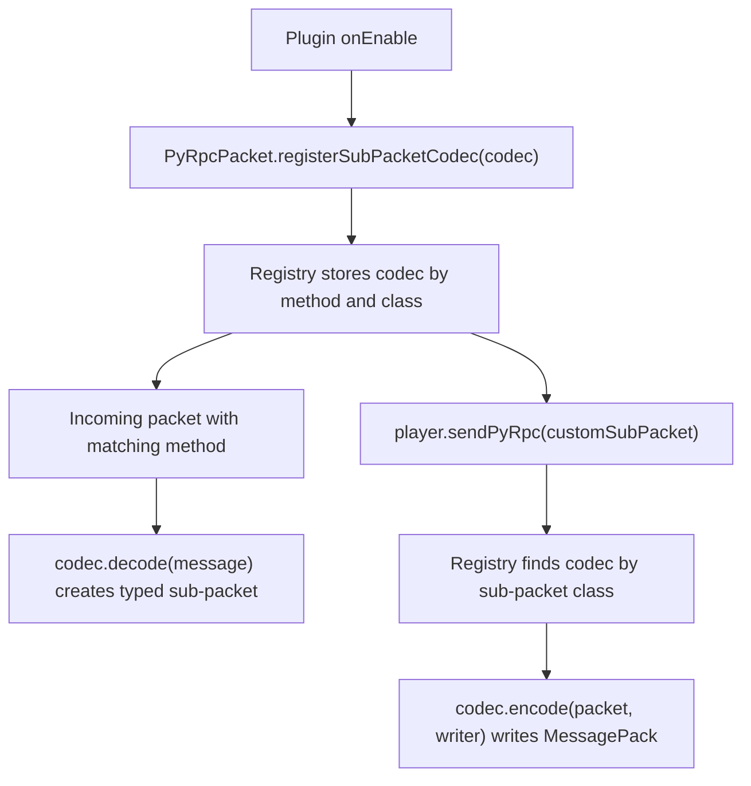

# Руководство по PyRpc

PyRpc — это доступный только для NetEase путь передачи пакетов в Nukkit-MOT для RPC-сообщений Python-скриптинга. Он в основном полезен, когда плагину нужно обмениваться пользовательскими событиями с клиентским модом NetEase или обрабатывать обратные вызовы магазина NetEase.

:::tip Область, основанная на исходном коде
Эта страница написана на основе текущего исходного кода Nukkit-MOT (коммит `1f043b3e7`), в особенности классов `Player`, `PyRpcPacket`, `PyRpcProtocol`, `PyRpcProcessor`, `PyRpcSubPacketCodec`, `ModEventPyRpcSubPacket`, `RawPyRpcSubPacket`, а также событий PyRpc игрока.
:::

## Основные правила

- PyRpc доступен только для сессий протокола NetEase.
- Процессор поддерживает протокол NetEase `V1_20_50_NETEASE` и более новые.
- `Player#sendPyRpcData(...)`, `Player#sendPyRpc(...)` и `Player#modNotifyToClient(...)` возвращают `false`, если игрок не использует игровую версию NetEase.
- Используйте `modNotifyToClient(...)` для обычных mod-событий «сервер → клиент».
- Используйте `PlayerNetEaseModEventC2SEvent` для обычных mod-событий «клиент → сервер».
- Используйте API для сырых полезных нагрузок (raw payload) только тогда, когда вы уже знаете точный метод PyRpc и структуру аргументов.

## Обзор потока выполнения

У PyRpc есть два разных направления. Исходящие пакеты начинаются в вашем плагине и отклоняются на раннем этапе, если игрок не находится в сессии протокола NetEase:



Входящие пакеты сначала декодируются, а затем диспетчеризуются через общее событие и необязательные специализированные события:



## Модель пакета

[PyRpcPacket](https://github.com/MemoriesOfTime/Nukkit-MOT/blob/master/src/main/java/cn/nukkit/network/protocol/netease/PyRpcPacket.java) содержит два значения:

| Поле | Значение |
| --- | --- |
| `data` | Полезная нагрузка PyRpc, закодированная в MessagePack |
| `msgId` | Беззнаковый 32-битный идентификатор сообщения, по умолчанию `9753608` |

Nukkit-MOT декодирует `data` в [PyRpcMessage](https://github.com/MemoriesOfTime/Nukkit-MOT/blob/master/src/main/java/cn/nukkit/network/protocol/netease/pyrpc/PyRpcMessage.java):

| Значение | Смысл |
| --- | --- |
| `method` | Имя метода PyRpc, например `ModEventC2S` |
| `arguments` | Декодированные аргументы метода |
| `rawRoot` | Исходный корневой объект декодированного MessagePack |
| `rawPayload` | Исходные байты полезной нагрузки пакета |
| `subPacket` | Типизированный `PyRpcSubPacket` либо сырой запасной вариант |

Встроенные вспомогательные средства и кодеки охватывают следующие методы:

| Метод | Направление | Типизированный пакет |
| --- | --- | --- |
| `ModEventC2S` | От клиента к серверу | `ModEventPyRpcSubPacket` |
| `ModEventS2C` | От сервера к клиенту | `ModEventPyRpcSubPacket` |
| `StoreBuySuccServerEvent` | От клиента к серверу | `StoreBuySuccessPyRpcSubPacket` |

Неизвестные декодированные методы превращаются в `RawPyRpcSubPacket`, поэтому плагины всё же могут проверить имя метода и список аргументов.

Путь декодирования намеренно консервативен:



## Отправка mod-события клиенту

Для большей части кода плагинов используйте `Player#modNotifyToClient(...)`. Этот метод создаёт пакет `ModEventS2C` и отправляет его только в том случае, если целевой игрок использует клиент NetEase.

```java title="pyrpc/DemoPyRpcSender.java"
package cn.nukkitmot.exampleplugin.pyrpc;

import cn.nukkit.Player;

import java.util.LinkedHashMap;
import java.util.Map;

public final class DemoPyRpcSender {

    public static boolean openPanel(Player player, String panelId) {
        Map<String, Object> eventData = new LinkedHashMap<>();
        eventData.put("panelId", panelId);
        eventData.put("readonly", false);

        return player.modNotifyToClient(
                "DemoMod",
                "main",
                "OpenPanelEvent",
                eventData);
    }
}
```

Проверяйте возвращаемое логическое значение. Результат `false` обычно означает, что игрок не использует игровую версию NetEase либо пакет не удалось поставить в очередь.

### Вспомогательный метод зашифрованных событий

`modNotifyToClientEncrypted(...)` — это небольшой вспомогательный метод поверх `modNotifyToClient(...)`. Он применяет вашу функцию шифрования к строке и отправляет результат как `eventData["data"]`.

```java
player.modNotifyToClientEncrypted(
        "DemoMod",
        "secure",
        "SecurePayloadEvent",
        "{\"action\":\"sync\"}",
        plainText -> encryptForClient(plainText));
```

Nukkit-MOT не определяет алгоритм шифрования. Серверный плагин и клиентский мод должны договориться о формате.

## Получение mod-событий клиента

Mod-события «клиент → сервер» приходят как `ModEventC2S`. Nukkit-MOT сначала вызывает общее событие `PlayerNetEasePyRpcReceivedEvent`, а затем срабатывает `PlayerNetEaseModEventC2SEvent` для типизированных mod-событий.

```java title="pyrpc/DemoPyRpcListener.java"
package cn.nukkitmot.exampleplugin.pyrpc;

import cn.nukkit.event.EventHandler;
import cn.nukkit.event.Listener;
import cn.nukkit.event.player.PlayerNetEaseModEventC2SEvent;

import java.util.Map;

public final class DemoPyRpcListener implements Listener {

    @EventHandler(ignoreCancelled = true)
    public void onModEvent(PlayerNetEaseModEventC2SEvent event) {
        if (!"DemoMod".equals(event.getModName())) {
            return;
        }
        if (!"main".equals(event.getSystemName())) {
            return;
        }
        if (!"SubmitPanelEvent".equals(event.getCustomEventName())) {
            return;
        }

        Map<String, Object> data = event.getEventData();
        Object rawPanelId = data.get("panelId");
        if (!(rawPanelId instanceof String panelId)) {
            event.setCancelled();
            return;
        }

        event.getPlayer().sendMessage("Submitted panel: " + panelId);
    }
}
```

Зарегистрируйте обработчик событий в своём плагине:

```java
this.getServer().getPluginManager().registerEvents(new DemoPyRpcListener(), this);
```

## Прослушивание всех сообщений PyRpc

Используйте `PlayerNetEasePyRpcReceivedEvent`, когда вам нужно проверять каждое декодированное сообщение PyRpc, включая неизвестные методы.

```java
@EventHandler(ignoreCancelled = true)
public void onAnyPyRpc(PlayerNetEasePyRpcReceivedEvent event) {
    String method = event.getMethod();
    event.getPlayer().getServer().getLogger().debug(
            "PyRpc method=" + method + ", msgId=" + event.getMsgId());
}
```

Отмена этого общего события останавливает последующее срабатывание специализированного события.

## Обработка сырых методов

Если для метода не зарегистрирован типизированный кодек, Nukkit-MOT представляет его как `RawPyRpcSubPacket`.

```java
@EventHandler(ignoreCancelled = true)
public void onRawPyRpc(PlayerNetEasePyRpcReceivedEvent event) {
    if (!(event.getSubPacket() instanceof RawPyRpcSubPacket raw)) {
        return;
    }
    if (!"CustomEngineCall".equals(raw.getMethod())) {
        return;
    }

    Object firstArgument = raw.getArguments().isEmpty() ? null : raw.getArguments().get(0);
    event.getPlayer().sendMessage("CustomEngineCall first arg = " + firstArgument);
}
```

Вы также можете отправить сырой метод с помощью `sendPyRpc(...)`:

```java
player.sendPyRpc(
        new RawPyRpcSubPacket(
                "CustomEngineCall",
                List.of("alpha", 42),
                null,
                null),
        0x12345678L);
```

Если вам нужен объект `PyRpcPacket` вместо отправки через `Player`, метод `PyRpcPacket.createCustomPacket(method, arguments, msgId)` создаёт ту же структуру полезной нагрузки сырого метода.

## Отправка предварительно закодированных полезных нагрузок

`sendPyRpcData(byte[] data, long msgId)` отправляет сырые байты MessagePack напрямую. Отдавайте предпочтение типизированным подпакетам или `modNotifyToClient(...)`, если только вы не связываете существующий формат полезной нагрузки.

```java
byte[] payload = loadPayloadFromYourBridge();
boolean sent = player.sendPyRpcData(payload, 0x12345678L);
```

Сервер не проверяет семантическую корректность структуры предварительно закодированных исходящих байтов.

## Регистрация пользовательского типизированного кодека

Для повторяющихся пользовательских методов определите `PyRpcSubPacket` и `PyRpcSubPacketCodec`. Зарегистрируйте кодек один раз при запуске плагина с помощью `PyRpcPacket.registerSubPacketCodec(...)`.



```java title="pyrpc/CustomNoticeSubPacket.java"
package cn.nukkitmot.exampleplugin.pyrpc;

import cn.nukkit.network.protocol.netease.pyrpc.PyRpcSubPacket;

public final class CustomNoticeSubPacket implements PyRpcSubPacket {

    public static final String METHOD = "CustomNotice";

    private final String message;

    public CustomNoticeSubPacket(String message) {
        this.message = message;
    }

    @Override
    public String getMethod() {
        return METHOD;
    }

    public String getMessage() {
        return message;
    }
}
```

```java title="pyrpc/CustomNoticeCodec.java"
package cn.nukkitmot.exampleplugin.pyrpc;

import cn.nukkit.network.protocol.netease.pyrpc.PyRpcMessage;
import cn.nukkit.network.protocol.netease.pyrpc.PyRpcProtocol;
import cn.nukkit.network.protocol.netease.pyrpc.PyRpcSubPacketCodec;
import cn.nukkit.network.protocol.netease.pyrpc.io.PyRpcWriter;

public final class CustomNoticeCodec implements PyRpcSubPacketCodec<CustomNoticeSubPacket> {

    @Override
    public String getMethod() {
        return CustomNoticeSubPacket.METHOD;
    }

    @Override
    public Class<CustomNoticeSubPacket> getSubPacketClass() {
        return CustomNoticeSubPacket.class;
    }

    @Override
    public CustomNoticeSubPacket decode(PyRpcMessage message) {
        if (message.getArguments().isEmpty()) {
            return null;
        }

        String text = PyRpcProtocol.asString(message.getArguments().get(0));
        return text != null ? new CustomNoticeSubPacket(text) : null;
    }

    @Override
    public void encode(CustomNoticeSubPacket packet, PyRpcWriter writer) {
        writer.writeMessage(packet.getMethod(), java.util.List.of(packet.getMessage()));
    }
}
```

```java title="DemoPlugin.java"
@Override
public void onEnable() {
    PyRpcPacket.registerSubPacketCodec(new CustomNoticeCodec());
    this.getServer().getPluginManager().registerEvents(new DemoPyRpcListener(), this);
}
```

Реестр кодеков является глобальным. Избегайте повторного использования имён методов, принадлежащих другим плагинам или встроенным кодекам Nukkit-MOT.

## Поддержка значений MessagePack

`PyRpcWriter` может кодировать следующие распространённые значения Java:

- `null`
- `String` и другие `CharSequence`
- `byte[]`
- `Boolean`
- `Float` и `Double`
- целочисленные значения `Number`
- `BigInteger`
- `Map`
- `Iterable`
- массивы Java

Ключи Map записываются как строки. Значения с неподдерживаемыми типами объектов записываются с помощью `toString()`, поэтому делайте полезные нагрузки событий явными и простыми.

## Ограничения и поведение при сбоях

Nukkit-MOT намеренно ограничивает декодирование PyRpc:

- Пустые полезные нагрузки игнорируются.
- Полезные нагрузки размером более `64 KiB` игнорируются.
- Контейнеры MessagePack с количеством элементов более `1024` отклоняются.
- Вложенность MessagePack глубже `32` уровней отклоняется.
- Некорректные или неподдерживаемые полезные нагрузки MessagePack декодируются в `null` и не вызывают событий PyRpc.

Для безопасности на стороне плагина:

- Не доверяйте входящим `eventData`; проверяйте имена методов, типы, размеры и права доступа.
- Держите полезные нагрузки событий небольшими.
- Своевременно отменяйте нежелательные общие события PyRpc, если не хотите, чтобы выполнялись специализированные обработчики.
- Рассматривайте PyRpc как слой интеграции с NetEase, а не как замену обычным API плагинов Nukkit.
