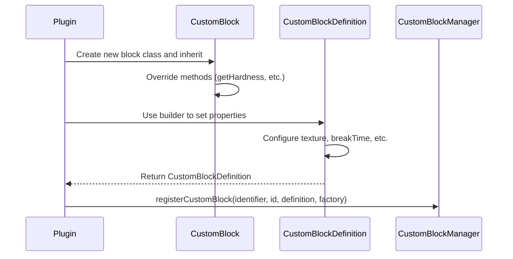

import FolderView from '@site/src/components/FolderView';

# Кастомный блок

:::danger Предварительные требования: файлы данных Bin

Перед использованием кастомных блоков необходимо скачать файлы данных Bin и поместить их в каталог сервера:

1. Скачайте их из [репозитория Bin_Data](https://github.com/MemoriesOfTime/Bin_Data)
2. Поместите папку `bin` в корневой каталог сервера

Каталог вашего сервера должен выглядеть так:
```
NukkitServer/
├── bin/                          ← Required for custom blocks
│   ├── vanilla_palette_xxx.nbt
│   └── ...
├── plugins/
├── worlds/
└── Nukkit-MOT-SNAPSHOT.jar
```

Без этих файлов регистрация кастомных блоков завершится с ошибкой.

:::

Для создания кастомного блока необходимо реализовать две основные составляющие:

1. Успешно зарегистрировать блок внутри плагина в Nukkit-MOT.
2. Определить текстуры блока в пакете ресурсов, который отправляется клиенту.

Далее на примере **кастомного блока камня** я продемонстрирую шаги по созданию кастомного блока.

## Регистрация блока в плагине \{#register-block-in-plugin}

Процесс регистрации описан следующей диаграммой последовательности:



### Создание нового класса блока \{#create-new-block-class}

Внутри плагина создайте новый класс `MyCustomStone`, унаследованный от `CustomBlock`:

```java title="custom/block/MyCustomStone.java"
package cn.nukkitmot.exampleplugin.custom.block;

import cn.nukkit.block.custom.container.CustomBlock;

public class MyCustomStone extends CustomBlock {
    // highlight-start
    public static final String IDENTIFIER = "myplugin:custom_stone";
    public static final int BLOCK_ID = 10001; // Must be >= 10000

    public MyCustomStone() {
        super(IDENTIFIER, BLOCK_ID);
    }

    @Override
    public String getName() {
        return "Custom Stone";
    }

    @Override
    public double getHardness() {
        return 1.5;
    }

    @Override
    public double getResistance() {
        return 6.0;
    }

    @Override
    public int getToolType() {
        return ItemTool.TYPE_PICKAXE;
    }
    // highlight-end
}
```

### Обзор ключевых классов \{#key-classes-overview}

#### CustomBlock vs CustomBlockMeta

Nukkit-MOT предоставляет два базовых класса для кастомных блоков:

- **CustomBlock** — для простых блоков без кастомных свойств (например, камень, земля)
- **CustomBlockMeta** — для блоков с кастомными свойствами/состояниями (например, редстоун-лампа со состоянием вкл/выкл)

### Регистрация блока \{#register-block}

Зарегистрируйте блок в методе `onEnable` вашего плагина:

```java title="ExamplePlugin.java"
import cn.nukkit.block.custom.CustomBlockManager;
import cn.nukkit.block.custom.CustomBlockDefinition;
import cn.nukkit.math.Vector3f;
import cn.nukkitmot.exampleplugin.custom.block.MyCustomStone;

public class ExamplePlugin extends PluginBase {
    @Override
    public void onEnable() {
        // highlight-start
        CustomBlockManager.get().registerCustomBlock(
            MyCustomStone.IDENTIFIER,
            MyCustomStone.BLOCK_ID,
            CustomBlockDefinition.builder(new MyCustomStone())
                .name("Custom Stone")
                .texture("custom_stone")
                .breakTime(1.5)
                .collisionBox(new Vector3f(-8, 0, -8), new Vector3f(16, 16, 16))
                .selectionBox(new Vector3f(-8, 0, -8), new Vector3f(16, 16, 16))
                .creativeGroup("itemGroup.name.stoneBrick")
                .creativeCategory(CreativeItemCategory.CONSTRUCTION)
                .build(),
            MyCustomStone::new
        );
        // highlight-end
    }
}
```

:::danger Критически важно: порядок загрузки плагина

Ваш плагин **должен** быть настроен с `load: STARTUP` в `plugin.yml`:

```yaml title="plugin.yml"
name: MyPlugin
main: cn.example.MyPlugin
version: 1.0.0
# highlight-next-line
load: STARTUP
```

Это связано с тем, что кастомные блоки должны быть зарегистрированы **до** вызова `CustomBlockManager.closeRegistry()`. Последовательность запуска сервера:

1. `enablePlugins(STARTUP)` → вызывает `onEnable()` для плагинов STARTUP
2. `CustomBlockManager.closeRegistry()` → **закрывает регистрацию, генерирует палитру**
3. `enablePlugins(POSTWORLD)` → вызывает `onEnable()` для плагинов POSTWORLD

Если ваш плагин использует значение по умолчанию `load: POSTWORLD`, к моменту вызова `onEnable()` реестр блоков уже будет закрыт, и регистрация завершится с ошибкой.

:::

:::warning Другие замечания

1. Идентификаторы кастомных блоков должны быть >= 10000 (`CustomBlockManager.LOWEST_CUSTOM_BLOCK_ID`)
2. Идентификатор должен соответствовать формату `namespace:block_name`

:::

### Методы билдера CustomBlockDefinition \{#customblockdefinition-builder}

Источник: [cn.nukkit.block.custom.CustomBlockDefinition](https://github.com/MemoriesOfTime/Nukkit-MOT/blob/master/src/main/java/cn/nukkit/block/custom/CustomBlockDefinition.java):

#### Основные свойства \{#basic-properties}

| Метод | Описание |
|--------|-------------|
| `name(String name)` | Задаёт отображаемое имя |
| `texture(String texture)` | Задаёт идентификатор текстуры |
| `breakTime(double second)` | Задаёт время добычи в секундах |

#### Коллизия и бокс выделения \{#collision-selection-box}

```java
// Full block collision
.collisionBox(new Vector3f(-8, 0, -8), new Vector3f(16, 16, 16))
.selectionBox(new Vector3f(-8, 0, -8), new Vector3f(16, 16, 16))

// Half slab collision
.collisionBox(new Vector3f(-8, 0, -8), new Vector3f(16, 8, 16))
```

Начало координат находится в центре нижней грани блока. Размер указывается в единицах 1/16 (пикселях).

#### Инвентарь творческого режима \{#creative-inventory}

```java
.creativeCategory(CreativeItemCategory.CONSTRUCTION)
.creativeGroup("itemGroup.name.stoneBrick")
// Or use combined method:
.creativeGroupAndCategory(CreativeItemGroup.STONE_BRICK, CreativeItemCategory.CONSTRUCTION)
```

#### Геометрическая модель \{#geometry-model}

```java
// Use geometry identifier
.geometry("geometry.custom_model")

// Or use Geometry object with bone visibility
.geometry(new Geometry("geometry.custom_model")
    .boneVisibility("bone1", true)
    .boneVisibility("bone2", "query.block_property('myplugin:active') == 1"))
```

#### Трансформация \{#transformation}

```java
import cn.nukkit.block.custom.container.data.Transformation;
import cn.nukkit.math.Vector3;

// Rotation must be multiples of 90 degrees
.transformation(new Transformation(
    new Vector3(0, 0, 0),     // translation
    new Vector3(1, 1, 1),     // scale
    new Vector3(0, 90, 0)     // rotation (90 degree increments)
))

// Simple rotation
.rotation(new Vector3f(0, 90, 0))
```

#### Материалы (текстуры для нескольких граней) \{#materials}

```java
import cn.nukkit.block.custom.container.data.Materials;

.materials(Materials.builder()
    .up(Materials.RenderMethod.OPAQUE, "grass_top")
    .down(Materials.RenderMethod.OPAQUE, "dirt")
    .any(Materials.RenderMethod.OPAQUE, "grass_side")
    .build())
```

**Варианты RenderMethod:**
- `OPAQUE` — полностью непрозрачный (по умолчанию)
- `BLEND` — прозрачность со смешиванием (как у стекла)
- `ALPHA_TEST` — двоичная прозрачность (как у листвы)

## Блоки со свойствами \{#blocks-with-properties}

Для блоков, которым нужно хранить состояние (например, лампа, которая может быть включена или выключена), используйте `CustomBlockMeta` с `BlockProperties`.

### Создание блока со свойствами \{#create-block-with-properties}

```java title="custom/block/MyLamp.java"
package cn.nukkitmot.exampleplugin.custom.block;

import cn.nukkit.block.custom.container.CustomBlockMeta;
import cn.nukkit.block.custom.properties.BlockProperties;
import cn.nukkit.block.custom.properties.BooleanBlockProperty;

public class MyLamp extends CustomBlockMeta {
    // highlight-start
    public static final String IDENTIFIER = "myplugin:my_lamp";
    public static final int BLOCK_ID = 10002;

    // Define the property
    public static final BooleanBlockProperty LIT =
        new BooleanBlockProperty("myplugin:lit", true);

    public static final BlockProperties PROPERTIES =
        new BlockProperties(LIT);

    public MyLamp() {
        this(0);
    }

    public MyLamp(int meta) {
        super(IDENTIFIER, BLOCK_ID, PROPERTIES, meta);
    }

    // Getter and setter for the property
    public boolean isLit() {
        return getBooleanValue(LIT.getName());
    }

    public void setLit(boolean lit) {
        setBooleanValue(LIT.getName(), lit);
    }

    @Override
    public int getLightLevel() {
        return isLit() ? 15 : 0;
    }
    // highlight-end
}
```

### Регистрация блока со свойствами \{#register-block-with-properties}

```java title="ExamplePlugin.java"
CustomBlockManager.get().registerCustomBlock(
    MyLamp.IDENTIFIER,
    MyLamp.BLOCK_ID,
    MyLamp.PROPERTIES,
    CustomBlockDefinition.builder(new MyLamp())
        .name("My Lamp")
        .texture("my_lamp_off")
        .breakTime(0.3)
        // Use permutations for different states
        .permutation(new Permutation(
            Materials.builder().any(Materials.RenderMethod.OPAQUE, "my_lamp_on").build(),
            "query.block_property('myplugin:lit') == 1"
        ))
        .build(),
    MyLamp::new  // Factory that accepts meta parameter
);
```

### Типы свойств \{#property-types}

#### BooleanBlockProperty \{#boolean-property}

```java
// Simple on/off state
BooleanBlockProperty powered = new BooleanBlockProperty("myplugin:powered", true);
```

#### IntBlockProperty \{#int-property}

```java
// Range of values (e.g., water level 0-7)
IntBlockProperty level = new IntBlockProperty("myplugin:level", true, 7, 0);

// With custom bit size
IntBlockProperty rotation = new IntBlockProperty("myplugin:rotation", true, 15, 0, 4);
```

#### EnumBlockProperty \{#enum-property}

```java
// Using string array
EnumBlockProperty<String> woodType = new EnumBlockProperty<>(
    "myplugin:wood_type",
    true,
    new String[]{"oak", "spruce", "birch", "jungle"}
);

// Using Java enum
public enum FacingDirection { NORTH, SOUTH, EAST, WEST }
EnumBlockProperty<FacingDirection> facing = new EnumBlockProperty<>(
    "myplugin:facing",
    true,
    FacingDirection.class
);
```

### Перестановки (условный рендеринг) \{#permutations}

Перестановки позволяют использовать разный рендеринг в зависимости от свойств блока:

```java
import cn.nukkit.block.custom.container.data.Permutation;

CustomBlockDefinition.builder(new MyBlock())
    // Default state
    .texture("my_block_default")
    // When property is true, use different texture
    .permutation(new Permutation(
        Materials.builder().any(Materials.RenderMethod.OPAQUE, "my_block_active").build(),
        "query.block_property('myplugin:active') == 1"
    ))
    // Multiple permutations
    .permutations(
        new Permutation(geometry1, "query.block_property('myplugin:state') == 0"),
        new Permutation(geometry2, "query.block_property('myplugin:state') == 1"),
        new Permutation(geometry3, "query.block_property('myplugin:state') == 2")
    )
    .build()
```

## Создание пакета ресурсов \{#creating-resource-pack}

### Структура каталогов пакета ресурсов \{#resource-pack-directory}

<FolderView
    paths={[
    'Resource Pack/manifest.json',
    'Resource Pack/pack_icon.png',
    'Resource Pack/textures/terrain_texture.json',
    'Resource Pack/textures/blocks/custom_stone.png',
    'Resource Pack/textures/blocks/my_lamp_off.png',
    'Resource Pack/textures/blocks/my_lamp_on.png',
]}
>
</FolderView>

### terrain_texture.json \{#terrain_texture-json}

```json title="RP/textures/terrain_texture.json"
{
    "resource_pack_name": "myplugin",
    "texture_name": "atlas.terrain",
    "padding": 8,
    "num_mip_levels": 4,
    "texture_data": {
        "custom_stone": {
            "textures": "textures/blocks/custom_stone"
        },
        "my_lamp_off": {
            "textures": "textures/blocks/my_lamp_off"
        },
        "my_lamp_on": {
            "textures": "textures/blocks/my_lamp_on"
        }
    }
}
```

:::tip Текстуры блоков и предметов

- Текстуры блоков используют `terrain_texture.json` и папку `textures/blocks/`
- Текстуры предметов используют `item_texture.json` и папку `textures/items/`

:::

### Кастомные геометрические модели \{#custom-geometry-models}

Если используется кастомная геометрия, добавьте файл модели:

<FolderView
    paths={[
    'Resource Pack/models/blocks/custom_model.geo.json',
]}
>
</FolderView>

```json title="RP/models/blocks/custom_model.geo.json"
{
    "format_version": "1.16.0",
    "minecraft:geometry": [
        {
            "description": {
                "identifier": "geometry.custom_model",
                "texture_width": 16,
                "texture_height": 16
            },
            "bones": [
                {
                    "name": "root",
                    "pivot": [0, 0, 0],
                    "cubes": [
                        {
                            "origin": [-8, 0, -8],
                            "size": [16, 16, 16],
                            "uv": [0, 0]
                        }
                    ]
                }
            ]
        }
    ]
}
```

## Дальнейшее изучение \{#further-exploration}

### Встроенные пакеты ресурсов в плагине \{#resource-packs-in-plugin}

Как и в случае с кастомными предметами, вы можете встроить пакеты ресурсов в свой плагин. Создайте папку `assets/resource_pack` внутри каталога `resources`.

<details>
    <summary>
      Показать структуру каталога resources
    </summary>
<FolderView
    paths={[
    'resources/plugin.yml',
    'resources/assets/resource_pack/manifest.json',
    'resources/assets/resource_pack/pack_icon.png',
    'resources/assets/resource_pack/textures/terrain_texture.json',
    'resources/assets/resource_pack/textures/blocks/custom_stone.png',
  ]}
>
</FolderView>
</details>

### Блок верстака \{#crafting-table-block}

Создайте кастомный верстак со своей собственной сеткой рецептов:

```java
import cn.nukkit.block.custom.container.data.CraftingTable;

CustomBlockDefinition.builder(new MyCraftingTable())
    .craftingTable(new CraftingTable(
        "My Crafting Table",        // Table name
        Arrays.asList("crafting_table", "my_table")  // Tags for recipes
    ))
    .build()
```

### Теги блока \{#block-tags}

Добавьте теги к своему блоку для совместимости с ванильными механиками:

```java
CustomBlockDefinition.builder(new MyBlock())
    .blockTags("stone", "minecraft:mineable/pickaxe")
    .build()
```

### Кастомная конфигурация NBT \{#custom-nbt}

Для расширенных настроек, не охватываемых методами билдера:

```java
CustomBlockDefinition.builder(new MyBlock())
    .texture("my_texture")
    .customBuild(nbt -> {
        // Add custom NBT data
        nbt.getCompound("components")
            .putCompound("minecraft:light_emission", new CompoundTag()
                .putInt("emission", 15));
    })
```
