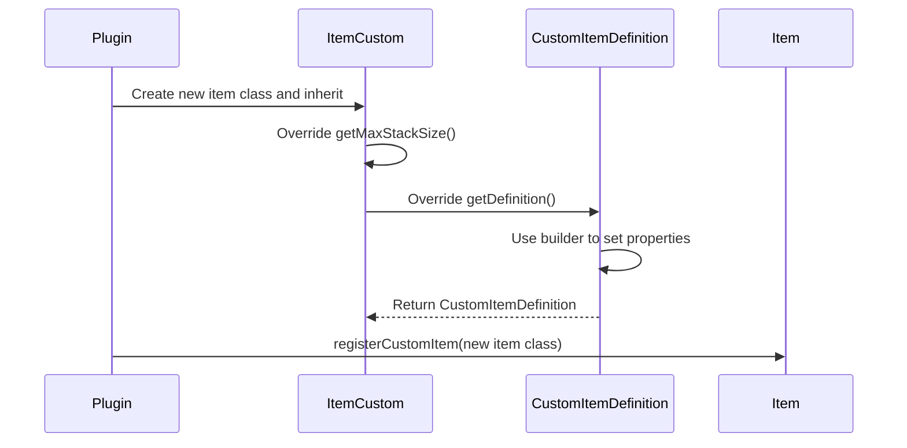

import FolderView from '@site/src/components/FolderView';

# Кастомный предмет

Чтобы создать кастомный предмет, необходимо реализовать две основные составляющие:

1. Успешно зарегистрировать предмет в Nukkit-MOT из плагина.
2. Определить текстуры предмета в пакете ресурсов, отправляемом клиенту.

Далее я продемонстрирую шаги по созданию кастомного предмета на примере **леденцового меча** (Candy Cane Sword).

## Регистрация предмета в плагине \{#register-item-in-plugin}

Процесс регистрации описан в следующей диаграмме последовательности:



### Создание нового класса предмета \{#creat-new-item-class}

Внутри плагина создайте новый класс `CandyCaneSword`, унаследуйте его от ItemCustom и переопределите необходимые методы:

```java title="custom/item/CandyCaneSword.java"
package cn.nukkitmot.exampleplugin.custom.item;

import cn.nukkit.item.customitem.CustomItemDefinition;
import cn.nukkit.item.customitem.ItemCustom;
import cn.nukkit.item.customitem.data.RenderOffsets;
import cn.nukkit.network.protocol.types.inventory.creative.CreativeItemCategory;

public class CandyCaneSword extends ItemCustom {
    // highlight-start
    private static String spacenameId = "nukkit:candy_cane_sword";
    private static String textureName = "candy_cane_sword";
    private static String name = null;

    public CandyCaneSword() {
        super(spacenameId, name, textureName);
    }

    public int scaleOffset() {
        return 32; // Must be a multiple of 16, such as 32, 64, 128
    }

    /**
     * This method sets up the custom item definition.
     */
    @Override
    public CustomItemDefinition getDefinition() {
        return CustomItemDefinition
                .simpleBuilder(this, CreativeItemCategory.EQUIPMENT)
                .creativeGroup("itemGroup.name.sword")
                .allowOffHand(true)
                .handEquipped(true)
                .renderOffsets(RenderOffsets.scaleOffset(scaleOffset()))
                .build();
    }

    @Override
    public int getMaxDurability() {
        return 500;
    }

    @Override
    public int getMaxStackSize() {
        return 1;
    }

    @Override
    public int getAttackDamage() {
        return 4;
    }

    @Override
    public boolean isSword() {
        return true;
    }
    // highlight-end
}
```

### Ключевые методы в ItemCustom \{#key-methods-itemcustom}

Из [cn.nukkit.item.customitem.ItemCustom](https://github.com/MemoriesOfTime/Nukkit-MOT/blob/master/src/main/java/cn/nukkit/item/customitem/ItemCustom.java):

Нам нужно использовать `@Override` для переопределения следующих методов:

- `getMaxStackSize()`
Используется для установки максимального размера стака кастомного предмета.

- `getDefinition()`
Возвращает класс CustomItemDefinition, который объединяет базовые атрибуты предмета: например, разрешено ли использовать его во второй руке, его категорию в творческом режиме и эффекты зачарований.

### Ключевые методы в CustomItemDefinition \{#key-methods-customitemdefinition}

Из [cn.nukkit.item.customitem.CustomItemDefinition](https://github.com/MemoriesOfTime/Nukkit-MOT/blob/master/src/main/java/cn/nukkit/item/customitem/CustomItemDefinition.java):

#### Распространённые билдеры  \{#common-builders}

- `customBuilder` - билдер для определения кастомных предметов.
- `simpleBuilder` - билдер для простых предметов (обычно используется по умолчанию).
- `toolBuilder` - билдер для предметов-инструментов.
- `armorBuilder` - билдер для предметов брони.
- `edibleBuilder` - билдер для съедобных предметов.
- `legacyBuilder` - билдер предметов в режиме Legacy (сервер регистрирует только идентификатор, текстуры предоставляются пакетом ресурсов).
- `legacyFoodBuilder` - билдер еды в режиме Legacy.

Начните с билдера, чтобы получить класс `CustomItemDefinition`.

```java title="java"
CustomItemDefinition.simpleBuilder(ItemCustom item, CreativeItemCategory creativeCategory);
```

#### Распространённые методы \{#common-methods}

Поскольку методы напрямую возвращают `this`, можно использовать плоский цепочечный стиль записи:

- `allowOffHand(boolean allowOffHand)` - разрешает ли держать предмет во второй руке.
- `handEquipped(boolean handEquipped)` - управляет отображением предмета в руке при виде от третьего лица.
- `foil(boolean foil)` - есть ли у предмета эффект свечения зачарования, как у зачарованных книг.
- `creativeGroup(String creativeGroup)` - управляет группой кастомного предмета в инвентаре творческого режима с помощью строкового идентификатора, например `"itemGroup.name.sword"`. Распространённые значения приведены в [справочнике ItemCreativeGroup](#itemcreativegroup-key-methods).
- `tag(String... tags)` - добавляет кастомному предмету один или несколько тегов.
- `canDestroyInCreative(boolean value)` - определяет, может ли игрок с этим предметом в руке ломать блоки в творческом режиме.

### Справочник ItemCreativeGroup \{#itemcreativegroup-key-methods}

Из [cn.nukkit.item.customitem.data.ItemCreativeGroup](https://github.com/MemoriesOfTime/Nukkit-MOT/blob/master/src/main/java/cn/nukkit/item/customitem/data/ItemCreativeGroup.java):

:::warning Устарело

Перечисление `ItemCreativeGroup` устарело (`@Deprecated`). Рекомендуется использовать строковые значения напрямую, например: `.creativeGroup("itemGroup.name.sword")`.

:::

Распространённые строковые значения творческих групп:

| Строковое значение | Описание |
|---|---|
| `itemGroup.name.sword` | Мечи |
| `itemGroup.name.pickaxe` | Кирки |
| `itemGroup.name.axe` | Топоры |
| `itemGroup.name.shovel` | Лопаты |
| `itemGroup.name.hoe` | Мотыги |
| `itemGroup.name.arrow` | Стрелы |
| `itemGroup.name.helmet` | Шлемы |
| `itemGroup.name.chestplate` | Нагрудники |
| `itemGroup.name.leggings` | Поножи |
| `itemGroup.name.boots` | Ботинки |
| `itemGroup.name.enchantedBook` | Зачарованные книги |

### Регистрация предмета \{#register-item}

И наконец, зарегистрируйте предмет в методе `onEnable` главного класса плагина:

```java title="ExamplePlugin.java"
import cn.nukkit.item.Item;
import cn.nukkitmot.exampleplugin.custom.item.CandyCaneSword;

public class ExamplePlugin extends PluginBase {
    @Override
    public void onEnable() {
        // highlight-start
        Item.registerCustomItem(CandyCaneSword.class);
        // highlight-end
    }
}
```

## Создание пакета ресурсов \{#creating-resource-pack}

Это руководство покажет, как создать пакет ресурсов и правильно связать его с текстурами предмета, чтобы кастомный предмет корректно отображался в игре.

Если в игре в панели предметов творческого режима по-прежнему видны пустые места, проверьте, что конфигурация пакета ресурсов и пути к текстурам предмета указаны верно.

Подробные шаги включают:

1. Определить UUID и информацию пакета ресурсов.
2. Определить пути к текстурам предмета в пакете ресурсов.
3. Упаковать пакет ресурсов и поместить его в папку `resource_packs` на сервере.

### Структура каталога пакета ресурсов \{#resource-pack-directory}

Каталог пакета ресурсов должен содержать следующие файлы:

<FolderView
    paths={[
    'Resource Pack/manifest.json',
    'Resource Pack/pack_icon.png',
    'Resource Pack/textures/item_texture.json',
    'Resource Pack/textures/texture_list.json',
    'Resource Pack/textures/items/candy_cane_sword.png',
]}
>
</FolderView>

### manifest.json \{#manifest-json}

Объяснение можно найти в Bedrock Wiki: [манифест пакета ресурсов (RP Manifest)](https://wiki.bedrock.dev/guide/project-setup.html#rp-manifest).

```json title="RP/manifest.json"
{
    "format_version": 2,
    "header": {
        "description": "BY.nukkit-mot",
        "name": "§7Test Resource Pack",
        "uuid": "00000000-0000-0000-0000-000020160300",
        "version": [1, 1, 6],
        "min_engine_version": [1, 14, 0]
    },
    "modules": [
        {
            "type": "resources",
            "uuid": "dde211f9-e1a6-435e-9a84-06fa9242f63e",
            "version": [1, 0, 0]
        }
    ]
}
```

### item_texture.json \{#item_texture-json}

```json title="RP/textures/item_texture.json"
{
    "resource_pack_name": "nukkit-mot",
    "texture_name": "atlas.items",
    "texture_data": {
        "candy_cane_sword": {
            "textures": "textures/items/candy_cane_sword"
        }
    }
}
```

Упакуйте пакет ресурсов и поместите его в папку `resource_packs` на сервере. После входа на сервер пакет ресурсов должен отображаться корректно.

:::danger Текстуры предмета отображаются некорректно?

Жаль это слышать, но сохраняйте спокойствие. Чтобы найти проблему, проверьте следующее:

1. Если это не встроенный пакет ресурсов плагина, был ли пакет заархивирован из корневого каталога?
> Иными словами, когда вы открываете zip-файл, сразу ли в нём виден файл `manifest.json`?

2. Изменили ли вы расширение файла пакета ресурсов с `.zip` на `.mcpack`?
> Клиент не поддерживает алгоритмы сжатия, отличные от zip.

3. После обновления пакета ресурсов очистили ли вы кэш клиента?
> Перейдите в `Settings → Storage → Resource Packs`. Если в кэше клиента есть копия пакета ресурсов, клиент не будет запрашивать у сервера обновлённый пакет.

:::

## Дальнейшее изучение \{#further-exploration}

### Типы кастомных предметов \{#custom-item-types}

Nukkit-MOT предоставляет несколько базовых классов для различных типов кастомных предметов:

| Класс | Описание |
|---|---|
| `ItemCustom` | Базовый класс кастомного предмета |
| `ItemCustomTool` | Кастомный инструмент (кирка, топор, лопата и т. д.) |
| `ItemCustomArmor` | Кастомная броня (шлем, нагрудник, поножи, ботинки) |
| `ItemCustomEdible` | Кастомный пищевой предмет |
| `ItemCustomProjectile` | Кастомный метательный предмет (снаряд) |
| `ItemCustomBookEnchanted` | Кастомная зачарованная книга |

Выбирайте подходящий базовый класс в зависимости от типа создаваемого предмета. Каждый класс предоставляет определённые методы и поведение, адаптированные под соответствующий тип предмета.

### Встроенные пакеты ресурсов в плагине \{#resource_packs-in-plugin}

Благодаря архитектуре Nukkit-MOT мы можем легко управлять пакетами ресурсов при разработке плагина.

Просто создайте папку `assets/resource_pack` внутри каталога `resources` плагина и поместите туда файлы пакета ресурсов.

Именно так это сделано в [ExamplePlugin](https://github.com/MemoriesOfTime/ExamplePlugin-Maven/tree/master/src/main/resources).

<details>
    <summary>
      Показать структуру каталога resources плагина ExamplePlugin
    </summary>
<FolderView
	paths={[
    'resources/plugin.yml',
    'resources/language',
    'resources/assets/resource_pack/manifest.json',
    'resources/assets/resource_pack/pack_icon.png',
    'resources/assets/resource_pack/textures/item_texture.json',
    'resources/assets/resource_pack/textures/texture_list.json',
    'resources/assets/resource_pack/textures/items/candy_cane_sword.png',
  ]}
>
</FolderView>
</details>

### Сравнение с Bedrock Wiki \{#comparing-with-bedrock-wiki}

Что делать, если в CustomItemDefinition нет нужного метода-обёртки?

Можно обратиться напрямую к документации Bedrock Wiki по [ItemComponents](https://wiki.bedrock.dev/items/item-components.html)!

Например, разрешение использования второй руки.

В классе [CustomItemDefinition](https://github.com/MemoriesOfTime/Nukkit-MOT/blob/master/src/main/java/cn/nukkit/item/customitem/CustomItemDefinition.java#L203) Nukkit-MOT содержится следующее:

```java
public class CustomItemDefinition {
    public static class SimpleBuilder {
        /**
         * Whether to allow the off-hand to have
         */
        public SimpleBuilder allowOffHand(boolean allowOffHand) {
            this.nbt.getCompound("components")
                    .getCompound("item_properties")
                    .putBoolean("allow_off_hand", allowOffHand);
            return this;
        }
    }
}
```

А Bedrock Wiki описывает [Allow Off Hand](https://wiki.bedrock.dev/items/item-components.html#allow-off-hand) следующим образом:

```md
## Allow Off Hand

Determines whether an item can be placed in the off-hand slot of the inventory.
```
```java title="minecraft:item > components"
"minecraft:allow_off_hand": {
    "value": true
}
```

`this.nbt` метода SimpleBuilder#allowOffHand создаётся внутри билдера — подробности можно посмотреть в [CustomItemDefinition.java#L208](https://github.com/MemoriesOfTime/Nukkit-MOT/blob/master/src/main/java/cn/nukkit/item/customitem/CustomItemDefinition.java#L208) Nukkit-MOT:

```java
    public static class SimpleBuilder {
        /**
         * Whether to allow the offHand to have
         */
        public SimpleBuilder allowOffHand(boolean allowOffHand) {
            this.nbt.getCompound("components")
                    .getCompound("item_properties")
                    .putBoolean("allow_off_hand", allowOffHand);
            return this;
        }
    }
```

:::note

Не для всех методов достаточно простого добавления nbt. Например, `minecraft:cooldown` требует, чтобы сервер обрабатывал `PlayerStartItemCoolDownPacket` для реализации перезарядки при использовании предмета.

Все поддерживаемые пакеты протокола перечислены в [cn.nukkit.network.protocol.ProtocolInfo](https://github.com/MemoriesOfTime/Nukkit-MOT/blob/master/src/main/java/cn/nukkit/network/protocol/ProtocolInfo.java).

:::

### RenderOffsets \{#render-offsets}

Знания, связанные со смещениями рендеринга, обширны и сложны. В настоящее время визуализирующих инструментов не существует, поэтому необходимо хорошее пространственное воображение.

Ссылки:

- [cn.nukkit.item.customitem.data.RenderOffsets](https://github.com/MemoriesOfTime/Nukkit-MOT/blob/master/src/main/java/cn/nukkit/item/customitem/data/RenderOffsets.java)
- [cn.nukkit.item.customitem.data.Offset](https://github.com/MemoriesOfTime/Nukkit-MOT/blob/master/src/main/java/cn/nukkit/item/customitem/data/Offset.java)

Из выделенной части приведённого ниже кода видно, что в класс `RenderOffsets` необходимо передать четыре объекта `Offset`.

```java title="Excerpt from: cn.coolloong.amethyst_equipment.Item.AmethystSpear"
    @Override
    public CustomItemDefinition getDefinition() {
        return CustomItemDefinition
                .toolBuilder(this, ItemCreativeCategory.EQUIPMENT)
                .addRepairItems(List.of(Item.fromString("minecraft:amethyst_shard")), 100)
                .addRepairItems(List.of(Item.fromString("yes:amethyst_spear")), 400)
                .renderOffsets(new RenderOffsets(
                    // highlight-start
                                Offset.builder()
                                        .position(0.48f, -0.128f, -0.946f)
                                        .rotation(11.696f, -64.536f, 79.413f)
                                        .scale(0.038f, 0.037f, 0.038f),
                                Offset.builder()
                                        .position(0.258f, 0.979f, -0.541f)
                                        .rotation(-63.268f, -43.969f, 144.041f)
                                        .scale(0.094f, 0.094f, 0.094f),
                                Offset.builder()
                                        .position(-1.053f, 0.136f, -0.803f)
                                        .rotation(27.273f, 67.731f, -64.494f)
                                        .scale(0.063f, 0.063f, 0.063f),
                                Offset.builder()
                                        .position(0.258f, 0.979f, -0.541f)
                                        .rotation(-63.268f, -43.969f, 144.041f)
                                        .scale(0.094f, 0.094f, 0.094f)
                        )
                    // highlight-end
                )
                .creativeGroup("itemGroup.name.sword")
                .allowOffHand(false)
                .handEquipped(true)
                .customBuild(nbt -> {
                    nbt.getCompound("components")
                            .putCompound("minecraft:cooldown", new CompoundTag()
                                    .putString("category", "amethyst_spear")
                                    .putFloat("duration", 3f))
                            .getCompound("item_properties").putBoolean("animates_in_toolbar", true)
                            .getCompound("item_properties").putInt("use_duration", 640);
                });
    }
```

В определении класса RenderOffsets:

```java
public RenderOffsets(@Nullable Offset mainHandFirstPerson, @Nullable Offset mainHandThirdPerson, @Nullable Offset offHandFirstPerson, @Nullable Offset offHandThirdPerson) {}
```

Отсюда понятно, что четыре параметра означают:

- mainHandFirstPerson: основная рука, вид от первого лица
- mainHandThirdPerson: основная рука, вид от третьего лица
- offHandFirstPerson: вторая рука, вид от первого лица
- offHandThirdPerson: вторая рука, вид от третьего лица

Предстоит сделать ещё много открытий...