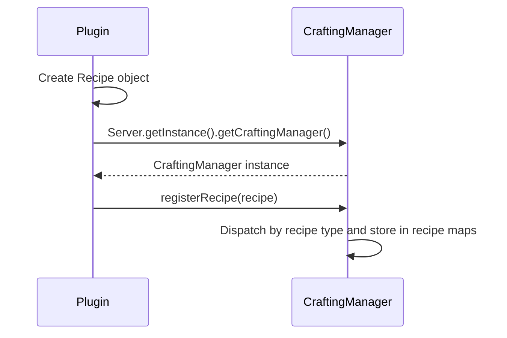

# Кастомный рецепт

Кастомные рецепты позволяют добавлять на сервер новые рецепты крафта, плавки и ковки. С их помощью вы можете дать игрокам возможность крафтить ванильные предметы новыми способами, создавать рецепты, дающие ваши кастомные предметы, или определять совершенно новые пути плавки и улучшения.

На этой странице рассматриваются следующие распространённые типы рецептов, поддерживаемые Nukkit-MOT:

| Тип рецепта | Класс | Описание |
|---|---|---|
| Рецепт по форме (shaped) | `ShapedRecipe` | Рецепт верстака с заданным шаблоном |
| Безформенный рецепт (shapeless) | `ShapelessRecipe` | Рецепт верстака, где расположение не имеет значения |
| Рецепт печи | `FurnaceRecipe` | Рецепт плавки в печи |
| Рецепт взрывной печи | `BlastFurnaceRecipe` | Рецепт плавки во взрывной печи |
| Рецепт костра | `CampfireRecipe` | Рецепт готовки на костре |
| Рецепт кузнечного стола | `SmithingRecipe` | Рецепт улучшения на кузнечном столе |
| Рецепт камнереза | `StonecutterRecipe` | Рецепт резки на камнерезе |

## Процесс регистрации \{#registration-flow}

Процесс регистрации описан в следующей диаграмме последовательности:



Регистрируйте все рецепты в методе `onEnable` вашего плагина:

```java title="ExamplePlugin.java"
import cn.nukkit.Server;
import cn.nukkit.inventory.CraftingManager;
import cn.nukkit.plugin.PluginBase;

public class ExamplePlugin extends PluginBase {
    @Override
    public void onEnable() {
        // highlight-start
        CraftingManager craftingManager = Server.getInstance().getCraftingManager();
        // Register recipes here...
        // highlight-end
    }
}
```

:::tip Удобный метод

Вы также можете использовать `getServer().getCraftingManager()` напрямую, поскольку `PluginBase` предоставляет метод `getServer()`.

:::

## Рецепт по форме (shaped) \{#shaped-recipe}

Рецепты по форме (shaped) задают определённый шаблон в данных рецептов крафта, отправляемых клиентам. Это самый распространённый тип рецептов, используемый для таких вещей, как инструменты, броня и блоки.

### Базовое использование \{#shaped-basic}

Форма задаётся как массив строк (1–3 ряда, каждый по 1–3 символа). Каждый символ сопоставляется с предметом-ингредиентом. Пробелы обозначают пустые слоты.

```java title="Пример ShapedRecipe"
import cn.nukkit.inventory.ShapedRecipe;
import cn.nukkit.item.Item;

// Craft a Diamond from 9 Diamond Ore
// highlight-start
craftingManager.registerRecipe(new ShapedRecipe(
    Item.get(Item.DIAMOND),                    // primaryResult
    new String[]{                               // shape (3x3 grid)
        "DDD",
        "DDD",
        "DDD"
    },
    Map.of(                                     // ingredient map
        'D', Item.get(Item.DIAMOND_ORE)
    ),
    List.of()                                   // extraResults (empty buckets, etc.)
));
// highlight-end
```

Это создаёт рецепт, по которому 9 алмазной руды, расположенной в квадрате 3×3, дают алмаз.

### Понимание формы \{#shaped-shape}

Массив формы определяет раскладку сетки крафта:

```
Shape: {"AB ",
        " C "}
```

Соответствует примерно такой сетке крафта:

```
[A] [B] [ ]
[ ] [C] [ ]
[ ] [ ] [ ]
```

:::warning Правила формы

- Каждый ряд должен иметь одинаковую длину (1–3 символа)
- Рядов должно быть от 1 до 3
- Каждый символ, отличный от пробела, должен иметь соответствующий ингредиент
- Карта ингредиентов не должна содержать символы, которые отсутствуют в форме
- Сетка рецепта **не** обязана быть квадратной — дополнять пустые ряды или столбцы не нужно

:::

:::info Сопоставление на стороне сервера

`CraftingDataPacket` отправляет клиентам сетку с формой, однако `CraftingManager.matchRecipe()` проверяет рецепты по форме по хешу результата и совокупности ингредиентов, а не по точным позициям в сетке. Если вашему плагину нужны дополнительные позиционные правила сверх обычных данных рецептов для клиента, проверяйте их в `CraftItemEvent`.

:::

### Полный конструктор \{#shaped-constructor}

Из класса [cn.nukkit.inventory.ShapedRecipe](https://github.com/MemoriesOfTime/Nukkit-MOT/blob/master/src/main/java/cn/nukkit/inventory/ShapedRecipe.java):

```java title="Конструктор"
new ShapedRecipe(
    String recipeId,         // Unique recipe identifier (can be null)
    int priority,            // Priority metadata
    Item primaryResult,      // Primary output item
    String[] shape,          // Shape array
    Map<Character, Item> ingredients,  // Character → Item mapping
    List<Item> extraResults  // Additional results (e.g., empty buckets)
);
```

### Пример: крафт кастомного предмета \{#shaped-custom-item}

Использование кастомного предмета в качестве результата рецепта:

```java title="Крафт кастомного меча из кастомных предметов"
import cn.nukkit.inventory.ShapedRecipe;
import cn.nukkit.item.Item;

// Craft the Candy Cane Sword: Candy Cane (C) + Stick (S)
craftingManager.registerRecipe(new ShapedRecipe(
    "candy_cane_sword",                         // recipeId
    1,                                          // priority metadata
    Item.fromString("nukkit:candy_cane_sword"), // custom item result
    new String[]{
        " C ",
        " C ",
        " S "
    },
    Map.of(
        'C', Item.get(Item.DYE, 9),             // Pink dye as "Candy Cane"
        'S', Item.get(Item.STICK)
    ),
    List.of()
));
```

### Пример: рецепт с дополнительными результатами \{#shaped-extra-results}

Некоторые рецепты оставляют предметы в сетке крафта (например, пустые вёдра после крафта торта):

```java title="Рецепт с дополнительными результатами"
import cn.nukkit.inventory.ShapedRecipe;
import cn.nukkit.item.Item;

craftingManager.registerRecipe(new ShapedRecipe(
    Item.get(Item.CAKE),
    new String[]{
        "MMM",
        "SES",
        "WWW"
    },
    Map.of(
        'M', Item.get(Item.BUCKET, 1),             // Milk bucket
        'S', Item.get(Item.SUGAR),
        'E', Item.get(Item.EGG),
        'W', Item.get(Item.WHEAT)
    ),
    // highlight-next-line
    List.of(Item.get(Item.BUCKET, 0, 3))        // 3 empty buckets returned
));
```

## Безформенный рецепт (shapeless) \{#shapeless-recipe}

Безформенные рецепты (shapeless) не требуют конкретного шаблона — ингредиенты можно располагать в любом месте сетки крафта. Они используются для таких рецептов, как красители, огненные заряды и другие комбинированные предметы.

### Базовое использование \{#shapeless-basic}

```java title="Пример ShapelessRecipe"
import cn.nukkit.inventory.ShapelessRecipe;
import cn.nukkit.item.Item;

// Combine Iron Ingot + Flint = Flint and Steel
// highlight-start
craftingManager.registerRecipe(new ShapelessRecipe(
    Item.get(Item.FLINT_AND_STEEL),           // result
    List.of(                                    // ingredients (order doesn't matter)
        Item.get(Item.IRON_INGOT),
        Item.get(Item.FLINT)
    )
));
// highlight-end
```

### Полный конструктор \{#shapeless-constructor}

Из класса [cn.nukkit.inventory.ShapelessRecipe](https://github.com/MemoriesOfTime/Nukkit-MOT/blob/master/src/main/java/cn/nukkit/inventory/ShapelessRecipe.java):

```java title="Конструктор"
new ShapelessRecipe(
    String recipeId,             // Unique recipe identifier (can be null)
    int priority,                // Priority metadata
    Item result,                 // Output item
    Collection<Item> ingredients // Ingredient list (max 9 items)
);
```

:::warning Ограничение на количество ингредиентов

`ShapelessRecipe` отклоняет коллекции ингредиентов с более чем 9 элементами. Количество у отдельного `Item` может быть больше 1, например `Item.get(Item.COAL, 1, 2)`.

:::

### Пример: смешивание красителей \{#shapeless-dye-mix}

```java title="ShapelessRecipe - кастомное смешивание красителей"
import cn.nukkit.inventory.ShapelessRecipe;
import cn.nukkit.item.Item;

// Mix Red + Yellow Dye = Orange Dye
craftingManager.registerRecipe(new ShapelessRecipe(
    "orange_dye_mix",
    0,
    Item.get(Item.DYE, 14),                   // Orange dye
    List.of(
        Item.get(Item.DYE, 1),                 // Red dye
        Item.get(Item.DYE, 11)                 // Yellow dye
    )
));
```

## Рецепт печи \{#furnace-recipe}

Рецепты печи определяют, что происходит при переплавке предмета в печи.

### Базовое использование \{#furnace-basic}

```java title="Пример FurnaceRecipe"
import cn.nukkit.inventory.FurnaceRecipe;
import cn.nukkit.item.Item;

// Smelt Diamond Ore → Diamond
// highlight-start
craftingManager.registerRecipe(new FurnaceRecipe(
    "diamond_ore_to_diamond",
    Item.get(Item.DIAMOND),                   // result
    Item.get(Item.DIAMOND_ORE)                // ingredient
));
// highlight-end
```

### Полный конструктор \{#furnace-constructor}

Из класса [cn.nukkit.inventory.FurnaceRecipe](https://github.com/MemoriesOfTime/Nukkit-MOT/blob/master/src/main/java/cn/nukkit/inventory/FurnaceRecipe.java):

```java title="Конструктор"
new FurnaceRecipe(
    String recipeId,   // Unique recipe identifier (can be null)
    Item result,       // Smelting output
    Item ingredient    // Input item to smelt
);
```

:::tip Сопоставление по метаданным

`CraftingManager` хранит рецепты плавки по хешу входного предмета. Сопоставление для печи, взрывной печи и костра сначала проверяет точный хеш damage/meta входного предмета; если совпадения нет, выполняется откат к тому же id предмета с meta `0`. Это значит, что рецепт с meta `0` может служить запасным вариантом для других вариантов предмета, если не зарегистрирован более специфичный рецепт.

Сетевой тип рецепта, например `FURNACE` или `FURNACE_DATA`, определяется на основе `ingredient.hasMeta()`, поэтому не судите о серверном сопоставлении только по имени типа.

:::

## Рецепт взрывной печи \{#blast-furnace-recipe}

Рецепты взрывной печи используют отдельную карту рецептов блока взрывной печи. Блочная сущность сопоставляет предметы с этой картой и обрабатывает совпавшие рецепты с множителем скорости `2`.

Сейчас `CraftingManager.packetFor()` не перебирает `getBlastFurnaceRecipes()` при построении `CraftingDataPacket`, поэтому кастомные рецепты взрывной печи — это правила обработки на стороне сервера, и не следует полагаться на них для отображения рецептов в книге рецептов клиента.

```java title="Пример BlastFurnaceRecipe"
import cn.nukkit.inventory.BlastFurnaceRecipe;
import cn.nukkit.item.Item;

// highlight-start
craftingManager.registerRecipe(new BlastFurnaceRecipe(
    Item.get(Item.IRON_INGOT),                // result
    Item.get(Item.IRON_ORE)                   // ingredient
));
// highlight-end
```

## Рецепт костра \{#campfire-recipe}

Рецепты костра определяют правила готовки для блока костра. `BlockEntityCampfire` сопоставляет зарегистрированные рецепты костра при обработке предметов на блоке.

Сейчас `CraftingManager.packetFor()` не добавляет рецепты костра в `CraftingDataPacket`, поэтому эти рецепты влияют на обработку костра на стороне сервера, а не на отображение в книге рецептов клиента.

```java title="Пример CampfireRecipe"
import cn.nukkit.inventory.CampfireRecipe;
import cn.nukkit.item.Item;

// highlight-start
craftingManager.registerRecipe(new CampfireRecipe(
    Item.get(Item.COOKED_PORKCHOP),           // result
    Item.get(Item.RAW_PORKCHOP)               // ingredient
));
// highlight-end
```

## Рецепт кузнечного стола \{#smithing-recipe}

Рецепты кузнечного стола используются в пути преобразования на кузнечном столе. Генерация обычного результата в текущем Nukkit-MOT реализована для потока незеритового улучшения: снаряжение + материал + `minecraft:netherite_upgrade_smithing_template`.

### Базовое использование \{#smithing-basic}

```java title="Пример SmithingRecipe"
import cn.nukkit.inventory.SmithingRecipe;
import cn.nukkit.item.Item;

// Upgrade: Diamond Sword + Netherite Ingot = Netherite Sword
// highlight-start
craftingManager.registerRecipe(new SmithingRecipe(
    "diamond_to_netherite_sword",              // recipeId
    0,                                         // priority metadata
    List.of(                                   // ingredients (order matters!)
        Item.get(Item.DIAMOND_SWORD),          //   [0] equipment
        Item.get(Item.NETHERITE_INGOT),        //   [1] material
        Item.fromString(Item.NETHERITE_UPGRADE_SMITHING_TEMPLATE) // [2] template
    ),
    Item.get(Item.NETHERITE_SWORD)             // result
));
// highlight-end
```

### Конструктор и порядок параметров \{#smithing-constructor}

Из класса [cn.nukkit.inventory.SmithingRecipe](https://github.com/MemoriesOfTime/Nukkit-MOT/blob/master/src/main/java/cn/nukkit/inventory/SmithingRecipe.java):

```java title="Конструктор"
new SmithingRecipe(
    String recipeId,
    int priority,
    Collection<Item> ingredients,  // Must follow this order:
                                   //   [0] equipment (base item to upgrade)
                                   //   [1] ingredient (upgrade material)
                                   //   [2] template (use the netherite upgrade template for normal output)
    Item result                     // Upgraded output item
);
```

:::warning Порядок ингредиентов важен

Коллекция ингредиентов должна содержать как минимум **снаряжение → ингредиент** именно в таком порядке. Третий предмет на уровне конструктора необязателен и по умолчанию равен Air, однако стандартный путь получения результата на кузнечном столе возвращает реальный результат, только когда фактическим предметом-шаблоном является `minecraft:netherite_upgrade_smithing_template`.

При использовании этого шаблона `getFinalResult()` копирует составной тег (compound tag) входного снаряжения в результат и переносит урон вплоть до максимальной прочности предмета-результата.

:::

## Рецепт камнереза \{#stonecutter-recipe}

Рецепты камнереза позволяют разрезать блоки на варианты с помощью блока камнереза.

```java title="Пример StonecutterRecipe"
import cn.nukkit.inventory.StonecutterRecipe;
import cn.nukkit.item.Item;

// highlight-start
craftingManager.registerRecipe(new StonecutterRecipe(
    "stone_to_stone_bricks",                  // recipeId
    0,                                         // priority metadata
    Item.get(Item.STONE_BRICKS, 0, 4),          // result (4 Stone Bricks)
    Item.get(Item.STONE)                       // ingredient
));
// highlight-end
```

### Полный конструктор \{#stonecutter-constructor}

Из класса [cn.nukkit.inventory.StonecutterRecipe](https://github.com/MemoriesOfTime/Nukkit-MOT/blob/master/src/main/java/cn/nukkit/inventory/StonecutterRecipe.java):

```java title="Конструктор"
new StonecutterRecipe(
    String recipeId,     // Unique recipe identifier
    int priority,        // Priority metadata
    Item result,         // Output item
    Item ingredient      // Input item
);
```

## Всё вместе \{#full-example}

Вот полный пример регистрации нескольких типов рецептов в плагине:

```java title="RecipePlugin.java"
package cn.nukkitmot.exampleplugin;

import cn.nukkit.inventory.*;
import cn.nukkit.item.Item;
import cn.nukkit.plugin.PluginBase;

import java.util.List;
import java.util.Map;

public class RecipePlugin extends PluginBase {
    @Override
    public void onEnable() {
        CraftingManager craftingManager = getServer().getCraftingManager();

        // Shaped: Craft a compass from 4 iron ingots + 1 redstone
        craftingManager.registerRecipe(new ShapedRecipe(
            "custom_compass",
            1,
            Item.get(Item.COMPASS),
            new String[]{
                " I ",
                "IRI",
                " I "
            },
            Map.of(
                'I', Item.get(Item.IRON_INGOT),
                'R', Item.get(Item.REDSTONE)
            ),
            List.of()
        ));

        // Shapeless: Combine 2 charcoal + 1 stick = 4 torches
        craftingManager.registerRecipe(new ShapelessRecipe(
            "custom_torch",
            0,
            Item.get(Item.TORCH, 0, 4),
            List.of(
                Item.get(Item.COAL, 1, 2),  // Charcoal
                Item.get(Item.STICK)
            )
        ));

        // Furnace: Smelt cobblestone back into stone
        craftingManager.registerRecipe(new FurnaceRecipe(
            "cobblestone_to_stone",
            Item.get(Item.STONE),
            Item.get(Item.COBBLESTONE)
        ));

        // Campfire: Cook raw beef
        craftingManager.registerRecipe(new CampfireRecipe(
            Item.get(Item.COOKED_BEEF),
            Item.get(Item.RAW_BEEF)
        ));

        // Stonecutter: Stone → 4 Stone Bricks
        craftingManager.registerRecipe(new StonecutterRecipe(
            "stone_to_bricks",
            0,
            Item.get(Item.STONE_BRICKS, 0, 4),
            Item.get(Item.STONE)
        ));

        this.getLogger().info("Custom recipes registered!");
    }
}
```

## Дополнительные сведения \{#further-exploration}

### Приоритет рецепта \{#recipe-priority}

Параметр `priority` хранится в объектах рецептов по форме, безформенных рецептов, кузнечных рецептов и рецептов камнереза. Для рецептов по форме, безформенных рецептов и рецептов камнереза он также записывается в данные крафта. Текущее сопоставление на стороне сервера не сортирует рецепты по этому значению. Для рецептов по форме и безформенных рецептов `CraftingManager` группирует рецепты по хешу предмета-результата, индексирует их по совокупному хешу ингредиентов и может перебирать соответствующую группу результатов.

- Короткие конструкторы **ShapedRecipe** и **ShapelessRecipe** используют приоритеты по умолчанию `1` и `10` соответственно
- Значение по умолчанию из ванильных JSON-файлов рецептов — `0`
- Более поздний рецепт по форме или безформенный рецепт с тем же хешем результата и тем же совокупным хешем ингредиентов заменяет предыдущую запись в серверной карте сопоставления; рецепты с разными ингредиентами сосуществуют
- Не полагайтесь на `priority` для переопределения ванильных рецептов

### Использование предметов с метаданными \{#metadata-items}

Многие ванильные предметы используют значения damage/meta для различения вариантов. Используйте двухаргументную форму `Item.get()`:

```java
// Bone meal / legacy white dye (meta 15)
Item.get(Item.DYE, 15);

// Coal (meta 0) vs Charcoal (meta 1)
Item.get(Item.COAL, 0);    // Coal
Item.get(Item.COAL, 1);    // Charcoal

// Items with count
Item.get(Item.TORCH, 0, 4);  // 4 torches
```

### Требование разблокировки рецепта \{#recipe-unlocking}

У ShapedRecipe и ShapelessRecipe есть расширенные конструкторы, принимающие `RecipeUnlockingRequirement`. Для протокола `v1_21_0` и новее Nukkit-MOT записывает требования к рецептам в `CraftingDataPacket`, что определяет, когда рецепты становятся видимы для игроков. Короткие конструкторы используют `RecipeUnlockingRequirement.ALWAYS_UNLOCKED`.

```java
import cn.nukkit.inventory.data.RecipeUnlockingRequirement;

// Always unlocked (default)
RecipeUnlockingRequirement.ALWAYS_UNLOCKED

// Based on context
new RecipeUnlockingRequirement(
    RecipeUnlockingRequirement.UnlockingContext.PLAYER_IN_WATER
)
```

### Рецепт с кастомными предметами \{#recipe-with-custom-items}

Вы можете использовать `Item.fromString()` для ссылок на кастомные предметы, зарегистрированные вашим плагином или другими плагинами:

```java
// Use a custom item as ingredient
Item.fromString("nukkit:candy_cane_sword")

// Use a custom item as result
Item.fromString("myplugin:magic_dust")
```

:::tip Порядок регистрации

Кастомные предметы должны быть зарегистрированы **до** рецептов, которые на них ссылаются. Поскольку `Item.registerCustomItem()` обычно вызывается в `onEnable()`, убедитесь, что он выполняется до кода регистрации рецептов в том же методе `onEnable()`.

:::

### Замена или удаление ванильных рецептов \{#removing-vanilla-recipes}

В Nukkit-MOT нет высокоуровневого вызова «удалить ванильный рецепт». Регистрация рецепта с более высоким `priority` не делает его победителем над ванильным рецептом.

Для рецептов по форме и безформенных рецептов замена происходит, только когда регистрация записывает тот же ключ карты `CraftingManager`: тот же хеш предмета-результата и тот же совокупный хеш ингредиентов. Если ваш кастомный рецепт использует другие входные предметы, оба рецепта остаются доступными.

Удаление записи из предоставляемого серверного хранилища сопоставления влияет на сопоставление: используйте `getShapedRecipes()`, `getShapelessRecipes()`, `getFurnaceRecipes()`, `getBlastFurnaceRecipes()`, `getSmithingRecipes()`, `getStonecutterRecipes()` или `campfireRecipes` в зависимости от типа рецепта.

Для рецептов, отображаемых в книге рецептов клиента, также удалите запись из коллекции, используемой `CraftingManager.packetFor()`, и вызовите `rebuildPacket()`, чтобы кэшированные данные `CraftingDataPacket` обновились. Рецепты по форме и безформенные рецепты рекламируются из `getRecipes()`, рецепты печи — из `getFurnaceRecipes()`, рецепты камнереза — из `getStonecutterRecipes()`, а кузнечные рецепты — из `getSmithingRecipes()`. Сейчас `packetFor()` не рекламирует карты рецептов взрывной печи и костра. Для блокировки на основе политик проверяйте/отменяйте транзакцию крафта в вашем плагине.
