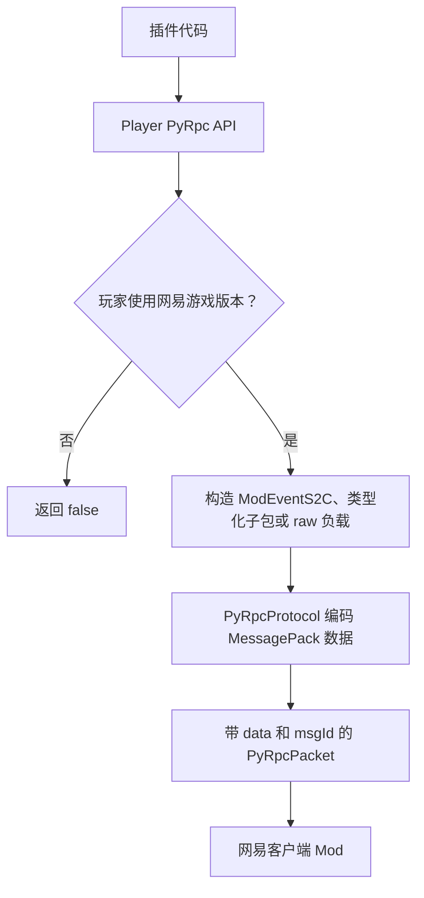
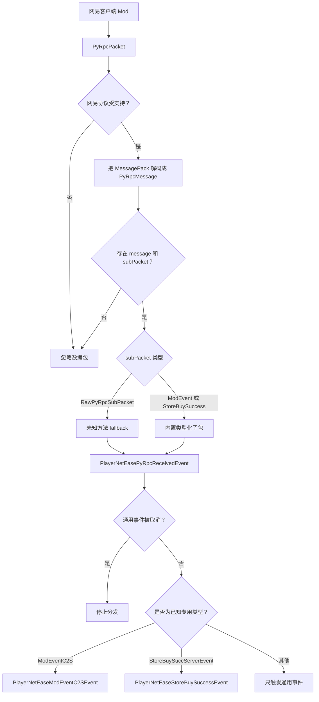
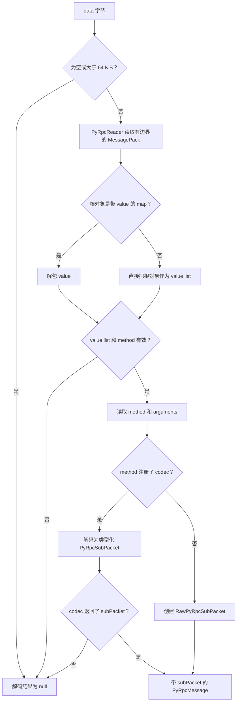
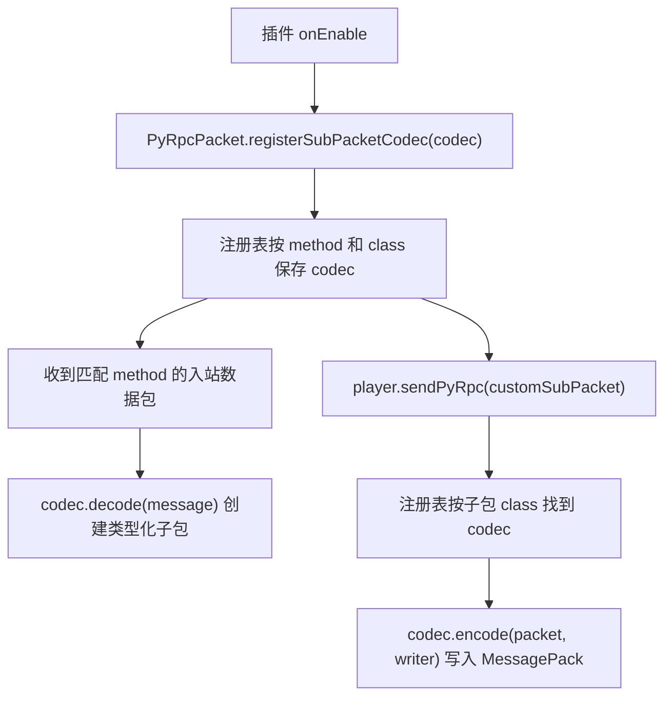

# PyRpc 教程

PyRpc 是 Nukkit-MOT 面向网易客户端的 Python 脚本 RPC 数据包通道。插件通常用它和网易客户端 Mod 交换自定义事件，或处理网易商店相关回调。

:::tip 源码依据
本文基于当前 Nukkit-MOT 源码 `1f043b3e7` 整理，重点参考 `Player`、`PyRpcPacket`、`PyRpcProtocol`、`PyRpcProcessor`、`PyRpcSubPacketCodec`、`ModEventPyRpcSubPacket`、`RawPyRpcSubPacket` 以及玩家 PyRpc 事件。
:::

## 核心规则

- PyRpc 只对网易协议会话可用。
- 处理器支持 `V1_20_50_NETEASE` 及更新的网易协议。
- `Player#sendPyRpcData(...)`、`Player#sendPyRpc(...)` 和 `Player#modNotifyToClient(...)` 在玩家不是网易版本时会返回 `false`。
- 普通服务端到客户端 Mod 事件优先使用 `modNotifyToClient(...)`。
- 普通客户端到服务端 Mod 事件优先监听 `PlayerNetEaseModEventC2SEvent`。
- 只有在你明确知道 PyRpc 方法名和参数结构时，才使用 raw payload 相关 API。

## 流程总览

PyRpc 有两个方向。外发数据包从插件代码开始，如果玩家不是网易协议会话，会在 `Player` API 处提前返回 `false`：



入站数据包会先解码，再经过通用事件和可选的专用事件分发：



## 数据包模型

[PyRpcPacket](https://github.com/MemoriesOfTime/Nukkit-MOT/blob/master/src/main/java/cn/nukkit/network/protocol/netease/PyRpcPacket.java) 主要包含两个值：

| 字段 | 含义 |
| --- | --- |
| `data` | MessagePack 编码后的 PyRpc 负载 |
| `msgId` | 无符号 32 位消息 ID，默认值为 `9753608` |

Nukkit-MOT 会把 `data` 解码成 [PyRpcMessage](https://github.com/MemoriesOfTime/Nukkit-MOT/blob/master/src/main/java/cn/nukkit/network/protocol/netease/pyrpc/PyRpcMessage.java)：

| 值 | 含义 |
| --- | --- |
| `method` | PyRpc 方法名，例如 `ModEventC2S` |
| `arguments` | 解码后的方法参数 |
| `rawRoot` | 原始 MessagePack 根对象 |
| `rawPayload` | 原始数据包负载字节 |
| `subPacket` | 类型化的 `PyRpcSubPacket`，或 raw fallback |

内置辅助方法和 codec 覆盖以下方法：

| 方法 | 方向 | 类型化数据包 |
| --- | --- | --- |
| `ModEventC2S` | 客户端到服务端 | `ModEventPyRpcSubPacket` |
| `ModEventS2C` | 服务端到客户端 | `ModEventPyRpcSubPacket` |
| `StoreBuySuccServerEvent` | 客户端到服务端 | `StoreBuySuccessPyRpcSubPacket` |

如果解码后的方法没有注册类型化 codec，Nukkit-MOT 会把它包装成 `RawPyRpcSubPacket`，插件仍然可以读取方法名和参数列表。

解码路径是保守的：



## 向客户端发送 Mod 事件

大多数插件场景直接使用 `Player#modNotifyToClient(...)`。它会创建 `ModEventS2C` 数据包，并且只在目标玩家使用网易客户端时发送。

```java title="pyrpc/DemoPyRpcSender.java"
package cn.nukkitmot.exampleplugin.pyrpc;

import cn.nukkit.Player;

import java.util.LinkedHashMap;
import java.util.Map;

public final class DemoPyRpcSender {

    public static boolean openPanel(Player player, String panelId) {
        Map<String, Object> eventData = new LinkedHashMap<>();
        eventData.put("panelId", panelId);
        eventData.put("readonly", false);

        return player.modNotifyToClient(
                "DemoMod",
                "main",
                "OpenPanelEvent",
                eventData);
    }
}
```

务必检查返回值。返回 `false` 通常表示玩家不是网易游戏版本，或者数据包没有成功进入发送队列。

### 加密事件辅助方法

`modNotifyToClientEncrypted(...)` 是 `modNotifyToClient(...)` 上的一层辅助封装。它会把你传入的字符串交给加密函数处理，然后把结果放到 `eventData["data"]` 中发送。

```java
player.modNotifyToClientEncrypted(
        "DemoMod",
        "secure",
        "SecurePayloadEvent",
        "{\"action\":\"sync\"}",
        plainText -> encryptForClient(plainText));
```

Nukkit-MOT 不规定加密算法。服务端插件和客户端 Mod 必须自行约定数据格式。

## 接收客户端 Mod 事件

客户端到服务端的 Mod 事件会以 `ModEventC2S` 到达。Nukkit-MOT 会先触发通用的 `PlayerNetEasePyRpcReceivedEvent`，然后对类型化的 Mod 事件继续触发 `PlayerNetEaseModEventC2SEvent`。

```java title="pyrpc/DemoPyRpcListener.java"
package cn.nukkitmot.exampleplugin.pyrpc;

import cn.nukkit.event.EventHandler;
import cn.nukkit.event.Listener;
import cn.nukkit.event.player.PlayerNetEaseModEventC2SEvent;

import java.util.Map;

public final class DemoPyRpcListener implements Listener {

    @EventHandler(ignoreCancelled = true)
    public void onModEvent(PlayerNetEaseModEventC2SEvent event) {
        if (!"DemoMod".equals(event.getModName())) {
            return;
        }
        if (!"main".equals(event.getSystemName())) {
            return;
        }
        if (!"SubmitPanelEvent".equals(event.getCustomEventName())) {
            return;
        }

        Map<String, Object> data = event.getEventData();
        Object rawPanelId = data.get("panelId");
        if (!(rawPanelId instanceof String panelId)) {
            event.setCancelled();
            return;
        }

        event.getPlayer().sendMessage("Submitted panel: " + panelId);
    }
}
```

在插件中注册监听器：

```java
this.getServer().getPluginManager().registerEvents(new DemoPyRpcListener(), this);
```

## 监听所有 PyRpc 消息

如果你需要检查所有已成功解码的 PyRpc 消息，包括未知方法，监听 `PlayerNetEasePyRpcReceivedEvent`。

```java
@EventHandler(ignoreCancelled = true)
public void onAnyPyRpc(PlayerNetEasePyRpcReceivedEvent event) {
    String method = event.getMethod();
    event.getPlayer().getServer().getLogger().debug(
            "PyRpc method=" + method + ", msgId=" + event.getMsgId());
}
```

取消这个通用事件会阻止后续专用事件继续触发。

## 处理 Raw 方法

如果某个方法没有注册类型化 codec，Nukkit-MOT 会把它暴露为 `RawPyRpcSubPacket`。

```java
@EventHandler(ignoreCancelled = true)
public void onRawPyRpc(PlayerNetEasePyRpcReceivedEvent event) {
    if (!(event.getSubPacket() instanceof RawPyRpcSubPacket raw)) {
        return;
    }
    if (!"CustomEngineCall".equals(raw.getMethod())) {
        return;
    }

    Object firstArgument = raw.getArguments().isEmpty() ? null : raw.getArguments().get(0);
    event.getPlayer().sendMessage("CustomEngineCall first arg = " + firstArgument);
}
```

也可以用 `sendPyRpc(...)` 发送 raw 方法：

```java
player.sendPyRpc(
        new RawPyRpcSubPacket(
                "CustomEngineCall",
                List.of("alpha", 42),
                null,
                null),
        0x12345678L);
```

如果你需要的是 `PyRpcPacket` 对象，而不是直接通过 `Player` 发送，可以使用 `PyRpcPacket.createCustomPacket(method, arguments, msgId)` 创建同样结构的 raw 方法负载。

## 发送已编码负载

`sendPyRpcData(byte[] data, long msgId)` 会直接发送 MessagePack 字节。除非你正在桥接一个已有的协议格式，否则优先使用类型化子包或 `modNotifyToClient(...)`。

```java
byte[] payload = loadPayloadFromYourBridge();
boolean sent = player.sendPyRpcData(payload, 0x12345678L);
```

服务端不会验证这些已编码外发字节的业务结构。

## 注册自定义类型化 Codec

如果某个自定义方法会被重复使用，可以定义自己的 `PyRpcSubPacket` 和 `PyRpcSubPacketCodec`。在插件启动时调用 `PyRpcPacket.registerSubPacketCodec(...)` 注册一次即可。



```java title="pyrpc/CustomNoticeSubPacket.java"
package cn.nukkitmot.exampleplugin.pyrpc;

import cn.nukkit.network.protocol.netease.pyrpc.PyRpcSubPacket;

public final class CustomNoticeSubPacket implements PyRpcSubPacket {

    public static final String METHOD = "CustomNotice";

    private final String message;

    public CustomNoticeSubPacket(String message) {
        this.message = message;
    }

    @Override
    public String getMethod() {
        return METHOD;
    }

    public String getMessage() {
        return message;
    }
}
```

```java title="pyrpc/CustomNoticeCodec.java"
package cn.nukkitmot.exampleplugin.pyrpc;

import cn.nukkit.network.protocol.netease.pyrpc.PyRpcMessage;
import cn.nukkit.network.protocol.netease.pyrpc.PyRpcProtocol;
import cn.nukkit.network.protocol.netease.pyrpc.PyRpcSubPacketCodec;
import cn.nukkit.network.protocol.netease.pyrpc.io.PyRpcWriter;

public final class CustomNoticeCodec implements PyRpcSubPacketCodec<CustomNoticeSubPacket> {

    @Override
    public String getMethod() {
        return CustomNoticeSubPacket.METHOD;
    }

    @Override
    public Class<CustomNoticeSubPacket> getSubPacketClass() {
        return CustomNoticeSubPacket.class;
    }

    @Override
    public CustomNoticeSubPacket decode(PyRpcMessage message) {
        if (message.getArguments().isEmpty()) {
            return null;
        }

        String text = PyRpcProtocol.asString(message.getArguments().get(0));
        return text != null ? new CustomNoticeSubPacket(text) : null;
    }

    @Override
    public void encode(CustomNoticeSubPacket packet, PyRpcWriter writer) {
        writer.writeMessage(packet.getMethod(), java.util.List.of(packet.getMessage()));
    }
}
```

```java title="DemoPlugin.java"
@Override
public void onEnable() {
    PyRpcPacket.registerSubPacketCodec(new CustomNoticeCodec());
    this.getServer().getPluginManager().registerEvents(new DemoPyRpcListener(), this);
}
```

codec 注册表是全局的。不要复用其他插件或 Nukkit-MOT 内置 codec 已经占用的方法名。

## MessagePack 值支持

`PyRpcWriter` 可以编码这些常见 Java 值：

- `null`
- `String` 和其他 `CharSequence`
- `byte[]`
- `Boolean`
- `Float` 和 `Double`
- 整数类 `Number`
- `BigInteger`
- `Map`
- `Iterable`
- Java 数组

Map key 会按字符串写入。无法识别的对象会用 `toString()` 写入，因此事件负载应保持明确、简单。

## 限制与失败行为

Nukkit-MOT 对 PyRpc 解码做了边界限制：

- 空负载会被忽略。
- 大于 `64 KiB` 的负载会被忽略。
- MessagePack 容器超过 `1024` 个条目会被拒绝。
- MessagePack 嵌套深度超过 `32` 层会被拒绝。
- 无效或不支持的 MessagePack 负载会解码为 `null`，不会触发 PyRpc 事件。

插件侧建议：

- 不信任传入的 `eventData`；校验方法名、类型、大小和权限。
- 保持事件负载尽量小。
- 如果不希望专用事件继续执行，可以尽早取消通用 PyRpc 事件。
- 把 PyRpc 当作网易客户端集成层，不要用它替代普通 Nukkit 插件 API。
