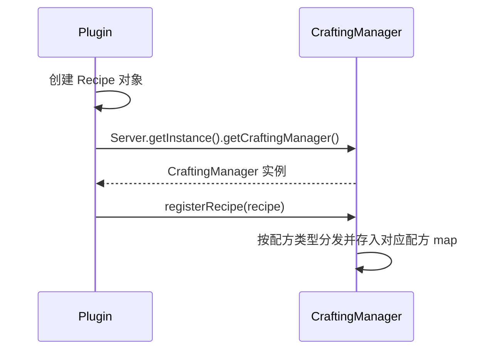

# 自定义配方

自定义配方允许你向服务器添加新的合成、熔炼和锻造配方。你可以利用它们让玩家以新的方式合成原版物品、创建产出你自定义物品的配方，或定义全新的熔炼和升级路径。

本文覆盖 Nukkit-MOT 支持的以下常用配方类型：

| 配方类型 | 类 | 描述 |
|---|---|---|
| 有序合成 | `ShapedRecipe` | 需要特定图案的工作台合成 |
| 无序合成 | `ShapelessRecipe` | 摆放位置不影响的工作台合成 |
| 熔炉配方 | `FurnaceRecipe` | 熔炉熔炼配方 |
| 高炉配方 | `BlastFurnaceRecipe` | 高炉熔炼配方 |
| 营火配方 | `CampfireRecipe` | 营火烹饪配方 |
| 锻造台配方 | `SmithingRecipe` | 锻造台升级配方 |
| 切石机配方 | `StonecutterRecipe` | 切石机切割配方 |

## 注册流程 \{#registration-flow}

按照以下序列图了解注册流程：



在插件的 `onEnable` 方法中注册所有配方：

```java title="ExamplePlugin.java"
import cn.nukkit.Server;
import cn.nukkit.inventory.CraftingManager;
import cn.nukkit.plugin.PluginBase;

public class ExamplePlugin extends PluginBase {
    @Override
    public void onEnable() {
        // highlight-start
        CraftingManager craftingManager = Server.getInstance().getCraftingManager();
        // 在这里注册配方...
        // highlight-end
    }
}
```

:::tip 便捷方法

由于 `PluginBase` 提供了 `getServer()` 方法，你也可以直接使用 `getServer().getCraftingManager()`。

:::

## 有序合成 \{#shaped-recipe}

有序合成会在发送给客户端的合成配方数据中定义特定图案。这是最常见的配方类型，用于工具、盔甲和方块等。

### 基本用法 \{#shaped-basic}

图案由字符串数组定义（1–3 行，每行 1–3 个字符）。每个字符映射到一个原料物品，空格表示空槽位。

```java title="ShapedRecipe 示例"
import cn.nukkit.inventory.ShapedRecipe;
import cn.nukkit.item.Item;

// 用 9 个钻石矿石合成 1 个钻石
// highlight-start
craftingManager.registerRecipe(new ShapedRecipe(
    Item.get(Item.DIAMOND),                    // primaryResult（主要结果）
    new String[]{                               // shape（图案，3x3 网格）
        "DDD",
        "DDD",
        "DDD"
    },
    Map.of(                                     // ingredient map（字符→物品映射）
        'D', Item.get(Item.DIAMOND_ORE)
    ),
    List.of()                                   // extraResults（额外结果，如空桶）
));
// highlight-end
```

这将创建一个配方：将 9 个钻石矿石排成 3×3 的方格来合成一个钻石。

### 理解图案格式 \{#shaped-shape}

图案数组定义了合成台的布局：

```
图案: {"AB ",
      " C "}
```

表示如下的合成网格：

```
[A] [B] [ ]
[ ] [C] [ ]
[ ] [ ] [ ]
```

:::warning 图案规则

- 每行的长度必须相同（1–3 个字符）
- 必须有 1–3 行
- 每个非空格字符必须有对应的原料
- 原料映射中不能包含未出现在图案里的字符
- 配方网格**不需要**是正方形 — 无需填充空行或空列

:::

:::info 服务端匹配

`CraftingDataPacket` 会把有序合成网格发送给客户端，但 `CraftingManager.matchRecipe()` 校验有序合成时使用的是输出 hash 和聚合后的原料，而不是精确格子位置。如果你的插件需要在普通客户端配方数据之外额外强制位置规则，请在 `CraftItemEvent` 中校验。

:::

### 完整构造方法 \{#shaped-constructor}

来自 [cn.nukkit.inventory.ShapedRecipe](https://github.com/MemoriesOfTime/Nukkit-MOT/blob/master/src/main/java/cn/nukkit/inventory/ShapedRecipe.java)：

```java title="构造方法"
new ShapedRecipe(
    String recipeId,         // 唯一配方标识符（可为 null）
    int priority,            // 优先级元数据
    Item primaryResult,      // 主要输出物品
    String[] shape,          // 图案数组
    Map<Character, Item> ingredients,  // 字符 → 物品映射
    List<Item> extraResults  // 额外结果（如空桶）
);
```

### 示例：合成自定义物品 \{#shaped-custom-item}

使用自定义物品作为配方结果：

```java title="用自定义物品合成自定义剑"
import cn.nukkit.inventory.ShapedRecipe;
import cn.nukkit.item.Item;

// 合成糖果手杖剑：糖果手杖 (C) + 木棍 (S)
craftingManager.registerRecipe(new ShapedRecipe(
    "candy_cane_sword",                         // recipeId
    1,                                          // priority 元数据
    Item.fromString("nukkit:candy_cane_sword"), // 自定义物品结果
    new String[]{
        " C ",
        " C ",
        " S "
    },
    Map.of(
        'C', Item.get(Item.DYE, 9),             // 粉红色染料作为"糖果手杖"
        'S', Item.get(Item.STICK)
    ),
    List.of()
));
```

### 示例：带额外结果的配方 \{#shaped-extra-results}

某些配方会在合成台网格中留下物品（如蛋糕配方留下空桶）：

```java title="带额外结果的配方"
import cn.nukkit.inventory.ShapedRecipe;
import cn.nukkit.item.Item;

craftingManager.registerRecipe(new ShapedRecipe(
    Item.get(Item.CAKE),
    new String[]{
        "MMM",
        "SES",
        "WWW"
    },
    Map.of(
        'M', Item.get(Item.BUCKET, 1),             // 牛奶桶
        'S', Item.get(Item.SUGAR),
        'E', Item.get(Item.EGG),
        'W', Item.get(Item.WHEAT)
    ),
    // highlight-next-line
    List.of(Item.get(Item.BUCKET, 0, 3))        // 返回 3 个空桶
));
```

## 无序合成 \{#shapeless-recipe}

无序合成不需要特定的摆放图案 — 原料可以放在合成台的任意位置。用于染料、火焰弹等组合物品。

### 基本用法 \{#shapeless-basic}

```java title="ShapelessRecipe 示例"
import cn.nukkit.inventory.ShapelessRecipe;
import cn.nukkit.item.Item;

// 铁锭 + 燧石 = 打火石
// highlight-start
craftingManager.registerRecipe(new ShapelessRecipe(
    Item.get(Item.FLINT_AND_STEEL),           // result（结果）
    List.of(                                    // ingredients（原料，顺序无关）
        Item.get(Item.IRON_INGOT),
        Item.get(Item.FLINT)
    )
));
// highlight-end
```

### 完整构造方法 \{#shapeless-constructor}

来自 [cn.nukkit.inventory.ShapelessRecipe](https://github.com/MemoriesOfTime/Nukkit-MOT/blob/master/src/main/java/cn/nukkit/inventory/ShapelessRecipe.java)：

```java title="构造方法"
new ShapelessRecipe(
    String recipeId,             // 唯一配方标识符（可为 null）
    int priority,                // 优先级元数据
    Item result,                 // 输出物品
    Collection<Item> ingredients // 原料列表（最多 9 个）
);
```

:::warning 原料数量限制

`ShapelessRecipe` 会拒绝超过 9 个条目的原料集合。单个 `Item` 的 count 可以大于 1，例如 `Item.get(Item.COAL, 1, 2)`。

:::

### 示例：染料混合 \{#shapeless-dye-mix}

```java title="ShapelessRecipe - 自定义染料混合"
import cn.nukkit.inventory.ShapelessRecipe;
import cn.nukkit.item.Item;

// 红色染料 + 黄色染料 = 橙色染料
craftingManager.registerRecipe(new ShapelessRecipe(
    "orange_dye_mix",
    0,
    Item.get(Item.DYE, 14),                   // 橙色染料
    List.of(
        Item.get(Item.DYE, 1),                 // 红色染料
        Item.get(Item.DYE, 11)                 // 黄色染料
    )
));
```

## 熔炉配方 \{#furnace-recipe}

熔炉配方定义在熔炉中熔炼物品的规则。

### 基本用法 \{#furnace-basic}

```java title="FurnaceRecipe 示例"
import cn.nukkit.inventory.FurnaceRecipe;
import cn.nukkit.item.Item;

// 熔炼钻石矿石 → 钻石
// highlight-start
craftingManager.registerRecipe(new FurnaceRecipe(
    "diamond_ore_to_diamond",
    Item.get(Item.DIAMOND),                   // result（结果）
    Item.get(Item.DIAMOND_ORE)                // ingredient（原料）
));
// highlight-end
```

### 完整构造方法 \{#furnace-constructor}

来自 [cn.nukkit.inventory.FurnaceRecipe](https://github.com/MemoriesOfTime/Nukkit-MOT/blob/master/src/main/java/cn/nukkit/inventory/FurnaceRecipe.java)：

```java title="构造方法"
new FurnaceRecipe(
    String recipeId,   // 唯一配方标识符（可为 null）
    Item result,       // 熔炼输出
    Item ingredient    // 输入物品
);
```

:::tip 元数据匹配

`CraftingManager` 会按输入物品 hash 存储熔炼配方。熔炉、高炉和营火匹配时会先查找精确的输入 damage/meta hash；如果未命中，再回退查找同一物品 id、meta 为 `0` 的配方。因此 meta `0` 配方可能作为其他变体的后备配方，除非已经注册了更精确的配方。

网络配方类型（例如 `FURNACE` 与 `FURNACE_DATA`）取决于 `ingredient.hasMeta()`，不要只根据类型名判断服务端匹配行为。

:::

## 高炉配方 \{#blast-furnace-recipe}

高炉配方使用高炉方块独立的配方 map。高炉方块实体会匹配该 map，并以 `2` 倍速度倍率处理匹配到的配方。

当前 `CraftingManager.packetFor()` 构建 `CraftingDataPacket` 时不会遍历 `getBlastFurnaceRecipes()`，因此自定义高炉配方属于服务端处理规则，不应依赖它出现在客户端配方书中。

```java title="BlastFurnaceRecipe 示例"
import cn.nukkit.inventory.BlastFurnaceRecipe;
import cn.nukkit.item.Item;

// highlight-start
craftingManager.registerRecipe(new BlastFurnaceRecipe(
    Item.get(Item.IRON_INGOT),                // result
    Item.get(Item.IRON_ORE)                   // ingredient
));
// highlight-end
```

## 营火配方 \{#campfire-recipe}

营火配方定义在营火方块上的烹饪规则。`BlockEntityCampfire` 会在处理营火上的物品时匹配已注册的营火配方。

当前 `CraftingManager.packetFor()` 不会把营火配方加入 `CraftingDataPacket`，因此这些配方影响的是服务端营火处理，而不是客户端配方书展示。

```java title="CampfireRecipe 示例"
import cn.nukkit.inventory.CampfireRecipe;
import cn.nukkit.item.Item;

// highlight-start
craftingManager.registerRecipe(new CampfireRecipe(
    Item.get(Item.COOKED_PORKCHOP),           // result
    Item.get(Item.RAW_PORKCHOP)               // ingredient
));
// highlight-end
```

## 锻造台配方 \{#smithing-recipe}

锻造台配方用于锻造台的 transform 路径。当前 Nukkit-MOT 的普通输出生成逻辑实现的是下界合金升级流程：装备 + 材料 + `minecraft:netherite_upgrade_smithing_template`。

### 基本用法 \{#smithing-basic}

```java title="SmithingRecipe 示例"
import cn.nukkit.inventory.SmithingRecipe;
import cn.nukkit.item.Item;

// 升级：钻石剑 + 下界合金锭 = 下界合金剑
// highlight-start
craftingManager.registerRecipe(new SmithingRecipe(
    "diamond_to_netherite_sword",              // recipeId
    0,                                         // priority 元数据
    List.of(                                   // ingredients（顺序重要！）
        Item.get(Item.DIAMOND_SWORD),          //   [0] 装备
        Item.get(Item.NETHERITE_INGOT),        //   [1] 材料
        Item.fromString(Item.NETHERITE_UPGRADE_SMITHING_TEMPLATE) // [2] 模板
    ),
    Item.get(Item.NETHERITE_SWORD)             // result
));
// highlight-end
```

### 构造方法与参数顺序 \{#smithing-constructor}

来自 [cn.nukkit.inventory.SmithingRecipe](https://github.com/MemoriesOfTime/Nukkit-MOT/blob/master/src/main/java/cn/nukkit/inventory/SmithingRecipe.java)：

```java title="构造方法"
new SmithingRecipe(
    String recipeId,
    int priority,
    Collection<Item> ingredients,  // 必须按此顺序：
                                   //   [0] 装备（待升级的基础物品）
                                   //   [1] 材料（升级材料）
                                   //   [2] 模板（普通输出需使用下界合金升级模板）
    Item result                     // 升级后的输出物品
);
```

:::warning 原料顺序很重要

原料集合至少必须按 **装备 → 材料** 的顺序提供前两个物品。第三个物品在构造器层面可省略，省略时模板默认为 Air，但默认锻造台结果路径只有在实际模板物品是 `minecraft:netherite_upgrade_smithing_template` 时才会返回真实结果。

使用该模板时，`getFinalResult()` 会把输入装备的 compound tag 复制到结果物品，并按结果物品的最大耐久度保留 damage。

:::

## 切石机配方 \{#stonecutter-recipe}

切石机配方允许使用切石机方块将方块切割为变体。

```java title="StonecutterRecipe 示例"
import cn.nukkit.inventory.StonecutterRecipe;
import cn.nukkit.item.Item;

// highlight-start
craftingManager.registerRecipe(new StonecutterRecipe(
    "stone_to_stone_bricks",                  // recipeId
    0,                                         // priority 元数据
    Item.get(Item.STONE_BRICKS, 0, 4),          // result（4 个石砖）
    Item.get(Item.STONE)                       // ingredient
));
// highlight-end
```

### 完整构造方法 \{#stonecutter-constructor}

来自 [cn.nukkit.inventory.StonecutterRecipe](https://github.com/MemoriesOfTime/Nukkit-MOT/blob/master/src/main/java/cn/nukkit/inventory/StonecutterRecipe.java)：

```java title="构造方法"
new StonecutterRecipe(
    String recipeId,     // 唯一配方标识符
    int priority,        // 优先级元数据
    Item result,         // 输出物品
    Item ingredient      // 输入物品
);
```

## 完整示例 \{#full-example}

以下是在插件中注册多种配方类型的完整示例：

```java title="RecipePlugin.java"
package cn.nukkitmot.exampleplugin;

import cn.nukkit.inventory.*;
import cn.nukkit.item.Item;
import cn.nukkit.plugin.PluginBase;

import java.util.List;
import java.util.Map;

public class RecipePlugin extends PluginBase {
    @Override
    public void onEnable() {
        CraftingManager craftingManager = getServer().getCraftingManager();

        // 有序合成：4 个铁锭 + 1 个红石 = 指南针
        craftingManager.registerRecipe(new ShapedRecipe(
            "custom_compass",
            1,
            Item.get(Item.COMPASS),
            new String[]{
                " I ",
                "IRI",
                " I "
            },
            Map.of(
                'I', Item.get(Item.IRON_INGOT),
                'R', Item.get(Item.REDSTONE)
            ),
            List.of()
        ));

        // 无序合成：2 个木炭 + 1 个木棍 = 4 个火把
        craftingManager.registerRecipe(new ShapelessRecipe(
            "custom_torch",
            0,
            Item.get(Item.TORCH, 0, 4),
            List.of(
                Item.get(Item.COAL, 1, 2),  // 木炭
                Item.get(Item.STICK)
            )
        ));

        // 熔炉：圆石 → 石头
        craftingManager.registerRecipe(new FurnaceRecipe(
            "cobblestone_to_stone",
            Item.get(Item.STONE),
            Item.get(Item.COBBLESTONE)
        ));

        // 营火：生牛肉 → 熟牛排
        craftingManager.registerRecipe(new CampfireRecipe(
            Item.get(Item.COOKED_BEEF),
            Item.get(Item.RAW_BEEF)
        ));

        // 切石机：石头 → 4 个石砖
        craftingManager.registerRecipe(new StonecutterRecipe(
            "stone_to_bricks",
            0,
            Item.get(Item.STONE_BRICKS, 0, 4),
            Item.get(Item.STONE)
        ));

        this.getLogger().info("自定义配方已注册！");
    }
}
```

## 进阶探索 \{#further-exploration}

### 配方优先级 \{#recipe-priority}

`priority` 参数会保存在有序、无序、锻造台和切石机配方对象中。对于有序、无序和切石机配方，它也会写入合成数据。当前服务端匹配不会按该值排序。对于有序和无序合成，`CraftingManager` 会先按输出物品 hash 分组，再按聚合后的原料 hash 建立索引，必要时遍历同一输出分组中的 map 项。

- **ShapedRecipe** 和 **ShapelessRecipe** 的简化构造方法默认优先级分别为 `1` 和 `10`
- 原版配方 JSON 文件中的默认值为 `0`
- 后注册的有序或无序配方只有在输出 hash 和聚合原料 hash 都相同时，才会替换服务端匹配 map 中的原项；原料不同的配方会并存
- 不要依赖 `priority` 覆盖原版配方

### 使用带元数据的物品 \{#metadata-items}

许多原版物品使用 damage/meta 值来区分变体。使用 `Item.get()` 的双参数形式：

```java
// 骨粉 / 旧版白色染料 (meta 15)
Item.get(Item.DYE, 15);

// 煤炭 (meta 0) vs 木炭 (meta 1)
Item.get(Item.COAL, 0);    // 煤炭
Item.get(Item.COAL, 1);    // 木炭

// 带数量的物品
Item.get(Item.TORCH, 0, 4);  // 4 个火把
```

### 配方解锁条件 \{#recipe-unlocking}

ShapedRecipe 和 ShapelessRecipe 有接收 `RecipeUnlockingRequirement` 的扩展构造方法。对于 `v1_21_0` 及更新协议，Nukkit-MOT 会把配方解锁条件写入 `CraftingDataPacket`，用于控制配方何时对玩家可见。简化构造方法使用 `RecipeUnlockingRequirement.ALWAYS_UNLOCKED`。

```java
import cn.nukkit.inventory.data.RecipeUnlockingRequirement;

// 始终解锁（默认）
RecipeUnlockingRequirement.ALWAYS_UNLOCKED

// 基于上下文
new RecipeUnlockingRequirement(
    RecipeUnlockingRequirement.UnlockingContext.PLAYER_IN_WATER
)
```

### 在配方中使用自定义物品 \{#recipe-with-custom-items}

你可以使用 `Item.fromString()` 来引用你的插件或其他插件注册的自定义物品：

```java
// 使用自定义物品作为原料
Item.fromString("nukkit:candy_cane_sword")

// 使用自定义物品作为结果
Item.fromString("myplugin:magic_dust")
```

:::tip 注册顺序

自定义物品必须在引用它们的配方之前注册。由于 `Item.registerCustomItem()` 通常在 `onEnable()` 中调用，请确保它在同一 `onEnable()` 方法中的配方注册代码之前运行。

:::

### 替换或移除原版配方 \{#removing-vanilla-recipes}

Nukkit-MOT 当前没有高层的“移除原版配方”调用。只注册一个更高 `priority` 的配方不会让它优先于原版配方匹配。

对于有序和无序合成，只有后注册配方写入相同的 `CraftingManager` map key 时才会形成替换：输出物品 hash 相同，聚合后的原料 hash 也相同。如果你的自定义配方使用不同输入，两个配方会同时存在。

从暴露的服务端匹配存储中移除条目会影响匹配：根据配方类型使用 `getShapedRecipes()`、`getShapelessRecipes()`、`getFurnaceRecipes()`、`getBlastFurnaceRecipes()`、`getSmithingRecipes()`、`getStonecutterRecipes()` 或 `campfireRecipes`。

对于会广播给客户端的配方，还要从 `CraftingManager.packetFor()` 使用的集合中移除条目，并调用 `rebuildPacket()` 刷新缓存的 `CraftingDataPacket` 数据。有序和无序合成从 `getRecipes()` 广播，熔炉配方从 `getFurnaceRecipes()` 广播，切石机配方从 `getStonecutterRecipes()` 广播，锻造台配方从 `getSmithingRecipes()` 广播。当前 `packetFor()` 不会广播高炉或营火配方 map。对于基于规则的禁用，请在插件中校验/取消相关合成交易。
