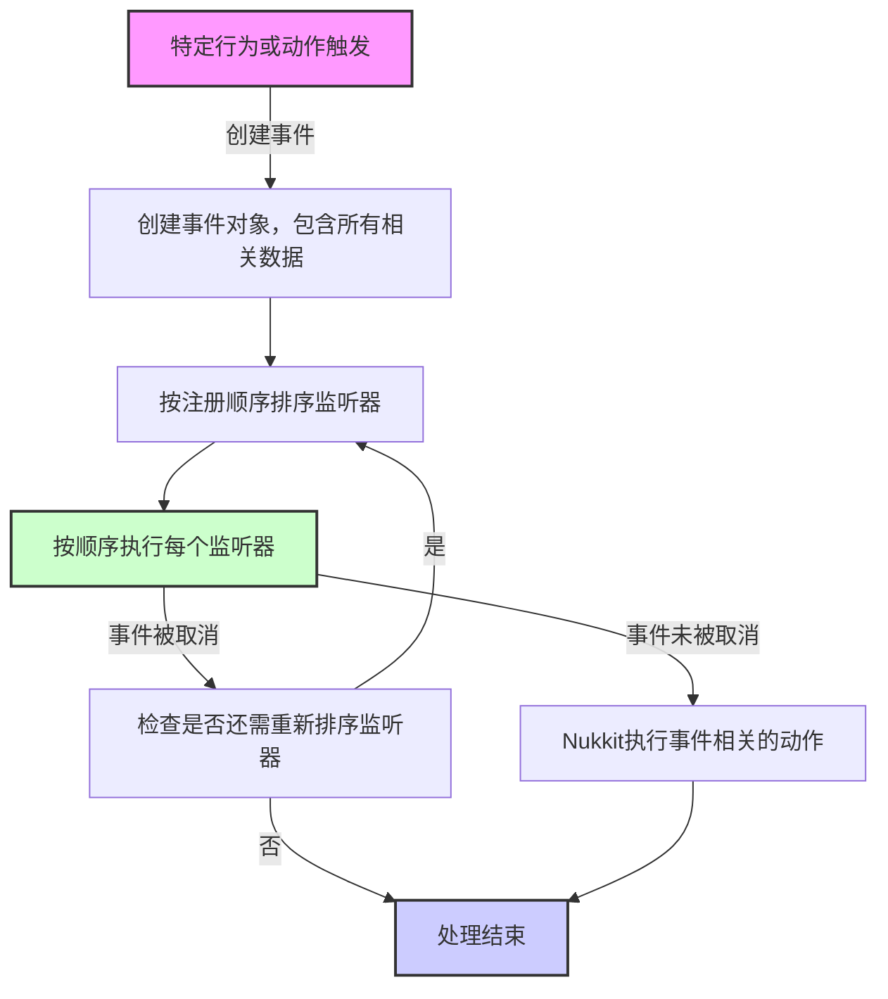

# Event 事件指南

```mermaid
graph TD;
    A[特定行为或动作触发] -->|创建事件| B[创建事件对象，包含所有相关数据]
    B --> D[按注册顺序排序监听器]
    D --> C[按顺序执行每个监听器]
    C -->|事件被取消| F[检查是否还需重新排序监听器]
    F -->|是| D
    F -->|否| Z[处理结束]
    C -->|事件未被取消| E[Nukkit执行事件相关的动作]
    E --> Z
    style A fill:#f9f,stroke:#333,stroke-width:2px
    style C fill:#cfc,stroke:#333,stroke-width:2px
    style Z fill:#ccf,stroke:#333,stroke-width:2px
```