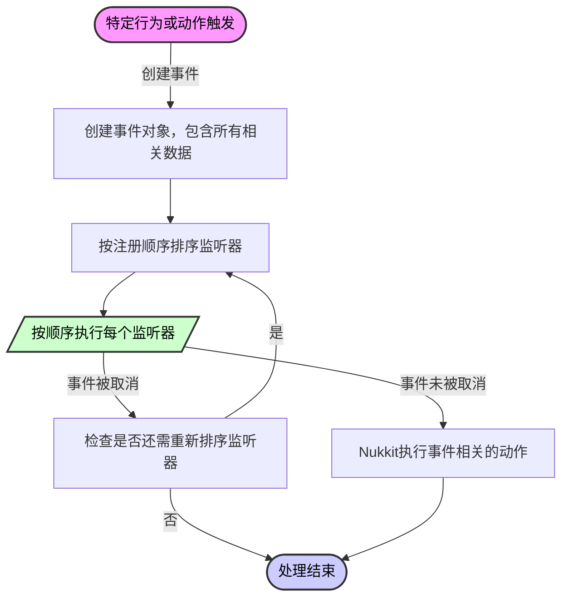

# Event 事件指南

## 事件的概念 \{#event-concept}

每当服务器中发生了特定的行为，一个事件对象就会产生。

事件是对某种行为或动作的描述，比如玩家登录、 玩家离开、玩家发送消息等等。

种种的行为或动作都对应一个事件对象作为它们的抽象，事件对象中带有这个行为或者动作中的一些关键信息，比如玩家 **发送消息事件** 对象中就带有发送事件的 **玩家对象、发送的消息字符串** 等等，而玩家对象又包含这个玩家的 **位置、生命值、物品栏** 等等数据。

插件可以向 Nukkit-MOT 注册监听器来在事件发生的时候做出反应。

每个事件对象都包含了对事件的描述，通常事件监听器会在事件发生之前被调用，此时监听器可以通过取消事件来阻止事件真的发生，如果没有任何事件监听器取消了这个事件，那么它就会真正地在游戏内发生。

监听器的执行是单线程的，所有监听器在注册的时候都要给 Nukkit-MOT 提供它的优先级，Nukkit-MOT 会按照优先级将监听器排序，然后依次执行监听器。

:::note

单线程意味着，您不能在事件中执行耗时操作，否则会影响服务器的正常运行。

:::

很可能在您的插件的监听器被执行之间这个事件已经被取消了，但通常这不会影响您的监听器的执行，您的监听器仍然会被执行，您可以通过 `event.isCancelled()` 来判断事件是否被取消了。

:::warning

特别注意的是，优先级越高，执行顺序越往后排。
也就是说，优先级越低，越优先执行！

:::

### 流程图 \{#flowchart}
<div style={{textAlign: 'center'}}>

</div>

## 事件监听器 \{#event-listeners}

事件监听器在游戏服务器插件开发中是一个关键组件，用于处理游戏中发生的各种事件。这部分将详细介绍如何在Nukkit插件中抽象和实现一个事件监听器，设置其优先级，并进行注册，以便在插件中有效响应服务器和玩家的活动。

### 实现监听器 \{#implementing-listener}

创建一个事件监听器涉及到实现 `Listener` 接口，并使用 `@EventHandler` 注解来标记那些应当在特定事件发生时被调用的方法。下面是一个具体的实现示例，用于监听服务器命令事件：

```java title="EventListener.java"
package cn.nukkitmot.exampleplugin;

import cn.nukkit.event.EventHandler;
import cn.nukkit.event.EventPriority;
import cn.nukkit.event.Listener;
import cn.nukkit.event.server.ServerCommandEvent;
import cn.nukkit.event.player.PlayerChatEvent;

public class EventListener implements Listener {
    private final ExamplePlugin plugin;

    public EventListener(ExamplePlugin plugin) {
        this.plugin = plugin;
    }

    @EventHandler(priority = EventPriority.NORMAL, ignoreCancelled = false)
    public void onServerCommand(ServerCommandEvent event) {
        if (event.isCancelled()) {
            return;
        }
        // Log the command to server console
        this.plugin.getLogger().info("ServerCommandEvent is called with command: " + event.getCommand());

        // Here you can add additional logic to modify the behavior based on the command
        if (event.getCommand().equalsIgnoreCase("stop")) {
            this.plugin.getLogger().info("Server stop command issued!");
            // Perform additional actions before server stops
        }
    }

    @EventHandler(priority = EventPriority.LOW, ignoreCancelled = true)
    public void onPlayerChat(PlayerChatEvent event) {
        if (event.getMessage().includes("cnm")) { // 检测消息中是否有 cnm
            event.setCancelled(true);
        }
    }
}
```

在演示代码中，`onServerCommand` 方法会在服务器命令事件触发时执行。通过此方法，可以进一步处理事件，例如检查命令内容并作出相应响应。

而 `onPlayerChat` 方法会在玩家聊天事件触发时执行。通过此方法，可以拦截玩家发送的消息，并进行相应的处理。

### 优先级 \{#priority}

事件的处理优先级是调整插件间互动的重要手段。在 Nukkit 中，事件可以根据其重要性被分配不同的优先级，如下所示：

引用自 [cn.nukkit.event.EventPriority](https://github.com/CloudburstMC/Nukkit/blob/master/src/main/java/cn/nukkit/event/EventPriority.java)

```java title="event/EventPriority.java"
public enum EventPriority {

    /**
     * 事件调用非常不重要且应该首先执行，以便其他插件可以进一步定制结果
     */
    LOWEST(0),
    /**
     * 事件调用的重要性较低
     */
    LOW(1),
    /**
     * 事件调用重要性一般，这也是默认的优先级。
     */
    NORMAL(2),
    /**
     * 事件调用的重要性较高
     */
    HIGH(3),
    /**
     * 事件调用至关重要，必须在事件结果上有最终决定权
     */
    HIGHEST(4),
    /**
     * 事件仅用于监控事件的结果。
     * 
     * 在这个优先级下不应对事件做任何修改
     * 
     * 修改指的是通过 `Event#setCanneled()` 取消事件，以及修改事件携带的数据。 
     */
    MONITOR(5);

    private final int slot;

    EventPriority(int slot) {
        this.slot = slot;
    }

    public int getSlot() {
        return slot;
    }
}
```

### 注册监听器 \{#registering-listeners}

事件监听器必须在插件启动时注册，以确保它们能够响应事件。这可以通过插件的 `onEnable` 方法完成：

```java title="ExamplePlugin.java"
public class ExamplePlugin extends PluginBase {
    @Override
    public void onEnable() {
        // 注册事件监听器
        // highlight-start
        this.getServer().getPluginManager().registerEvents(new EventListener(this), this);
        // highlight-end
    }
}
```

此方法中，我们创建了 `EventListener` 的实例，并通过插件管理器注册它。这确保了每当相关事件发生时，我们的 `EventListener` 可以接收并处理这些事件。

## 结语 \{#conclusion}

当你使用命令 `/stop` 将会触发事件 `ServerCommandEvent` ，然后 `onServerCommand` 会被调用，你可以添加一些逻辑来处理这个事件。

当玩家发送消息时，`onPlayerChat` 会被调用，若消息中包含 `cnm` 则事件被取消，玩家的消息也不会在游戏中真的发送。

## 事件名-来自AI翻译
以下是版本为：Nukkit-MOT-20240721.031240-313 
> 对每个文件名的翻译和简要说明：
**基础事件类**：
*   `Cancellable.class`： 可取消事件
*   `Event.class`： 事件基类
*   `EventHandler.class`： 事件处理器
*   `EventPriority.class`： 事件优先级
*   `HandlerList.class`： 处理器列表
*   `Listener.class`： 监听器
**方块相关事件**：
*   `block\AnvilDamageEvent.class`： 铁砧损坏事件
*   `block\BellRingEvent.class`： 钟声事件
*   `block\BlockBreakEvent.class`： 方块破坏事件
*   `block\BlockBurnEvent.class`： 方块燃烧事件
*   `block\BlockEvent.class`： 方块事件
*   `block\BlockExplodeEvent.class`： 方块爆炸事件
*   `block\BlockExplosionPrimeEvent.class`： 方块爆炸启动事件
*   `block\BlockFadeEvent.class`： 方块褪色事件
*   `block\BlockFallEvent.class`： 方块掉落事件
*   `block\BlockFormEvent.class`： 方块形成事件
*   `block\BlockFromToEvent.class`： 方块转移事件
*   `block\BlockGrowEvent.class`： 方块生长事件
*   `block\BlockHarvestEvent.class`： 方块收获事件
*   `block\BlockIgniteEvent.class`： 方块点燃事件
*   `block\BlockPistonEvent.class`： 方块活塞事件
*   `block\BlockPlaceEvent.class`： 方块放置事件
*   `block\BlockRedstoneEvent.class`： 方块红石事件
*   `block\BlockSpreadEvent.class`： 方块扩散事件
*   `block\BlockUpdateEvent.class`： 方块更新事件
*   `block\ComposterEmptyEvent.class`： 堆肥桶清空事件
*   `block\ComposterFillEvent.class`： 堆肥桶填充事件
*   `block\DoorToggleEvent.class`：  门开关事件
*   `block\ItemFrameDropItemEvent.class`： 帧内物品掉落事件
*   `block\ItemFrameUseEvent.class`： 帧内物品使用事件
*   `block\LeavesDecayEvent.class`： 树叶凋落事件
*   `block\LecternDropBookEvent.class`： 讲台掉落书事件
*   `block\LecternPageChangeEvent.class`： 讲台页面改变事件
*   `block\LiquidFlowEvent.class`： 液体流动事件
*   `block\SignChangeEvent.class`： 牌子文字改变事件
*   `block\SignColorChangeEvent.class`： 牌子颜色改变事件
*   `block\SignGlowEvent.class`： 牌子发光事件
*   `block\WaterFrostEvent.class`： 水结冰事件
**实体相关事件**：
*   `entity\CreatureSpawnEvent.class`： 生物生成事件
*   `entity\CreeperPowerEvent.class`： 爬行者电力事件
*   `entity\EntityArmorChangeEvent.class`： 实体装备改变事件
*   `entity\EntityBlockChangeEvent.class`： 实体方块改变事件
*   `entity\EntityCombustEvent.class`： 实体燃烧事件
*   `entity\EntityDamageEvent.class`： 实体伤害事件
*   `entity\EntityDeathEvent.class`： 实体死亡事件
*   `entity\EntityDespawnEvent.class`： 实体消失事件
*   `entity\EntityEffectEvent.class`： 实体效果事件
*   `entity\EntityExplodeEvent.class`： 实体爆炸事件
*   `entity\EntityInteractEvent.class`： 实体交互事件
*   `entity\EntityInventoryChangeEvent.class`： 实体库存改变事件
*   `entity\EntityLevelChangeEvent.class`： 实体等级改变事件
*   `entity\EntityMotionEvent.class`： 实体移动事件
*   `entity\EntityPortalEnterEvent.class`： 实体进入传送门事件
*   `entity\EntityPotionEffectEvent.class`： 实体药水效果事件
*   `entity\EntityRegainHealthEvent.class`： 实体回复生命值事件
*   `entity\EntityShootBowEvent.class`： 实体射箭事件
*   `entity\EntitySpawnEvent.class`： 实体生成事件
*   `entity\EntityTeleportEvent.class`： 实体传送事件
*   `entity\EntityVehicleEnterEvent.class`： 实体进入载具事件
*   `entity\EntityVehicleExitEvent.class`： 实体离开载具事件
*   `entity\ExplosionPrimeEvent.class`： 爆炸启动事件
*   `entity\ItemDespawnEvent.class`： 物品消失事件
*   `entity\ItemSpawnEvent.class`： 物品生成事件
*   `entity\ProjectileHitEvent.class`： 抛射物击中事件
*   `entity\ProjectileLaunchEvent.class`： 抛射物发射事件
**库存相关事件**：
*   `inventory\BrewEvent.class`： 酿造事件
*   `inventory\CampfireSmeltEvent.class`： 营火熔炼事件
*   `inventory\CraftItemEvent.class`： 合成物品事件
*   `inventory\EnchantItemEvent.class`： 附魔物品事件
*   `inventory\FurnaceBurnEvent.class`： 熔炉燃烧事件
*   `inventory\FurnaceSmeltEvent.class`： 熔炉熔炼事件
*   `inventory\InventoryClickEvent.class`： 库存点击事件
*   `inventory\InventoryCloseEvent.class`： 库存关闭事件
*   `inventory\InventoryEvent.class`： 库存事件
*   `inventory\InventoryMoveItemEvent.class`： 库存物品移动事件
*   `inventory\InventoryOpenEvent.class`： 库存打开事件
*   `inventory\InventoryPickupArrowEvent.class`： 捡起箭矢事件
*   `inventory\InventoryPickupItemEvent.class`： 捡起物品事件
*   `inventory\InventoryPickupTridentEvent.class`： 捡起三叉戟事件
*   `inventory\InventoryTransactionEvent.class`： 库存交易事件
*   `inventory\RepairItemEvent.class`： 修复物品事件
*   `inventory\SmithingTableEvent.class`： 锻造台事件
*   `inventory\StartBrewEvent.class`： 开始酿造事件
**世界相关事件**：
*   `level\ChunkEvent.class`： 区域事件
*   `level\ChunkLoadEvent.class`： 区域加载事件
*   `level\ChunkPopulateEvent.class`： 区域生成事件
*   `level\ChunkUnloadEvent.class`： 区域卸载事件
*   `level\LevelEvent.class`： 世界事件
*   `level\LevelInitEvent.class`： 世界初始化事件
*   `level\LevelLoadEvent.class`： 世界加载事件
*   `level\LevelSaveEvent.class`： 世界保存事件
*   `level\LevelUnloadEvent.class`： 世界卸载事件
*   `level\SpawnChangeEvent.class`： 生成点改变事件
*   `level\StructureGrowEvent.class`： 结构生长事件
*   `level\ThunderChangeEvent.class`： 雷暴改变事件
*   `level\WeatherChangeEvent.class`： 天气改变事件
*   `level\WeatherEvent.class`： 天气事件
**玩家相关事件**：
*   `player\CraftingTableOpenEvent.class`： 打开合成台事件
*   `player\PlayerAchievementAwardedEvent.class`： 玩家成就获得事件
*   `player\PlayerAnimationEvent.class`： 玩家动画事件
*   `player\PlayerAsyncPreLoginEvent.class`： 玩家异步预登录事件
*   `player\PlayerBedEnterEvent.class`： 玩家进入床事件
*   `player\PlayerBedLeaveEvent.class`： 玩家离开床事件
*   `player\PlayerBlockPickEvent.class`： 玩家拾取方块事件
*   `player\PlayerBucketEvent.class`： 玩家桶事件
*   `player\PlayerChangeSkinEvent.class`： 玩家更换皮肤事件
*   `player\PlayerChatEvent.class`： 玩家聊天事件
*   `player\PlayerChunkRequestEvent.class`： 玩家请求区域事件
*   `player\PlayerCommandPreprocessEvent.class`： 玩家命令预处理事件
*   `player\PlayerCreationEvent.class`： 玩家创建事件
*   `player\PlayerDeathEvent.class`： 玩家死亡事件
*   `player\PlayerDialogRespondedEvent.class`： 玩家对话框响应事件
*   `player\PlayerDropItemEvent.class`： 玩家丢弃物品事件
*   `player\PlayerEatFoodEvent.class`： 玩家吃东西事件
