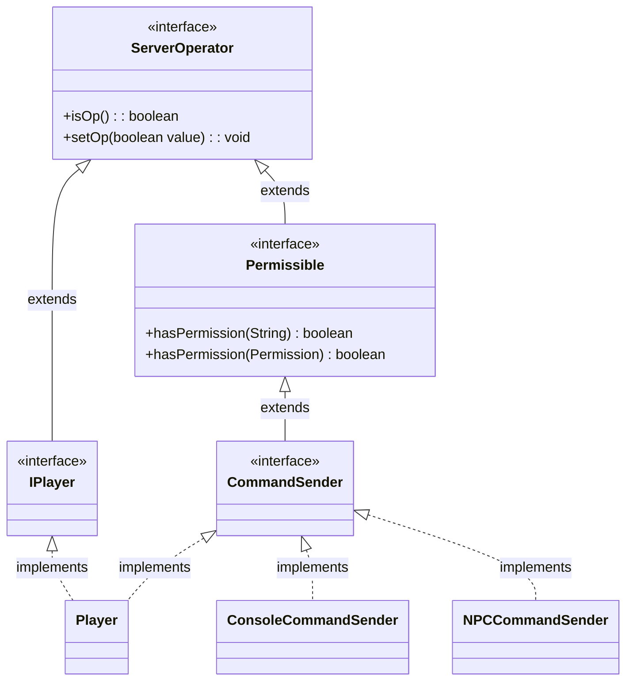

# Permission 权限指南

在 Nukkit-MOT 插件中，权限是用来控制玩家对特定功能和操作的能力的关键机制。

通过权限系统，可以确保只有授权玩家能执行特定操作，从而增强插件的安全性和功能性。

## 包结构 \{#package-structure}
Nukkit 的权限管理在 [cn.nukkit.permission](https://github.com/MemoriesOfTime/Nukkit-MOT/tree/master/src/main/java/cn/nukkit/permission) 包中进行。

这个包是至关重要的，因为它包含了实现权限检查所需的类和接口。

常用的类有：
- [BanList](#class-banlist)
- Permissible
- [Permission](#class-permission)

常用的接口有：
- [ServerOperator](#class-serveroperator)

## Permission 类概览 \{#class-permission}
`Permission` 类在 `cn.nukkit.permission` 包中扮演了中心角色。它包含了系统中使用的默认权限值，帮助标准化了插件内权限的处理方式。

### 核心常量 \{#permission-static}
该类定义了一些核心常量，这些常量代表了权限系统中的默认值，主要包括：
- `DEFAULT_OP`: 默认的操作者权限值，代表 `op`。
- `DEFAULT_NOT_OP`: 默认的非操作者权限值，代表 `notop`。
- `DEFAULT_TRUE`: 默认的允许访问权限值，代表 `true`。
- `DEFAULT_FALSE`: 默认的禁止访问权限值，代表 `false`。
- `DEFAULT_PERMISSION`: 如果没有指定默认值，使用此权限（也就是 DEFAULT_OP 的 `op`）。

### 主要构造函数和方法 \{#main-constructors-and-methods}
- **构造函数**：`Permission` 类提供了几个构造函数，允许在创建权限时设置名称、描述、默认值和子权限。
- `getByName(String value)`：此静态方法通过字符串参数返回相应的默认权限值。它支持多种别名识别，如 `admin`, `isadmin`, `notadmin` 等。
- `setDefault(String value)`：设置该权限的默认值。
- `getDescription()` 和 `setDescription(String description)`：获取和设置权限的描述信息。
- `getPermissibles()`：返回所有订阅了此权限的 `Permissible` 实例集合。
- `recalculatePermissibles()`：当权限的默认值或结构发生变化时，重新计算与此权限相关的所有 `Permissible` 实例的权限。
- `addParent(Permission permission, boolean value)`：将一个权限作为父权限添加到当前权限，可指定继承方式。

### 示例用法 \{#example-usage-permission}

以下是如何在插件启动时注册权限和检查玩家是否具有该权限的示例代码：

```java
import cn.nukkit.permission.Permission;

public class YourPlugin extends PluginBase {
    @Override
    public void onEnable() {
        // 注册自定义权限
        registerPermissions();
    }

    private void registerPermissions() {
        PluginManager pm = this.getServer().getPluginManager();
        pm.addPermission(new Permission("yourplugin.custom.permission", "允许访问自定义功能", Permission.DEFAULT_TRUE));
    }

    public void checkPermission(Player player) {
        if (player.hasPermission("yourplugin.custom.permission")) {
            player.sendMessage("你有权限访问这个功能。");
        } else {
            player.sendMessage("你没有权限访问这个功能。");
        }
    }
}
```

## BanList 类概览 \{#class-banlist}

`BanList` 类在 `cn.nukkit.permission` 包中用于管理服务器的封禁列表。可以用它操作如添加、移除和检查ban状态。

除非您要编写安全类插件，否则通常不会使用这个类。

### 示例用法 \{#example-usage-banlist}

```java
public class YourPlugin extends PluginBase {
    @Override
    public void onEnable() {
        this.getServer().getNameBans();// 获取服务器的，玩家封禁列表
        this.getServer().getIPBans();// 获取服务器的，IP封禁列表
    }
}
```

## ServerOperator 接口概览 \{#class-serveroperator}

在 Nukkit 中，OP（Operator）指的是拥有访问特权命令和功能的服务器管理员。本节介绍了 `ServerOperator` 接口，该接口定义了与管理操作员相关的方法。

### 主要方法 \{#main-methods-serveroperator}

`ServerOperator` 接口提供了检查和设置对象操作员状态的方法。

- **isOp() 方法：**
  - **描述：** 检查对象是否为服务器操作员。
  - **返回类型：** `boolean`
  - **返回值：** 如果对象是操作员，则为 `true`，否则为 `false`。

- **setOp(boolean value) 方法：**
  - **描述：** 将对象设置为服务器操作员或取消操作员状态。
  - **参数：**
    - `value`（`boolean` 类型）：`true` 表示授予操作员状态，`false` 表示取消操作员状态。

### 关系图 \{#relationship-diagram}



### 示例用法 \{#example-usage-serveroperator}

以下是如何在插件代码中使用 `ServerOperator` 接口的示例：

```java
import cn.nukkit.permission.ServerOperator;

public class MyPluginCommandExecutor implements CommandExecutor {

    @Override
    public boolean onCommand(CommandSender sender, Command command, String label, String[] args) {
        if (sender.isOp()) {
            // 执行操作员允许的操作
            sender.sendMessage("您是一个操作员。");
        } else {
            // 处理非操作员操作
            sender.sendMessage("您不是一个操作员。");
        }
        return true;
    }
}
```

## 小技巧 \{#tips}

### 使用 plugin.yml 注册权限节点 \{#registering-permission-nodes}

Nukkit-MOT 的 `plugin.yml` 传承了 Bukkit 的优秀设计，你可以通过简单的编辑 yml 文件来迅速注册插件的权限节点。

以下是一个示例，展示了如何注册权限以控制宠物管理插件的功能：

```yml title="plugin.yml"
permissions:
  pets.command:
    description: "允许用户管理自己的宠物"
    default: op
  pets.manage:
    description: "允许用户管理所有宠物"
    default: op
  pets.call:
    description: "允许用户召唤宠物"
    default: true
```

在这个示例中：

- `pets.command` 权限允许玩家管理自己的宠物，但默认情况下只有操作员（OP）拥有这个权限。
- `pets.manage` 权限允许玩家管理所有宠物，同样默认情况下只有操作员（OP）拥有这个权限。
- `pets.call` 权限允许玩家召唤宠物，并且默认情况下任何人都拥有这个权限。
- `default` 使用的值可以参考 [Permission 类的核心常量](#permission-static)

## 结语 \{#conclusion}

作为一名普通开发者，我们一般直接使用 plugin.yml 来注册权限节点。

而后在实际操作前使用 `hasPermission(String permission)` 方法确保玩家拥有此权限。