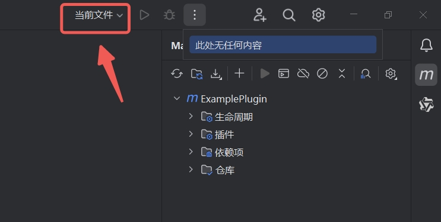
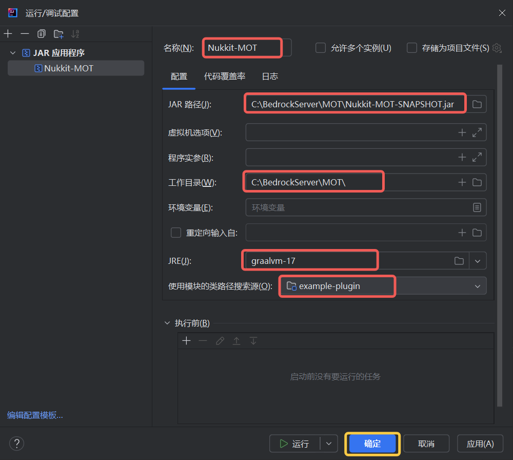

# 调试您的插件

插件开发过程中，通常会遇到一些代码逻辑错误、插件的兼容性问题、性能瓶颈等挑战。

合理的使用断点能够帮助我们快速分析、定位问题。

而插件调试需要先在 IDEA 中进行 `运行/调试配置` 的编辑。

## 编辑调试配置

使用 IDEA 打开项目。

1. 在顶栏中，打开 `运行/调试配置` 窗口。
2. 选择 `JAR 应用程序` 模板。

3. 编辑窗口内容

| 字段 | 描述 |
| --- | --- |
| 名称 | Nukkit-MOT |
| JAR 路径 | 指 `Nukkit-MOT-SNAPSHOT.jar` 的完整路径 |
| 工作目录 | 指 `Nukkit-MOT` 服务端所处的文件夹路径 |
| JRE | 选择 Java 17 运行时 |

最后点击 `确定` 即可。

## 在构建成功后自动更新插件

通过上述操作，我们已经可以使用 `Shift + F9` 组合键进行代码调试。

但为了方便，我们希望在每次构建成功后自动更新插件。

...