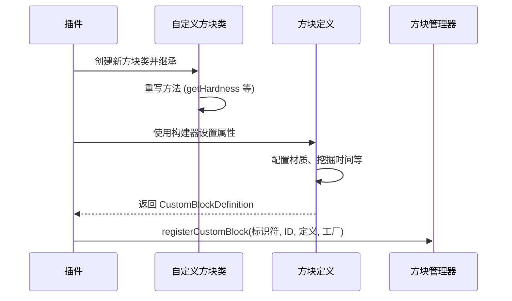

import FolderView from '@site/src/components/FolderView';

# 自定义方块

:::danger 前提条件：Bin 数据文件

在使用自定义方块之前，你必须下载并放置 Bin 数据文件到服务器目录：

1. 从 [Bin_Data 仓库](https://github.com/MemoriesOfTime/Bin_Data) 下载
2. 将 `bin` 文件夹放置到服务器根目录

你的服务器目录结构应该如下：
```
NukkitServer/
├── bin/                          ← 自定义方块必需
│   ├── vanilla_palette_xxx.nbt
│   └── ...
├── plugins/
├── worlds/
└── Nukkit-MOT-SNAPSHOT.jar
```

没有这些文件，自定义方块注册将会失败。

:::

想要创建一个自定义方块，需要包含两个部分：

1. 插件内成功注册到 Nukkit-MOT
2. 资源包内定义方块贴图发送给客户端

接下来以 **自定义石头方块** 为例，演示自定义方块的步骤。

## 在插件中注册方块 \{#register-block-in-plugin}

我们按照以下序列图进行操作：



### 创建新方块的类 \{#create-new-block-class}

在插件中，新建 `MyCustomStone` 类，继承 `CustomBlock`：

```java title="custom/block/MyCustomStone.java"
package cn.nukkitmot.exampleplugin.custom.block;

import cn.nukkit.block.custom.container.CustomBlock;

public class MyCustomStone extends CustomBlock {
    // highlight-start
    public static final String IDENTIFIER = "myplugin:custom_stone";
    public static final int BLOCK_ID = 10001; // 必须 >= 10000

    public MyCustomStone() {
        super(IDENTIFIER, BLOCK_ID);
    }

    @Override
    public String getName() {
        return "Custom Stone";
    }

    @Override
    public double getHardness() {
        return 1.5;
    }

    @Override
    public double getResistance() {
        return 6.0;
    }

    @Override
    public int getToolType() {
        return ItemTool.TYPE_PICKAXE;
    }
    // highlight-end
}
```

### 关键类概述 \{#key-classes-overview}

#### CustomBlock 与 CustomBlockMeta

Nukkit-MOT 提供了两个自定义方块的基类：

- **CustomBlock** - 用于没有自定义属性的简单方块（如石头、泥土）
- **CustomBlockMeta** - 用于带有自定义属性/状态的方块（如红石灯有开/关状态）

### 注册方块 \{#register-block}

在插件入口类的 `onEnable` 方法中注册方块：

```java title="ExamplePlugin.java"
import cn.nukkit.block.custom.CustomBlockManager;
import cn.nukkit.block.custom.CustomBlockDefinition;
import cn.nukkit.math.Vector3f;
import cn.nukkitmot.exampleplugin.custom.block.MyCustomStone;

public class ExamplePlugin extends PluginBase {
    @Override
    public void onEnable() {
        // highlight-start
        CustomBlockManager.get().registerCustomBlock(
            MyCustomStone.IDENTIFIER,
            MyCustomStone.BLOCK_ID,
            CustomBlockDefinition.builder(new MyCustomStone())
                .name("Custom Stone")
                .texture("custom_stone")
                .breakTime(1.5)
                .collisionBox(new Vector3f(-8, 0, -8), new Vector3f(16, 16, 16))
                .selectionBox(new Vector3f(-8, 0, -8), new Vector3f(16, 16, 16))
                .creativeGroup("itemGroup.name.stoneBrick")
                .creativeCategory(CreativeItemCategory.CONSTRUCTION)
                .build(),
            MyCustomStone::new
        );
        // highlight-end
    }
}
```

:::danger 关键：插件加载顺序

你的插件**必须**在 `plugin.yml` 中配置 `load: STARTUP`：

```yaml title="plugin.yml"
name: MyPlugin
main: cn.example.MyPlugin
version: 1.0.0
# highlight-next-line
load: STARTUP
```

这是因为自定义方块必须在 `CustomBlockManager.closeRegistry()` 调用**之前**注册。服务器启动顺序如下：

1. `enablePlugins(STARTUP)` → 调用 STARTUP 插件的 `onEnable()`
2. `CustomBlockManager.closeRegistry()` → **关闭注册，生成调色板**
3. `enablePlugins(POSTWORLD)` → 调用 POSTWORLD 插件的 `onEnable()`

如果你的插件使用默认的 `load: POSTWORLD`，当 `onEnable()` 被调用时方块注册表已经关闭，注册将会失败。

:::

:::warning 其他注意事项

1. 自定义方块 ID 必须 >= 10000 (`CustomBlockManager.LOWEST_CUSTOM_BLOCK_ID`)
2. 标识符应遵循 `命名空间:方块名` 的格式

:::

### CustomBlockDefinition 构建器方法 \{#customblockdefinition-builder}

引自 [cn.nukkit.block.custom.CustomBlockDefinition](https://github.com/MemoriesOfTime/Nukkit-MOT/blob/master/src/main/java/cn/nukkit/block/custom/CustomBlockDefinition.java)：

#### 基础属性 \{#basic-properties}

| 方法 | 描述 |
|------|------|
| `name(String name)` | 设置显示名称 |
| `texture(String texture)` | 设置材质标识符 |
| `breakTime(double second)` | 设置挖掘时间（秒） |

#### 碰撞箱和选择箱 \{#collision-selection-box}

```java
// 完整方块碰撞箱
.collisionBox(new Vector3f(-8, 0, -8), new Vector3f(16, 16, 16))
.selectionBox(new Vector3f(-8, 0, -8), new Vector3f(16, 16, 16))

// 半砖碰撞箱
.collisionBox(new Vector3f(-8, 0, -8), new Vector3f(16, 8, 16))
```

原点位于方块的中心底部。尺寸单位为 1/16（像素）。

#### 创造栏分类 \{#creative-inventory}

```java
.creativeCategory(CreativeItemCategory.CONSTRUCTION)
.creativeGroup("itemGroup.name.stoneBrick")
// 或使用组合方法：
.creativeGroupAndCategory(CreativeItemGroup.STONE_BRICK, CreativeItemCategory.CONSTRUCTION)
```

#### 几何模型 \{#geometry-model}

```java
// 使用几何模型标识符
.geometry("geometry.custom_model")

// 或使用 Geometry 对象控制骨骼显示
.geometry(new Geometry("geometry.custom_model")
    .boneVisibility("bone1", true)
    .boneVisibility("bone2", "query.block_property('myplugin:active') == 1"))
```

#### 变换 \{#transformation}

```java
import cn.nukkit.block.custom.container.data.Transformation;
import cn.nukkit.math.Vector3;

// 旋转角度必须是 90 度的倍数
.transformation(new Transformation(
    new Vector3(0, 0, 0),     // 位移
    new Vector3(1, 1, 1),     // 缩放
    new Vector3(0, 90, 0)     // 旋转（90度的倍数）
))

// 简单旋转
.rotation(new Vector3f(0, 90, 0))
```

#### 材质（多面贴图） \{#materials}

```java
import cn.nukkit.block.custom.container.data.Materials;

.materials(Materials.builder()
    .up(Materials.RenderMethod.OPAQUE, "grass_top")
    .down(Materials.RenderMethod.OPAQUE, "dirt")
    .any(Materials.RenderMethod.OPAQUE, "grass_side")
    .build())
```

**RenderMethod 选项：**
- `OPAQUE` - 完全不透明（默认）
- `BLEND` - 透明混合（如玻璃）
- `ALPHA_TEST` - 二值透明（如树叶）

## 带属性的方块 \{#blocks-with-properties}

对于需要存储状态的方块（如可以开/关的灯），使用 `CustomBlockMeta` 配合 `BlockProperties`。

### 创建带属性的方块 \{#create-block-with-properties}

```java title="custom/block/MyLamp.java"
package cn.nukkitmot.exampleplugin.custom.block;

import cn.nukkit.block.custom.container.CustomBlockMeta;
import cn.nukkit.block.custom.properties.BlockProperties;
import cn.nukkit.block.custom.properties.BooleanBlockProperty;

public class MyLamp extends CustomBlockMeta {
    // highlight-start
    public static final String IDENTIFIER = "myplugin:my_lamp";
    public static final int BLOCK_ID = 10002;

    // 定义属性
    public static final BooleanBlockProperty LIT =
        new BooleanBlockProperty("myplugin:lit", true);

    public static final BlockProperties PROPERTIES =
        new BlockProperties(LIT);

    public MyLamp() {
        this(0);
    }

    public MyLamp(int meta) {
        super(IDENTIFIER, BLOCK_ID, PROPERTIES, meta);
    }

    // 属性的 getter 和 setter
    public boolean isLit() {
        return getBooleanValue(LIT.getName());
    }

    public void setLit(boolean lit) {
        setBooleanValue(LIT.getName(), lit);
    }

    @Override
    public int getLightLevel() {
        return isLit() ? 15 : 0;
    }
    // highlight-end
}
```

### 注册带属性的方块 \{#register-block-with-properties}

```java title="ExamplePlugin.java"
CustomBlockManager.get().registerCustomBlock(
    MyLamp.IDENTIFIER,
    MyLamp.BLOCK_ID,
    MyLamp.PROPERTIES,
    CustomBlockDefinition.builder(new MyLamp())
        .name("My Lamp")
        .texture("my_lamp_off")
        .breakTime(0.3)
        // 使用 permutation 实现不同状态的渲染
        .permutation(new Permutation(
            Materials.builder().any(Materials.RenderMethod.OPAQUE, "my_lamp_on").build(),
            "query.block_property('myplugin:lit') == 1"
        ))
        .build(),
    MyLamp::new  // 接受 meta 参数的工厂方法
);
```

### 属性类型 \{#property-types}

#### BooleanBlockProperty（布尔属性） \{#boolean-property}

```java
// 简单的开/关状态
BooleanBlockProperty powered = new BooleanBlockProperty("myplugin:powered", true);
```

#### IntBlockProperty（整数属性） \{#int-property}

```java
// 值的范围（如水位 0-7）
IntBlockProperty level = new IntBlockProperty("myplugin:level", true, 7, 0);

// 自定义位大小
IntBlockProperty rotation = new IntBlockProperty("myplugin:rotation", true, 15, 0, 4);
```

#### EnumBlockProperty（枚举属性） \{#enum-property}

```java
// 使用字符串数组
EnumBlockProperty<String> woodType = new EnumBlockProperty<>(
    "myplugin:wood_type",
    true,
    new String[]{"oak", "spruce", "birch", "jungle"}
);

// 使用 Java 枚举
public enum FacingDirection { NORTH, SOUTH, EAST, WEST }
EnumBlockProperty<FacingDirection> facing = new EnumBlockProperty<>(
    "myplugin:facing",
    true,
    FacingDirection.class
);
```

### Permutation（条件渲染） \{#permutations}

Permutation 允许根据方块属性进行不同的渲染：

```java
import cn.nukkit.block.custom.container.data.Permutation;

CustomBlockDefinition.builder(new MyBlock())
    // 默认状态
    .texture("my_block_default")
    // 当属性为 true 时，使用不同的材质
    .permutation(new Permutation(
        Materials.builder().any(Materials.RenderMethod.OPAQUE, "my_block_active").build(),
        "query.block_property('myplugin:active') == 1"
    ))
    // 多个 permutation
    .permutations(
        new Permutation(geometry1, "query.block_property('myplugin:state') == 0"),
        new Permutation(geometry2, "query.block_property('myplugin:state') == 1"),
        new Permutation(geometry3, "query.block_property('myplugin:state') == 2")
    )
    .build()
```

## 制作资源包 \{#creating-resource-pack}

### 资源包目录构成 \{#resource-pack-directory}

<FolderView
    paths={[
    'Resource Pack/manifest.json',
    'Resource Pack/pack_icon.png',
    'Resource Pack/textures/terrain_texture.json',
    'Resource Pack/textures/blocks/custom_stone.png',
    'Resource Pack/textures/blocks/my_lamp_off.png',
    'Resource Pack/textures/blocks/my_lamp_on.png',
]}
>
</FolderView>

### terrain_texture.json \{#terrain_texture-json}

```json title="RP/textures/terrain_texture.json"
{
    "resource_pack_name": "myplugin",
    "texture_name": "atlas.terrain",
    "padding": 8,
    "num_mip_levels": 4,
    "texture_data": {
        "custom_stone": {
            "textures": "textures/blocks/custom_stone"
        },
        "my_lamp_off": {
            "textures": "textures/blocks/my_lamp_off"
        },
        "my_lamp_on": {
            "textures": "textures/blocks/my_lamp_on"
        }
    }
}
```

:::tip 方块与物品材质的区别

- 方块材质使用 `terrain_texture.json` 和 `textures/blocks/` 文件夹
- 物品材质使用 `item_texture.json` 和 `textures/items/` 文件夹

:::

### 自定义几何模型 \{#custom-geometry-models}

如果使用自定义几何模型，需要添加模型文件：

<FolderView
    paths={[
    'Resource Pack/models/blocks/custom_model.geo.json',
]}
>
</FolderView>

```json title="RP/models/blocks/custom_model.geo.json"
{
    "format_version": "1.16.0",
    "minecraft:geometry": [
        {
            "description": {
                "identifier": "geometry.custom_model",
                "texture_width": 16,
                "texture_height": 16
            },
            "bones": [
                {
                    "name": "root",
                    "pivot": [0, 0, 0],
                    "cubes": [
                        {
                            "origin": [-8, 0, -8],
                            "size": [16, 16, 16],
                            "uv": [0, 0]
                        }
                    ]
                }
            ]
        }
    ]
}
```

## 深入了解 \{#further-exploration}

### 插件内置资源包 \{#resource-packs-in-plugin}

与自定义物品一样，你可以将资源包嵌入到插件中。在 `resources` 目录下创建 `assets/resource_pack` 文件夹。

<details>
    <summary>
      查看 resources 目录结构
    </summary>
<FolderView
    paths={[
    'resources/plugin.yml',
    'resources/assets/resource_pack/manifest.json',
    'resources/assets/resource_pack/pack_icon.png',
    'resources/assets/resource_pack/textures/terrain_texture.json',
    'resources/assets/resource_pack/textures/blocks/custom_stone.png',
  ]}
>
</FolderView>
</details>

### 工作台方块 \{#crafting-table-block}

创建一个带有自己配方网格的自定义工作台：

```java
import cn.nukkit.block.custom.container.data.CraftingTable;

CustomBlockDefinition.builder(new MyCraftingTable())
    .craftingTable(new CraftingTable(
        "My Crafting Table",        // 工作台名称
        Arrays.asList("crafting_table", "my_table")  // 配方标签
    ))
    .build()
```

### 方块标签 \{#block-tags}

为方块添加标签以兼容原版机制：

```java
CustomBlockDefinition.builder(new MyBlock())
    .blockTags("stone", "minecraft:mineable/pickaxe")
    .build()
```

### 自定义 NBT 配置 \{#custom-nbt}

对于构建器方法未覆盖的高级配置：

```java
CustomBlockDefinition.builder(new MyBlock())
    .texture("my_texture")
    .customBuild(nbt -> {
        // 添加自定义 NBT 数据
        nbt.getCompound("components")
            .putCompound("minecraft:light_emission", new CompoundTag()
                .putInt("emission", 15));
    })
```