# 自定义物品

想要创建一个自定义物品，需要包含两个部分：

1. 插件内成功注册到 Nukkit-MOT
2. 资源包内定义物品贴图发送给客户端

接下来以 **糖果剑** 为例，演示自定义物品的步骤。

## 在插件中注册物品

我们按照以下序列图进行操作

```mermaid
sequenceDiagram
    participant Plugin
    participant ItemCustom
    participant CustomItemDefinition
    participant Item
    
    Plugin->>ItemCustom: 创建新物品类并继承
    ItemCustom->>ItemCustom: 重写getMaxStackSize()
    ItemCustom->>ItemCustom: 重写scaleOffset()
    ItemCustom->>CustomItemDefinition: 重写getDefinition()
    CustomItemDefinition->>CustomItemDefinition: 使用构建器设置属性
    CustomItemDefinition-->>ItemCustom: 返回CustomItemDefinition
    Plugin->>Item: registerCustomItem(新物品类)
```



### 创建新物品的类

在插件中，新建 `CandyCaneSword` 类，继承 ItemCustom 并重写相应方法

```java title="custom/item/CandyCaneSword.java"
public static class CandyCaneSword extends ItemCustom {
    private static String stringId = "candy_cane_sword";
    public static String name = "糖果剑";

    @Override
    public int getMaxStackSize() {
        return 1;
    }

    public int scaleOffset() {
        return 32; // 需要是16的倍数，如 32、64、128
    }

    /**
     * 该方法设置自定义物品的定义
     */
    @Override
    public CustomItemDefinition getDefinition() {
        return CustomItemDefinition
            .simpleBuilder(this, ItemCreativeCategory.EQUIPMENT)
            .creativeGroup("itemGroup.name.item")
            .allowOffHand(false)
            .renderOffsets(RenderOffsets.scaleOffset(scaleOffset()))
            .build();
    }

    public CandyCaneSword() {
        super(stringId, name);
    }

    @Override
    public int getMaxDurability() {
        return 500;
    }
}
```

### ItemCustom 主要方法

引自 [cn.nukkit.item.customitem.ItemCustom](https://github.com/MemoriesOfTime/Nukkit-MOT/blob/master/src/main/java/cn/nukkit/item/customitem/ItemCustom.java)

我们需要用 `@Override` 来重写下面的方法。

- `getMaxStackSize()`
方法用于设置自定义物品的最大堆叠数量。

- `scaleOffset()`
方法用于设置自定义物品的贴图大小，返回值需要是16的倍数，如 32、64、128。

- `getDefinition()`
返回一个 CustomItemDefinition 类概括了该物品的基本属性，如 是否允许副手、在创造栏的分类、附魔效果。

### CustomItemDefinition 主要方法

引自 [cn.nukkit.item.customitem.CustomItemDefinition](https://github.com/MemoriesOfTime/Nukkit-MOT/blob/master/src/main/java/cn/nukkit/item/customitem/CustomItemDefinition.java)

#### 常用构建器

- `customBuilder` 自定义物品的定义构造器

- `simpleBuilder` 简单物品的构建器 （默认使用这个）

- `toolBuilder` 工具物品的构建器

- `armorBuilder` 盔甲物品的构建器

- `edibleBuilder` 食品的构建器

先使用构建器返回一个 `CustomItemDefinition` 类

```java title="java"
CustomItemDefinition.simpleBuilder(ItemCustom item, ItemCreativeCategory creativeCategory);
```

#### 常用方法

由于方法直接返回 `this` 因此我们可以使用扁平化的写法。

- `allowOffHand(boolean allowOffHand)` 是否允许副手持有。

- `handEquipped(boolean handEquipped)` 控制第三人称手持物品的显示方式。

- `foil(boolean foil)` 是否有附魔光辉效果，比如附魔书就有。

- `creativeGroup(ItemCreativeGroup creativeGroup)` 控制自定义物品在创造栏的分组，例如所有的附魔书都是 `ItemCreativeGroup.ENCHANTED_BOOK` 组。

- `canDestroyInCreative(boolean value)` 控制拿该物品的玩家是否可以在创造模式挖掘方块。

### ItemCreativeGroup 主要方法

引自 [cn.nukkit.item.customitem.data.ItemCreativeGroup](https://github.com/MemoriesOfTime/Nukkit-MOT/blob/master/src/main/java/cn/nukkit/item/customitem/data/ItemCreativeGroup.java)

### 注册物品

最后，在插件入口类的 onEnable 方法中注册物品

```java title="ExamplePlugin.java"
import cn.nukkit.item.Item;

@Override
public void onEnable() {
    Item.registerCustomItem(CandyCaneSword.class);
}
```

## 制作资源包

教程将指导您如何制作资源包，确保正确指向物品贴图，以在游戏内正确显自定义物品。

如果在游戏内创造物品栏中仍然看到空白格子，请检查资源包配置和物品贴图路径是否正确。

详细步骤包括：

1. 定义资源包的 UUID 和信息。
2. 在资源包中定义物品贴图路径。
3. 打包资源包并放入服务器的 resource_packs 文件夹。

### 资源包目录构成

资源包目录应该包含以下文件：

```mermaid
graph TD;
    RP("📁 Resource Pack") --> manifest["📄 manifest.json"];
    RP --> pack_icon["📄 pack_icon.png"];
    RP --> textures("📁 textures");
    textures --> item_texture["📄 item_texture.json"];
    RP --> items("📁 items");
    items --> candy_cane_sword["📄 candy_cane_sword.png"];
```



### manifest.json

参考 Bedrock Wiki 对 [RP Manifest](https://wiki.bedrock.dev/guide/project-setup.html#rp-manifest) 的讲解。

```json title="RP/manifest.json"
{
    "format_version": 2,
    "header": {
        "description": "BY.nukkit-mot",
        "name": "§7测试资源包",
        "uuid": "00000000-0000-0000-0000-000020160300",
        "version": [1, 1, 6],
        "min_engine_version": [1, 14, 0]
    },
    "modules": [
        {
            "type": "resources",
            "uuid": "dde211f9-e1a6-435e-9a84-06fa9242f63e",
            "version": [1, 0, 0]
        }
    ]
}
```

### item_texture.json

```json title="RP/textures/item_texture.json"
{
    "resource_pack_name": "nukkit-mot",
    "texture_name": "atlas.items",
    "texture_data": {
        // highlight-start
        "candy_cane_sword": {
            "textures": "textures/items/candy_cane_sword"
        }
        // highlight-end
    }
}
```

打包好资源包

放入服务器的 `resource_packs` 文件夹

进入服务器，正常情况下您会看见资源包正常显示

:::note

打包资源包时是以根目录进行打包，否则客户端无法读取资源包。

根目录指的是，与 `manifest.json` 文件同级的目录。

:::

## 深入了解

### 与 Bedrock Wiki 的对照关系

如果 CustomItemDefinition 中没有您想要的封装方法，该怎么做呢？

我们可以直接参照 Bedrock Wiki 的 [ItemComponents](https://wiki.bedrock.dev/items/item-components.html) 文档！

以允许副手举例。

在 Nukkit-MOT 的 [CustomItemDefinition](https://github.com/MemoriesOfTime/Nukkit-MOT/blob/master/src/main/java/cn/nukkit/item/customitem/CustomItemDefinition.java#L203) 类中的内容如下

```java
public class CustomItemDefinition {
    public static class SimpleBuilder {
        /**
         * 是否允许副手持有
         */
        public SimpleBuilder allowOffHand(boolean allowOffHand) {
            this.nbt.getCompound("components")
                    .getCompound("item_properties")
                    .putBoolean("allow_off_hand", allowOffHand);
            return this;
        }
    }
}
```

而 Bedrock Wiki 中是这么介绍 [Allow Off Hand](https://wiki.bedrock.dev/items/item-components.html#allow-off-hand) 的：

```md
## Allow Off Hand

Determines whether an item can be placed in the off-hand slot of the inventory.
```
```java title="minecraft:item > components"
"minecraft:allow_off_hand": {
    "value": true
}
```

SimpleBuilder#allowOffHand 方法中的 `this.nbt` 在构建器中被创建，可参考 Nukkit-MOT 的 [CustomItemDefinition.java#L171](https://github.com/MemoriesOfTime/Nukkit-MOT/blob/master/src/main/java/cn/nukkit/item/customitem/CustomItemDefinition.java#L171)

```java
    public static class SimpleBuilder {
        protected final CompoundTag nbt = new CompoundTag()
                .putCompound("components", new CompoundTag()
                        .putCompound("item_properties", new CompoundTag()
                                .putCompound("minecraft:icon", new CompoundTag())
                        )
                );
    }
```

:::note

并不是所有方法都能通过简单的添加 nbt 就达成其效果的，譬如 `minecraft:cooldown` 就需要服务器来处理 `PlayerStartItemCoolDownPacket` 以实现物品的使用冷却行为。

可以在 [cn.nukkit.network.protocol.ProtocolInfo](https://github.com/MemoriesOfTime/Nukkit-MOT/blob/master/src/main/java/cn/nukkit/network/protocol/ProtocolInfo.java) 中查看协议支持的所有数据包。

:::